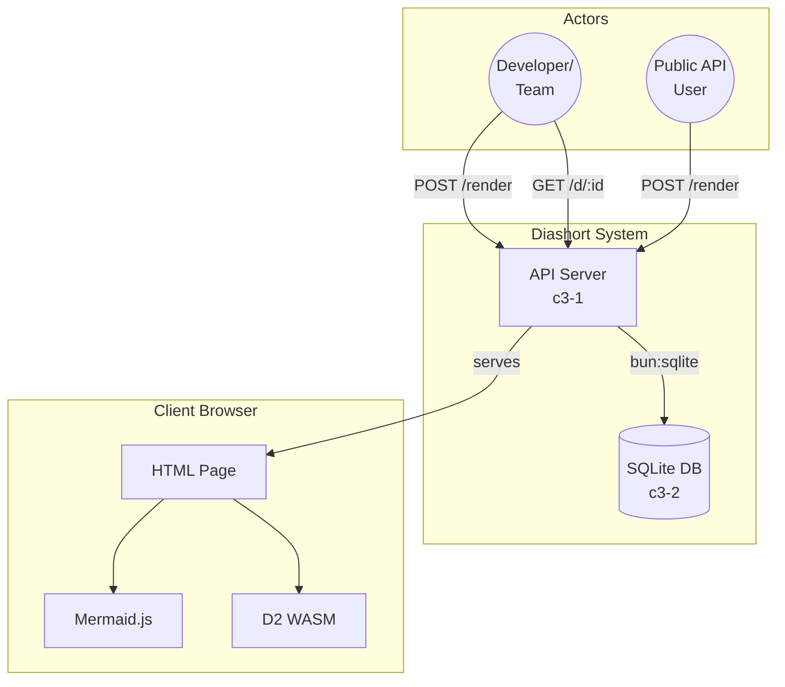
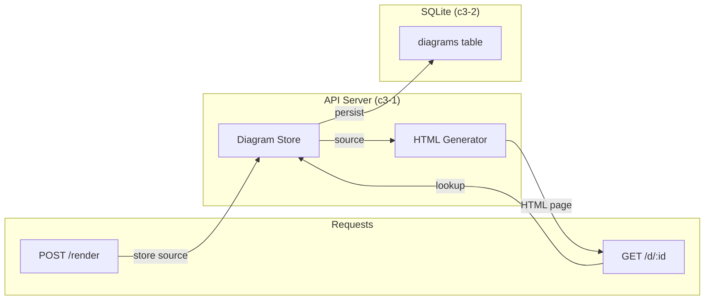

# Diashort

A diagram shortlink service. Users submit diagram source code (Mermaid or D2 format), the service stores it in SQLite and returns a shortlink. Viewing the shortlink serves an HTML page that renders the diagram client-side using Mermaid.js or D2 WASM.

## Overview

## Actors

| ID | Actor | Type | Purpose |
|----|-------|------|---------|
| A1 | Developer/Team | user | Share diagrams in documentation, PRs, and chat |
| A2 | Public API User | external-service | Programmatic diagram generation via HTTP API |

## Containers

| ID | Name | Type | Status | Purpose |
|----|------|------|--------|---------|
| c3-1 | API Server | service | active | HTTP service: store diagram source, serve HTML pages with client-side rendering |
| c3-2 | SQLite Database | database | active | Persistent storage for diagram source code |

**Architecture rationale:** Single-instance deployment. All rendering happens client-side, so server is just store/serve. SQLite stores diagram source (tiny, <10KB each). HTML pages are CDN-cacheable.

## External Systems

None. All rendering happens in the client browser using:
- **Mermaid.js** - JavaScript library loaded from CDN
- **D2 WASM** - WebAssembly module bundled with HTML page

## Linkages

| From | To | Protocol | Reasoning |
|------|-----|----------|-----------|
| API Server | SQLite | bun:sqlite | In-process, no network - source persistence |
| Client | Mermaid.js CDN | HTTPS | Standard JS library, cached by browser |
| Client | D2 WASM | bundled | WebAssembly for D2 rendering |

## Cross-Cutting Concerns

| Concern | Implementation |
|---------|----------------|
| Authentication | Optional Basic Auth via `AUTH_ENABLED`, `AUTH_USER`, `AUTH_PASS` env vars |
| Logging | Pino with configurable level, pretty-print in dev |
| Error Handling | Typed errors (`ValidationError`, `NotFoundError`) with HTTP status mapping |
| Configuration | Environment-based via @pumped-fn/lite tags system |
| Caching | HTML pages are CDN-cacheable (immutable content) |
| Cleanup | Diagrams older than retention period (default 30 days) deleted daily |

## E2E Testing Strategy

**Boundaries tested:**
- HTTP API endpoints (create, view)
- Diagram storage and retrieval
- HTML page generation with correct format detection
- Error responses (validation, not found)

**Key user flows:**
1. Submit diagram source → get shortlink → view HTML page
2. View page → browser renders diagram client-side

**Integration proves:**
- SQLite persistence works across restarts
- HTML pages contain correct diagram source
- Mermaid/D2 format detection works
