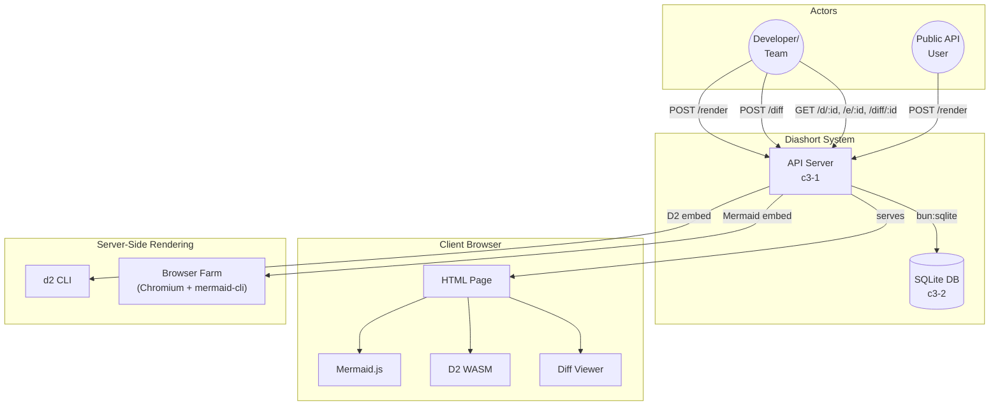
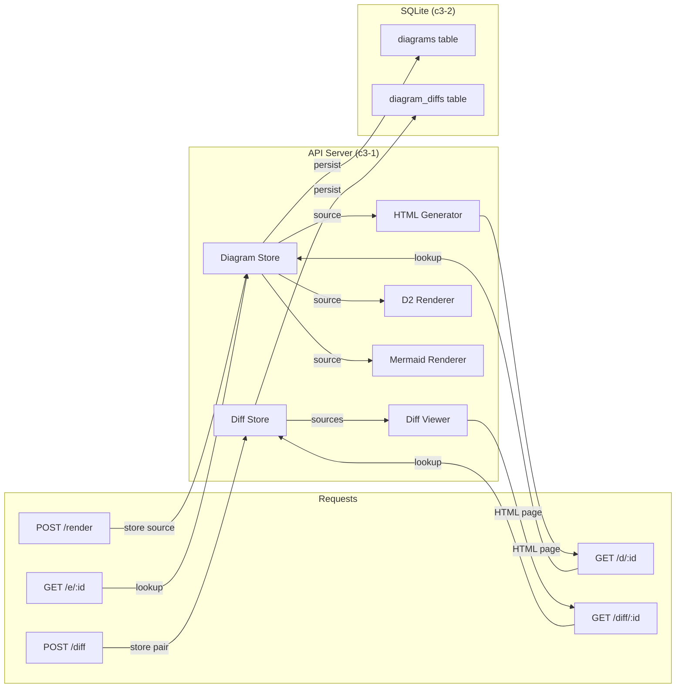

# Diashort

A diagram shortlink service. Users submit diagram source code (Mermaid or D2 format), the service stores it in SQLite and returns a shortlink. Viewing the shortlink serves an HTML page that renders the diagram client-side using Mermaid.js or D2 WASM. Embeddable SVG output is available via server-side rendering (D2 CLI, Mermaid browser farm). Diagram diffs provide side-by-side comparison with synced zoom/pan.

## Overview

## Actors

| ID | Actor | Type | Purpose |
|----|-------|------|---------|
| A1 | Developer/Team | user | Share diagrams in documentation, PRs, and chat |
| A2 | Public API User | external-service | Programmatic diagram generation via HTTP API |

## Containers

| ID | Name | Type | Status | Purpose |
|----|------|------|--------|---------|
| c3-1 | API Server | service | active | HTTP service: store diagram source, serve HTML pages, render SVG, compare diffs |
| c3-2 | SQLite Database | database | active | Persistent storage for diagram source code, diffs, and render queue |

**Architecture rationale:** Single-instance deployment. Client-side rendering for viewing, server-side rendering for embedding. SQLite stores diagram source (tiny, <10KB each). HTML pages are CDN-cacheable.

## External Systems

| System | Purpose | Required |
|--------|---------|----------|
| **d2 CLI** | Server-side D2 diagram rendering to SVG | Yes (for embed) |
| **Chromium** | Headless browser for Mermaid SSR via browser farm | Optional (CHROME_PATH) |
| **Mermaid.js CDN** | Client-side Mermaid rendering in browser | Yes (loaded by HTML pages) |

## Linkages

| From | To | Protocol | Reasoning |
|------|-----|----------|-----------|
| API Server | SQLite | bun:sqlite | In-process, no network - source persistence |
| API Server | d2 CLI | subprocess | SVG rendering for D2 diagrams |
| API Server | Chromium | CDP (WebSocket) | Mermaid SSR via browser farm |
| Client | Mermaid.js CDN | HTTPS | Standard JS library, cached by browser |

## Cross-Cutting Concerns

| Concern | Implementation |
|---------|----------------|
| Authentication | Optional Basic Auth via `AUTH_ENABLED`, `AUTH_USER`, `AUTH_PASS` env vars |
| Logging | Pino with configurable level, pretty-print in dev |
| Error Handling | Typed errors with HTTP status mapping (c3-108) |
| Configuration | Environment-based via @pumped-fn/lite tags system (c3-103) |
| Caching | HTML/SVG pages are CDN-cacheable (immutable content) |
| Cleanup | Diagrams/diffs older than retention period (default 30 days) deleted daily |
| Security | Input sanitization, output validation, SSRF prevention in browser farm |

## E2E Testing Strategy

**Boundaries tested:**
- HTTP API endpoints (create, view, embed, diff)
- Diagram and diff storage and retrieval
- HTML page generation with correct format detection
- SVG embedding for D2 and Mermaid
- Error responses (validation, not found)

**Key user flows:**
1. Submit diagram source -> get shortlink -> view HTML page
2. Submit diagram source -> get embed URL -> get SVG
3. Submit before/after pair -> get diff shortlink -> view comparison
4. View page -> browser renders diagram client-side

**Integration proves:**
- SQLite persistence works across restarts
- HTML pages contain correct diagram source
- SVG output is valid and sanitized
- Mermaid/D2 format detection works
