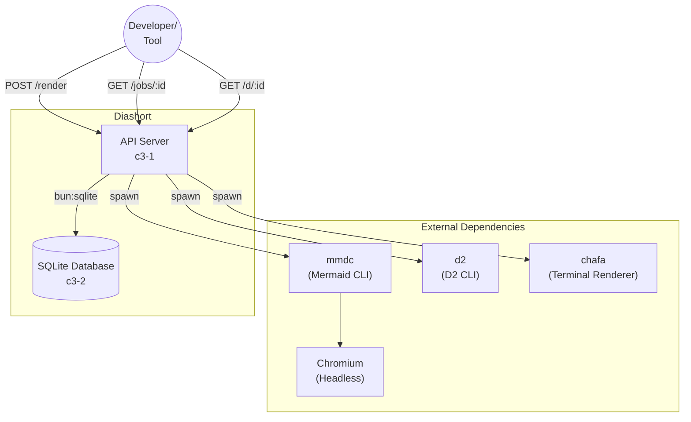

# Diashort Overview

## Overview {#c3-0-overview}

Diashort is a diagram shortlink service. Users submit diagram source code (Mermaid or D2 format), the service renders it to SVG or PNG, caches the result, and returns a shortlink for retrieval.

**Foundational Stack:**
- **Bun** - JavaScript/TypeScript runtime (fast, Docker-native)
- **@pumped-fn/lite** - Dependency injection via atoms, tags, and flows

## System Architecture {#c3-0-architecture}

## Actors {#c3-0-actors}

| Actor | Type | Interacts Via |
|-------|------|---------------|
| Developer/Team | Human | HTTP API - shares diagrams in docs, PRs, chat |
| Internal Tool | System | HTTP API - programmatic diagram generation |
| Public User | Human | HTTP API - anonymous diagram creation (if exposed) |

## Containers {#c3-0-containers}

| Container | ID | Archetype | Responsibility |
|-----------|-----|-----------|----------------|
| API Server | c3-1 | HTTP Service | Accept render requests, orchestrate rendering via external CLI tools, cache results, serve cached diagrams via shortlinks |
| SQLite Database | c3-2 | Data Store | Persistent storage for async job records (pending, rendering, completed, failed) |

**Two-container architecture:** Diashort separates compute (API Server) from data storage (SQLite Database) per C4 conventions. Databases are containers because they "store data" - a distinct responsibility from containers that "execute behavior".

## Container Interactions {#c3-0-interactions}

| From | To | Protocol | Purpose |
|------|-----|----------|---------|
| API Server (c3-1) | SQLite Database (c3-2) | bun:sqlite | Job persistence (create, status, cleanup) |
| API Server (c3-1) | mmdc | Subprocess spawn | Render Mermaid diagrams |
| API Server (c3-1) | d2 | Subprocess spawn | Render D2 diagrams |
| API Server (c3-1) | chafa | Subprocess spawn | Convert PNG to terminal output (symbols, sixels, kitty, iterm) |

**Note:** API Server to SQLite Database is an internal container-to-container dependency via Bun's native bun:sqlite module (in-process, no network). External tool invocation (mmdc, d2, chafa) is via subprocess spawning.

## Cross-Cutting Concerns {#c3-0-cross-cutting}

- **Auth:** Optional Basic Auth via `AUTH_ENABLED`, `AUTH_USER`, `AUTH_PASS` env vars
- **Logging:** Pino logger with pretty-print in development, JSON in production
- **Errors:** Typed error classes (`ValidationError`, `NotFoundError`, `BackpressureError`, `RenderError`, `AuthError`, `JobNotFoundError`) with HTTP status mapping
- **Configuration:** Environment-based via @pumped-fn/lite tags system
- **Backpressure:** Queue with configurable max concurrent/waiting limits
- **Caching:** In-memory with TTL expiration and periodic GC
- **Job Retention:** Completed/failed jobs retained for configurable duration (default 1 hour), then cleaned up
