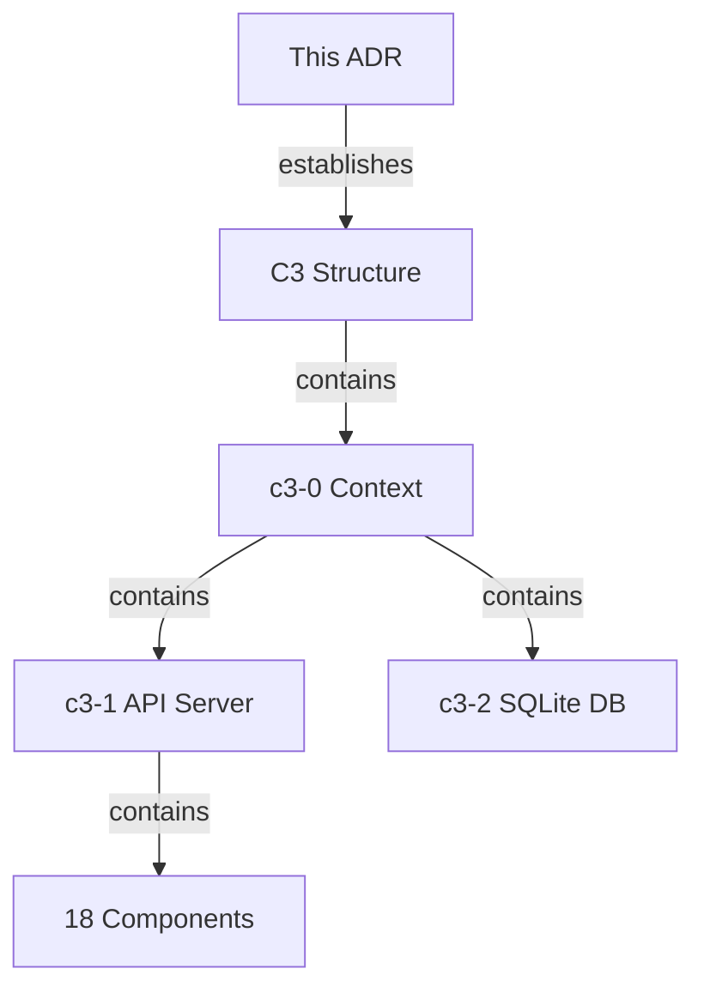

# C3 Architecture Documentation Adoption

## Overview

## Status

**Implemented** - 2026-01-06

## Problem

| Situation | Impact |
|-----------|--------|
| No architecture docs | Onboarding takes weeks |
| Knowledge in heads | Bus factor risk |
| Ad-hoc decisions | Inconsistent patterns |

## Decision Drivers

- Need for clear system understanding
- Growing codebase with multiple rendering strategies
- Async job system adds complexity
- External tool integrations require documentation

## Decision

Adopt C3 (Context-Container-Component) methodology for architecture documentation.

## Structure Created

| Level | ID | Name | Purpose |
|-------|-----|------|---------|
| Context | c3-0 | Diashort | System overview, actors, external systems |
| Container | c3-1 | API Server | HTTP service, rendering, caching, jobs |
| Container | c3-2 | SQLite Database | Async job persistence |
| Component | c3-101-107 | Foundation | Bun Server, DI, Config, Queue, Cache, Logger, Browser Pool |
| Component | c3-108 | Auxiliary | Error Handling patterns |
| Component | c3-109-118 | Feature | Renderers, Flows, Job system |

## Rationale

| Consideration | C3 Approach |
|---------------|-------------|
| Layered abstraction | Context → Container → Component |
| Change isolation | Strategic vs tactical separation |
| Growth-ready | Structure exists before content |
| Decision tracking | ADRs capture evolution |

## Consequences

### Positive

- Architecture visible and navigable
- Onboarding accelerated
- Decisions documented with reasoning
- Component responsibilities clear

### Negative

- Maintenance overhead (docs can drift)
- Initial time investment
- Must update docs when code changes

## Verification

- [x] `.c3/README.md` exists (c3-0)
- [x] All containers have `README.md`
- [x] Diagrams use consistent IDs
- [x] Linkages have reasoning
- [x] Key components documented

## Adoption Progress

| Level | Category | Status | Documented | Total |
|-------|----------|--------|------------|-------|
| Context | - | Complete | 1 | 1 |
| Containers | - | Complete | 2 | 2 |
| Components | Foundation | Complete | 4 | 7 |
| Components | Auxiliary | Complete | 1 | 1 |
| Components | Feature | Complete | 4 | 10 |

## Audit Record

| Phase | Date | Notes |
|-------|------|-------|
| Adopted | 2026-01-06 | Initial C3 structure created |
| Documented | 2026-01-06 | Context, containers, key components documented |
