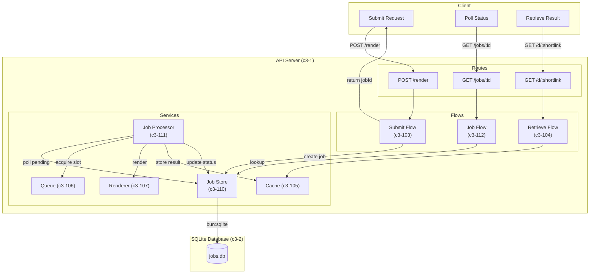
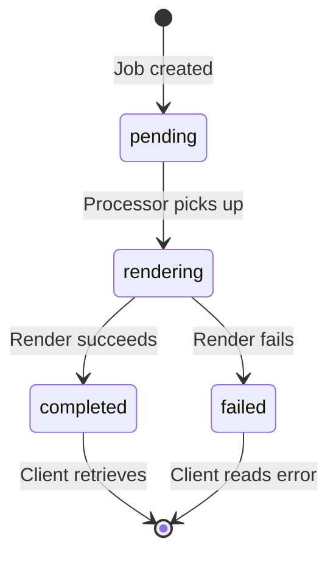

# Async Render with Job Polling

## Problem/Requirement

The current `/render` endpoint is **blocking** - clients must wait for the entire render operation to complete before receiving a response. This causes:

1. **Client connection exhaustion** - Long renders tie up HTTP connections
2. **Timeout failures** - Complex diagrams may exceed client/proxy timeouts
3. **Poor UX** - No progress visibility; client appears frozen
4. **Resource contention** - Blocking requests consume server resources inefficiently

**Requirement:** Transform the render system to support **async job-based processing** while preserving backward compatibility via an optional sync mode.

## Exploration Journey

### Option 1: Webhook/Callback Pattern

Client provides a callback URL; server POSTs result when complete.

- **Pro:** No polling overhead
- **Con:** Requires client to expose an endpoint
- **Con:** Network issues cause silent failures
- **Con:** Complex retry/delivery guarantees needed

**Rejected:** Too complex for the use case; requires clients to be servers.

### Option 2: Server-Sent Events (SSE)

Client maintains open connection; server streams status updates.

- **Pro:** Real-time updates
- **Con:** Connection still held open (defeats purpose)
- **Con:** Proxy/firewall compatibility issues
- **Con:** Complex reconnection handling

**Rejected:** Doesn't solve connection exhaustion.

### Option 3: Job-Based Polling (Selected)

Client submits job, receives job ID, polls for status.

- **Pro:** Frees client connection immediately
- **Pro:** Simple to implement and debug
- **Pro:** Works through all proxies/firewalls
- **Pro:** Natural fit for batch operations
- **Con:** Polling overhead (mitigated by reasonable intervals)

**Selected:** Best balance of simplicity, compatibility, and solving the core problem.

### Storage Decision: SQLite

For job persistence, considered:

1. **In-memory Map** - Lost on restart; no durability
2. **Redis** - Adds operational dependency
3. **SQLite** - Durable, zero-config, Bun native support via `bun:sqlite`

**Selected:** SQLite via `bun:sqlite` - durable, simple, no external dependencies.

### Sync Mode Decision

Should we keep the blocking mode?

- Some clients prefer simple request/response
- Migration path for existing integrations
- Quick renders don't benefit from async

**Decision:** Support both modes via query parameter `?mode=sync|async` (default: async).

## Solution

### Architecture Overview



**Note:** SQLite Database is a separate container (c3-2) per C4 conventions. Databases "store data" - a distinct responsibility from compute containers that "execute behavior".

### Job Lifecycle



### API Contract Changes

#### POST /render (Async Mode - Default)

```
POST /render
Content-Type: application/json

{
  "source": "graph TD; A-->B;",
  "format": "mermaid",
  "outputType": "svg"
}

Response (202 Accepted):
{
  "jobId": "job_abc123",
  "status": "pending",
  "statusUrl": "/jobs/job_abc123"
}
```

#### POST /render?mode=sync (Sync Mode - Backward Compatible)

```
POST /render?mode=sync
Content-Type: application/json

{
  "source": "graph TD; A-->B;",
  "format": "mermaid",
  "outputType": "svg"
}

Response (200 OK):
{
  "shortlink": "abc12345",
  "url": "/d/abc12345"
}
```

#### GET /jobs/:jobId (New)

```
GET /jobs/job_abc123

Response (200 OK) - Pending:
{
  "jobId": "job_abc123",
  "status": "pending",
  "createdAt": "2025-12-23T10:00:00Z"
}

Response (200 OK) - Rendering:
{
  "jobId": "job_abc123",
  "status": "rendering",
  "createdAt": "2025-12-23T10:00:00Z",
  "startedAt": "2025-12-23T10:00:01Z"
}

Response (200 OK) - Completed:
{
  "jobId": "job_abc123",
  "status": "completed",
  "createdAt": "2025-12-23T10:00:00Z",
  "completedAt": "2025-12-23T10:00:05Z",
  "result": {
    "shortlink": "abc12345",
    "url": "/d/abc12345"
  }
}

Response (200 OK) - Failed:
{
  "jobId": "job_abc123",
  "status": "failed",
  "createdAt": "2025-12-23T10:00:00Z",
  "completedAt": "2025-12-23T10:00:05Z",
  "error": "Syntax error in diagram"
}

Response (404) - Not Found:
{
  "error": "Job not found"
}
```

### Job Schema (SQLite)

```sql
CREATE TABLE jobs (
  id TEXT PRIMARY KEY,           -- job_<uuid8>
  status TEXT NOT NULL,          -- pending, rendering, completed, failed
  source TEXT NOT NULL,          -- diagram source
  format TEXT NOT NULL,          -- mermaid, d2
  output_type TEXT NOT NULL,     -- svg, png
  shortlink TEXT,                -- result shortlink (when completed)
  error TEXT,                    -- error message (when failed)
  created_at INTEGER NOT NULL,   -- unix timestamp ms
  started_at INTEGER,            -- when rendering began
  completed_at INTEGER           -- when finished (success or fail)
);

CREATE INDEX idx_jobs_status ON jobs(status);
CREATE INDEX idx_jobs_created ON jobs(created_at);
```

### Job Retention

- Completed/failed jobs retained for 1 hour (configurable via `JOB_RETENTION_MS`)
- Periodic cleanup removes expired jobs
- Prevents unbounded table growth

## Changes Across Layers

### Context (c3-0)

| What | Change |
|------|--------|
| Containers | Add SQLite Database (c3-2) as separate container |
| Container Interactions | Add API Server -> SQLite Database dependency |
| Cross-Cutting Concerns | Add job retention policy |

### Container - SQLite Database (c3-2) - NEW

| What | Change |
|------|--------|
| Create container | New container for persistent job storage |
| Schema | Define jobs table with status, source, result fields |
| Data lifecycle | Define retention policy for completed/failed jobs |
| Technology | bun:sqlite (bundled with Bun runtime) |

### Container - API Server (c3-1)

| What | Change |
|------|--------|
| Container Dependencies | Add dependency on SQLite Database (c3-2) |
| Technology Stack | Add bun:sqlite as client to c3-2 |
| Components | Add c3-110 (Job Store), c3-111 (Job Processor), c3-112 (Job Flow) |
| Key Flows | Update Render Flow section to describe async path |
| Architecture Diagram | Add Job Store, Job Processor; show c3-2 as external container |

### Components

| Component | Change Type | Description |
|-----------|-------------|-------------|
| c3-101 (Bun Server) | Modify | Add GET /jobs/:id route, mode query param on POST /render |
| c3-103 (Render Flow) | Modify | Split into sync/async paths; async creates job and returns |
| c3-106 (Queue) | Minor | No structural change; Job Processor uses it |
| c3-110 (Job Store) | **New** | Job persistence client - uses SQLite Database container (c3-2) |
| c3-111 (Job Processor) | **New** | Background processor polling jobs, invoking renderer |
| c3-112 (Job Flow) | **New** | Orchestrates job status lookup |

### New Error Types

| Error | HTTP Status | When |
|-------|-------------|------|
| JobNotFoundError | 404 | GET /jobs/:id with unknown ID |

### New Configuration

| Setting | Environment Variable | Default | Purpose |
|---------|---------------------|---------|---------|
| Job Retention | JOB_RETENTION_MS | 3600000 (1 hour) | How long to keep completed/failed jobs |
| Job DB Path | JOB_DB_PATH | ./data/jobs.db | SQLite database location |
| Processor Poll Interval | JOB_POLL_INTERVAL_MS | 100 | How often processor checks for pending jobs |

## Verification

### Functional Checks

- [ ] POST /render (async) returns 202 with jobId
- [ ] POST /render?mode=sync returns 200 with shortlink (backward compatible)
- [ ] GET /jobs/:id returns correct status for pending/rendering/completed/failed
- [ ] GET /jobs/:unknown returns 404
- [ ] Completed jobs contain shortlink that resolves via GET /d/:shortlink
- [ ] Failed jobs contain error message
- [ ] Job processor respects queue backpressure

### Integration Checks

- [ ] Jobs persist across server restart
- [ ] Job cleanup removes expired jobs
- [ ] Concurrent job submissions handled correctly
- [ ] Queue limits still enforced (via Job Processor)

### Performance Checks

- [ ] Async mode returns within 50ms (job creation only)
- [ ] Sync mode performance unchanged from current
- [ ] SQLite handles expected job volume

## Implementation Plan

### Phase 1: Foundation

1. Add SQLite database setup and migrations
2. Create Job Store component (c3-110)
3. Create Job Processor component (c3-111)

### Phase 2: API Changes

4. Modify Bun Server routing for mode parameter
5. Create Job Flow for status lookup (c3-112)
6. Update Render Flow for async path

### Phase 3: Integration

7. Wire Job Processor to Queue and Renderer
8. Add job cleanup scheduler
9. Update configuration system

### Phase 4: Testing

10. Unit tests for Job Store
11. Unit tests for Job Processor
12. Integration tests for full async flow
13. Backward compatibility tests for sync mode

## Audit Record

### Lifecycle

| Phase | Date | Status | Notes |
|-------|------|--------|-------|
| Proposed | 2025-12-23 | OK | Created by c3 agent |
| Accepted | 2025-12-23 | OK | Accepted by user |
| Layer Docs Updated | 2025-12-23 | OK | c3-0, c3-1 updated; c3-2 (container), c3-110, c3-111, c3-112 created |
| Implemented | | | |

### Audit Runs

| Date | Scope | Result | Drift Detected |
|------|-------|--------|----------------|
