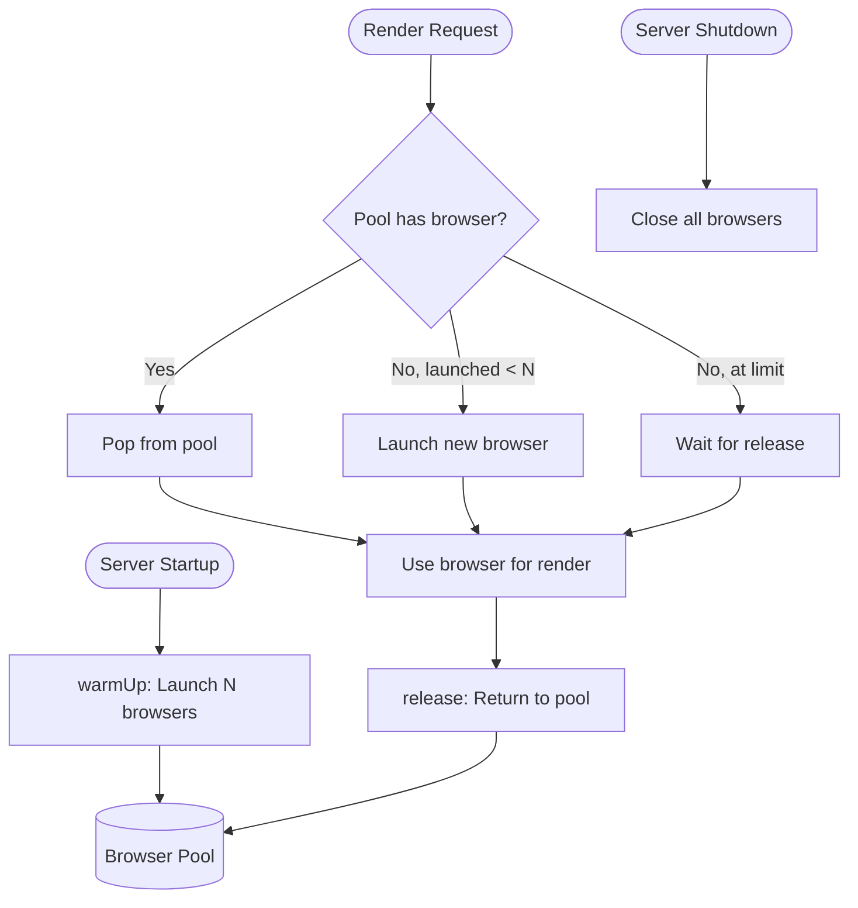

# Mermaid Browser Pool Implementation Plan

> **For Claude:** REQUIRED SUB-SKILL: Use superpowers:executing-plans to implement this plan task-by-task.

**Goal:** Replace mmdc CLI subprocess spawning with a Puppeteer browser pool for faster mermaid rendering.

**Architecture:** Create a pool of pre-warmed Puppeteer browser instances that persist across requests. The renderer acquires a browser from the pool, calls `renderMermaid()`, and releases it back. Pool size matches `QUEUE_MAX_CONCURRENT` for optimal throughput.

**Tech Stack:** `@mermaid-js/mermaid-cli` (programmatic API), `puppeteer` (browser automation), `@pumped-fn/lite` (DI framework), Bun runtime.

**Related ADR:** [adr-20251223-mermaid-browser-pool.md](./adr-20251223-mermaid-browser-pool.md)

---

## Task 1: Add Dependencies

**Files:**
- Modify: `package.json`

**Step 1: Add mermaid-cli and puppeteer dependencies**

```bash
bun add @mermaid-js/mermaid-cli puppeteer
```

**Step 2: Verify installation**

Run: `bun install && ls node_modules/@mermaid-js/mermaid-cli`
Expected: Directory exists with package files

**Step 3: Commit**

```bash
git add package.json bun.lock
git commit -m "chore: add @mermaid-js/mermaid-cli and puppeteer dependencies"
```

---

## Task 2: Add Pool Configuration Tag

**Files:**
- Modify: `src/config/tags.ts`

**Step 1: Write the failing test**

Create test in `src/__tests__/config.test.ts` (add to existing):

```typescript
it("parses BROWSER_POOL_SIZE from env", () => {
  const tags = loadConfigTags({ BROWSER_POOL_SIZE: "5" });
  const poolSizeTag = tags.find(t => t.label === "browser-pool-size");
  expect(poolSizeTag).toBeDefined();
});

it("defaults BROWSER_POOL_SIZE to QUEUE_MAX_CONCURRENT", () => {
  const tags = loadConfigTags({ QUEUE_MAX_CONCURRENT: "8" });
  const poolSizeTag = tags.find(t => t.label === "browser-pool-size");
  expect(poolSizeTag?.value).toBe(8);
});
```

**Step 2: Run test to verify it fails**

Run: `bun test src/__tests__/config.test.ts`
Expected: FAIL - poolSizeTag is undefined

**Step 3: Add browserPoolSizeTag to tags.ts**

In `src/config/tags.ts`, add after `queueConfigTag`:

```typescript
export const browserPoolSizeTag = tag<number>({
  label: "browser-pool-size",
  default: 10,
});
```

**Step 4: Update loadConfigTags to include pool size**

In `loadConfigTags` function, add before the return statement:

```typescript
const browserPoolSize = parseNumber(env, "BROWSER_POOL_SIZE", queueMaxConcurrent);
```

Add to the return array:

```typescript
browserPoolSizeTag(browserPoolSize),
```

**Step 5: Run test to verify it passes**

Run: `bun test src/__tests__/config.test.ts`
Expected: PASS

**Step 6: Commit**

```bash
git add src/config/tags.ts src/__tests__/config.test.ts
git commit -m "feat: add BROWSER_POOL_SIZE config tag"
```

---

## Task 3: Create Browser Pool Atom

**Files:**
- Create: `src/atoms/browser-pool.ts`
- Create: `src/__tests__/browser-pool.test.ts`

**Step 1: Write the failing test for pool creation**

Create `src/__tests__/browser-pool.test.ts`:

```typescript
import { describe, it, expect, mock, beforeEach, afterEach } from "bun:test";
import { createScope } from "@pumped-fn/lite";
import { browserPoolAtom } from "../atoms/browser-pool";
import { browserPoolSizeTag, logLevelTag, nodeEnvTag } from "../config/tags";
import { loggerAtom } from "../atoms/logger";
import { mockLoggerAtom } from "./helpers/mocks";

describe("Browser Pool (c3-113)", () => {
  it("exports browserPoolAtom", async () => {
    expect(browserPoolAtom).toBeDefined();
  });
});
```

**Step 2: Run test to verify it fails**

Run: `bun test src/__tests__/browser-pool.test.ts`
Expected: FAIL - Cannot find module '../atoms/browser-pool'

**Step 3: Create minimal browser-pool.ts**

Create `src/atoms/browser-pool.ts`:

```typescript
import { atom, tags } from "@pumped-fn/lite";
import { browserPoolSizeTag } from "../config/tags";
import { loggerAtom } from "./logger";
import type { Browser } from "puppeteer";

export interface BrowserPool {
  acquire(): Promise<Browser>;
  release(browser: Browser): void;
  warmUp(): Promise<void>;
  shutdown(): Promise<void>;
}

export const browserPoolAtom = atom({
  deps: {
    poolSize: tags.required(browserPoolSizeTag),
    logger: loggerAtom,
  },
  factory: (ctx, { poolSize, logger }): BrowserPool => {
    const pool: Browser[] = [];
    const waiting: Array<(browser: Browser) => void> = [];
    let launched = 0;

    const launchBrowser = async (): Promise<Browser> => {
      const puppeteer = await import("puppeteer");
      const browser = await puppeteer.default.launch({
        headless: true,
        args: ["--no-sandbox", "--disable-setuid-sandbox"],
      });
      logger.debug("Launched new browser instance");
      return browser;
    };

    const acquire = async (): Promise<Browser> => {
      if (pool.length > 0) {
        const browser = pool.pop()!;
        logger.debug({ poolSize: pool.length }, "Acquired browser from pool");
        return browser;
      }

      if (launched < poolSize) {
        launched++;
        const browser = await launchBrowser();
        return browser;
      }

      return new Promise((resolve) => {
        waiting.push(resolve);
        logger.debug({ waitingCount: waiting.length }, "Waiting for browser");
      });
    };

    const release = (browser: Browser): void => {
      if (waiting.length > 0) {
        const next = waiting.shift()!;
        next(browser);
        logger.debug({ waitingCount: waiting.length }, "Handed browser to waiter");
      } else {
        pool.push(browser);
        logger.debug({ poolSize: pool.length }, "Released browser to pool");
      }
    };

    const warmUp = async (): Promise<void> => {
      logger.info({ poolSize }, "Warming up browser pool");
      const browsers = await Promise.all(
        Array.from({ length: poolSize }, () => launchBrowser())
      );
      launched = poolSize;
      pool.push(...browsers);
      logger.info({ poolSize }, "Browser pool warmed up");
    };

    const shutdown = async (): Promise<void> => {
      logger.info({ poolSize: pool.length }, "Shutting down browser pool");
      await Promise.all(pool.map((b) => b.close()));
      pool.length = 0;
      launched = 0;
      logger.info("Browser pool shut down");
    };

    ctx.cleanup(async () => {
      await shutdown();
    });

    return { acquire, release, warmUp, shutdown };
  },
});
```

**Step 4: Run test to verify it passes**

Run: `bun test src/__tests__/browser-pool.test.ts`
Expected: PASS

**Step 5: Commit**

```bash
git add src/atoms/browser-pool.ts src/__tests__/browser-pool.test.ts
git commit -m "feat: add browser pool atom with acquire/release/warmUp/shutdown"
```

---

## Task 4: Add Browser Pool Tests for Acquire/Release

**Files:**
- Modify: `src/__tests__/browser-pool.test.ts`

**Step 1: Add test for acquire returns browser**

Add to `src/__tests__/browser-pool.test.ts`:

```typescript
// Mock puppeteer at top of file
const mockBrowser = {
  close: mock(() => Promise.resolve()),
  newPage: mock(() => Promise.resolve({})),
};

const mockPuppeteer = {
  default: {
    launch: mock(() => Promise.resolve(mockBrowser)),
  },
};

// Mock the import
mock.module("puppeteer", () => mockPuppeteer);

describe("Browser Pool (c3-113)", () => {
  const createTestScope = () => {
    return createScope({
      tags: [
        browserPoolSizeTag(2),
        logLevelTag("info"),
        nodeEnvTag("test"),
      ],
      presets: [[loggerAtom, mockLoggerAtom]] as any,
    });
  };

  beforeEach(() => {
    mockPuppeteer.default.launch.mockClear();
    mockBrowser.close.mockClear();
  });

  it("acquire() launches browser when pool is empty", async () => {
    const scope = createTestScope();
    const pool = await scope.resolve(browserPoolAtom);

    const browser = await pool.acquire();

    expect(browser).toBeDefined();
    expect(mockPuppeteer.default.launch).toHaveBeenCalledTimes(1);

    await scope.dispose();
  });

  it("release() returns browser to pool for reuse", async () => {
    const scope = createTestScope();
    const pool = await scope.resolve(browserPoolAtom);

    const browser1 = await pool.acquire();
    pool.release(browser1);
    const browser2 = await pool.acquire();

    expect(browser1).toBe(browser2);
    expect(mockPuppeteer.default.launch).toHaveBeenCalledTimes(1);

    await scope.dispose();
  });

  it("warmUp() pre-launches poolSize browsers", async () => {
    const scope = createTestScope();
    const pool = await scope.resolve(browserPoolAtom);

    await pool.warmUp();

    expect(mockPuppeteer.default.launch).toHaveBeenCalledTimes(2);

    await scope.dispose();
  });

  it("shutdown() closes all browsers", async () => {
    const scope = createTestScope();
    const pool = await scope.resolve(browserPoolAtom);

    await pool.warmUp();
    await pool.shutdown();

    expect(mockBrowser.close).toHaveBeenCalledTimes(2);

    await scope.dispose();
  });
});
```

**Step 2: Run tests**

Run: `bun test src/__tests__/browser-pool.test.ts`
Expected: PASS

**Step 3: Commit**

```bash
git add src/__tests__/browser-pool.test.ts
git commit -m "test: add browser pool acquire/release/warmUp/shutdown tests"
```

---

## Task 5: Create Mermaid Renderer Atom (New Implementation)

**Files:**
- Create: `src/atoms/mermaid-renderer.ts`
- Create: `src/__tests__/mermaid-renderer.test.ts`

**Step 1: Write the failing test**

Create `src/__tests__/mermaid-renderer.test.ts`:

```typescript
import { describe, it, expect, mock } from "bun:test";
import { createScope } from "@pumped-fn/lite";
import { mermaidRendererAtom } from "../atoms/mermaid-renderer";
import { browserPoolSizeTag, logLevelTag, nodeEnvTag } from "../config/tags";
import { loggerAtom } from "../atoms/logger";
import { mockLoggerAtom } from "./helpers/mocks";

describe("Mermaid Renderer (c3-107 replacement)", () => {
  it("exports mermaidRendererAtom", async () => {
    expect(mermaidRendererAtom).toBeDefined();
  });
});
```

**Step 2: Run test to verify it fails**

Run: `bun test src/__tests__/mermaid-renderer.test.ts`
Expected: FAIL - Cannot find module

**Step 3: Create mermaid-renderer.ts**

Create `src/atoms/mermaid-renderer.ts`:

```typescript
import { atom } from "@pumped-fn/lite";
import { browserPoolAtom, type BrowserPool } from "./browser-pool";
import { loggerAtom } from "./logger";

export class MermaidRenderError extends Error {
  constructor(message: string) {
    super(message);
    this.name = "MermaidRenderError";
  }
}

export interface MermaidRenderer {
  render(source: string, outputType: "svg" | "png"): Promise<Uint8Array>;
}

export const mermaidRendererAtom = atom({
  deps: {
    pool: browserPoolAtom,
    logger: loggerAtom,
  },
  factory: (_ctx, { pool, logger }): MermaidRenderer => {
    return {
      render: async (source: string, outputType: "svg" | "png"): Promise<Uint8Array> => {
        const browser = await pool.acquire();

        try {
          logger.debug({ outputType }, "Rendering mermaid diagram");

          const { renderMermaid } = await import("@mermaid-js/mermaid-cli");

          const result = await renderMermaid(browser, source, outputType, {
            backgroundColor: "transparent",
          });

          logger.debug("Mermaid render complete");

          return result.data;
        } catch (error) {
          logger.error({ error }, "Mermaid render failed");
          throw new MermaidRenderError(
            error instanceof Error ? error.message : String(error)
          );
        } finally {
          pool.release(browser);
        }
      },
    };
  },
});
```

**Step 4: Run test to verify it passes**

Run: `bun test src/__tests__/mermaid-renderer.test.ts`
Expected: PASS

**Step 5: Commit**

```bash
git add src/atoms/mermaid-renderer.ts src/__tests__/mermaid-renderer.test.ts
git commit -m "feat: add mermaid renderer using browser pool and renderMermaid API"
```

---

## Task 6: Update Renderer Service to Use Pool for Mermaid

**Files:**
- Modify: `src/atoms/renderer.ts`
- Modify: `src/__tests__/renderer.test.ts`

**Step 1: Update renderer.ts to use mermaidRendererAtom for mermaid format**

Modify `src/atoms/renderer.ts`:

```typescript
import { service, tags, type Lite } from "@pumped-fn/lite";
import { loggerAtom } from "./logger";
import { spawnFnTag } from "../config/tags";
import { mermaidRendererAtom, MermaidRenderError } from "./mermaid-renderer";
import { tmpdir } from "os";
import { join } from "path";
import { randomUUID } from "crypto";

export class RenderError extends Error {
  constructor(message: string) {
    super(message);
    this.name = "RenderError";
  }
}

const readStream = async (stream: ReadableStream): Promise<string> => {
  const reader = stream.getReader();
  let result = "";
  const decoder = new TextDecoder();
  while (true) {
    const { done, value } = await reader.read();
    if (done) break;
    result += decoder.decode(value);
  }
  return result;
};

export interface RendererService extends Lite.ServiceMethods {
  render: (
    ctx: Lite.ExecutionContext,
    source: string,
    format: "mermaid" | "d2",
    outputType: "svg" | "png"
  ) => Promise<Uint8Array>;
}

export const rendererService = service({
  deps: {
    logger: loggerAtom,
    spawn: tags.required(spawnFnTag),
    mermaidRenderer: mermaidRendererAtom,
  },
  factory: (_ctx, { logger, spawn, mermaidRenderer }): RendererService => ({
    render: async (
      _ctx: Lite.ExecutionContext,
      source: string,
      format: "mermaid" | "d2",
      outputType: "svg" | "png"
    ): Promise<Uint8Array> => {
      // Use browser pool for mermaid
      if (format === "mermaid") {
        try {
          return await mermaidRenderer.render(source, outputType);
        } catch (error) {
          if (error instanceof MermaidRenderError) {
            throw new RenderError(error.message);
          }
          throw error;
        }
      }

      // Keep subprocess approach for d2
      const id = randomUUID();
      const tempDir = tmpdir();
      const inputPath = join(tempDir, `diashort-${id}.d2`);
      const outputPath = join(tempDir, `diashort-${id}.${outputType}`);

      try {
        await Bun.write(inputPath, source);
        logger.debug({ inputPath, format }, "Created temp input file");

        const cmd = ["d2", inputPath, outputPath];
        logger.debug({ cmd }, "Spawning renderer");

        let proc;
        try {
          proc = spawn(cmd, {
            stdout: "pipe",
            stderr: "pipe",
          });
        } catch (e: any) {
          throw new RenderError(`Failed to spawn renderer: ${e.message}`);
        }

        const exitCode = await proc.exited;

        if (exitCode !== 0) {
          const stderr = await readStream(proc.stderr);
          logger.error({ exitCode, stderr }, "Renderer failed");
          throw new RenderError(`Renderer failed with exit code ${exitCode}: ${stderr}`);
        }

        logger.debug({ outputPath }, "Renderer finished, reading output");

        const output = Bun.file(outputPath);
        const exists = await output.exists();
        if (!exists) {
          throw new RenderError("Output file not generated");
        }

        const bytes = await output.bytes();
        return bytes;
      } catch (error) {
        logger.error({ error }, "Render error");
        if (error instanceof RenderError) throw error;
        throw new RenderError(error instanceof Error ? error.message : String(error));
      } finally {
        try {
          const inputExists = await Bun.file(inputPath).exists();
          if (inputExists) await Bun.file(inputPath).delete();

          const outputExists = await Bun.file(outputPath).exists();
          if (outputExists) await Bun.file(outputPath).delete();

          logger.debug({ inputPath, outputPath }, "Cleaned up temp files");
        } catch (cleanupError) {
          logger.warn({ cleanupError }, "Failed to cleanup temp files");
        }
      }
    },
  }),
});
```

**Step 2: Update renderer tests to mock mermaidRendererAtom**

Update `src/__tests__/renderer.test.ts` to add mermaid renderer mock to the scope setup.

**Step 3: Run all tests**

Run: `bun test`
Expected: PASS

**Step 4: Commit**

```bash
git add src/atoms/renderer.ts src/__tests__/renderer.test.ts
git commit -m "feat: use browser pool for mermaid rendering, keep d2 subprocess"
```

---

## Task 7: Add Pool Warm-Up at Server Startup

**Files:**
- Modify: `src/server.ts`

**Step 1: Import browserPoolAtom**

Add to imports in `src/server.ts`:

```typescript
import { browserPoolAtom } from "./atoms/browser-pool";
```

**Step 2: Warm up pool before starting server**

In `startServer()`, after resolving logger and before `Bun.serve()`:

```typescript
// Warm up browser pool for fast first requests
const browserPool = await scope.resolve(browserPoolAtom);
logger.info("Warming up browser pool...");
await browserPool.warmUp();
logger.info("Browser pool ready");
```

**Step 3: Run server manually to verify startup**

Run: `bun run src/server.ts`
Expected: Logs show "Warming up browser pool..." then "Browser pool ready"

**Step 4: Commit**

```bash
git add src/server.ts
git commit -m "feat: warm up browser pool at server startup"
```

---

## Task 8: Update Integration Tests

**Files:**
- Modify: `src/__tests__/integration.test.ts`

**Step 1: Verify existing tests still pass**

Run: `bun test src/__tests__/integration.test.ts`

**Step 2: Add performance assertion (optional)**

Add test that first mermaid render after warmup completes quickly:

```typescript
it("first mermaid render completes in <2s after pool warmup", async () => {
  // Pool is warmed up in beforeAll
  const start = Date.now();

  const response = await fetch(`${baseUrl}/render`, {
    method: "POST",
    headers: { "Content-Type": "application/json" },
    body: JSON.stringify({
      source: "graph TD; A-->B;",
      format: "mermaid",
      outputType: "svg",
    }),
  });

  const elapsed = Date.now() - start;
  expect(response.ok).toBe(true);
  expect(elapsed).toBeLessThan(2000);
});
```

**Step 3: Run integration tests**

Run: `bun test src/__tests__/integration.test.ts`
Expected: PASS

**Step 4: Commit**

```bash
git add src/__tests__/integration.test.ts
git commit -m "test: add integration test for pool performance"
```

---

## Task 9: Create C3 Documentation for Browser Pool

**Files:**
- Create: `.c3/c3-1-api-server/c3-113-browser-pool.md`

**Step 1: Create component documentation**

Create `.c3/c3-1-api-server/c3-113-browser-pool.md`:

```markdown
---
id: c3-113
c3-version: 3
title: Browser Pool
type: component
parent: c3-1
summary: >
  Manages a pool of Puppeteer browser instances for mermaid rendering.
  Pre-warms at startup, provides acquire/release for request handling.
---

# Browser Pool

## Contract

From Container (c3-1): "Manage pool of Puppeteer browser instances for mermaid rendering"

## How It Works

### Flow



### Dependencies

| Dependency | Component | Purpose |
|------------|-----------|---------|
| Config | c3-108 | Get BROWSER_POOL_SIZE |
| Logger | c3-109 | Log pool operations |

### Configuration

| Setting | Environment Variable | Default | Purpose |
|---------|---------------------|---------|---------|
| Pool Size | BROWSER_POOL_SIZE | QUEUE_MAX_CONCURRENT | Number of browser instances |

## Edge Cases

| Scenario | Behavior | Rationale |
|----------|----------|-----------|
| Browser crash during render | Error propagates, browser not returned | Caller handles retry |
| Pool exhausted | New requests wait for release | Backpressure via queue |
| Shutdown with active renders | Wait for cleanup, then close | Graceful shutdown |

## References

- src/atoms/browser-pool.ts - Implementation
- [ADR: Mermaid Browser Pool](../adr/adr-20251223-mermaid-browser-pool.md)
```

**Step 2: Commit**

```bash
git add .c3/c3-1-api-server/c3-113-browser-pool.md
git commit -m "docs: add C3 documentation for browser pool component"
```

---

## Task 10: Update Renderer C3 Documentation

**Files:**
- Modify: `.c3/c3-1-api-server/c3-107-renderer.md`

**Step 1: Update to reflect new architecture**

Update the diagram and dependencies section to show:
- Mermaid: Uses Browser Pool (c3-113) → renderMermaid API
- D2: Still uses subprocess spawn

**Step 2: Commit**

```bash
git add .c3/c3-1-api-server/c3-107-renderer.md
git commit -m "docs: update renderer C3 docs for browser pool integration"
```

---

## Task 11: Update TOC and Mark ADR Accepted

**Files:**
- Modify: `.c3/TOC.md`
- Modify: `.c3/adr/adr-20251223-mermaid-browser-pool.md`

**Step 1: Add c3-113 to TOC**

In `.c3/TOC.md`, add to the c3-1 Components section:

```markdown
| [c3-113](c3-1-api-server/c3-113-browser-pool.md) | Browser Pool | Puppeteer instance pool for mermaid |
```

**Step 2: Update ADR status to accepted**

Change status in ADR from `proposed` to `accepted`.

**Step 3: Commit**

```bash
git add .c3/TOC.md .c3/adr/adr-20251223-mermaid-browser-pool.md
git commit -m "docs: add browser pool to TOC, mark ADR as accepted"
```

---

## Task 12: Final Verification

**Step 1: Run all tests**

Run: `bun test`
Expected: All tests PASS

**Step 2: Start server and verify warm-up**

Run: `bun run src/server.ts`
Expected:
- "Warming up browser pool..."
- "Browser pool ready"
- "Server started"

**Step 3: Test first render performance**

```bash
time curl -X POST http://localhost:3000/render \
  -H "Content-Type: application/json" \
  -d '{"source": "graph TD; A-->B;", "format": "mermaid", "outputType": "svg"}'
```

Expected: Response in <500ms (pool already warm)

**Step 4: Final commit**

```bash
git add -A
git commit -m "feat: complete mermaid browser pool implementation

- Add browser pool atom with acquire/release/warmUp/shutdown
- Create mermaid renderer using renderMermaid API
- Update renderer service to use pool for mermaid
- Warm up pool at server startup
- Add C3 documentation for browser pool component
- Update tests for new architecture

Closes: adr-20251223-mermaid-browser-pool"
```

---

## Verification Checklist

| Criterion | How to Verify |
|-----------|---------------|
| First mermaid render <500ms | Time first request after startup |
| Pool reuse working | Check logs show "Acquired browser from pool" |
| D2 still works | Test d2 render request |
| Graceful shutdown | SIGTERM closes browsers cleanly |
| Tests pass | `bun test` all green |
