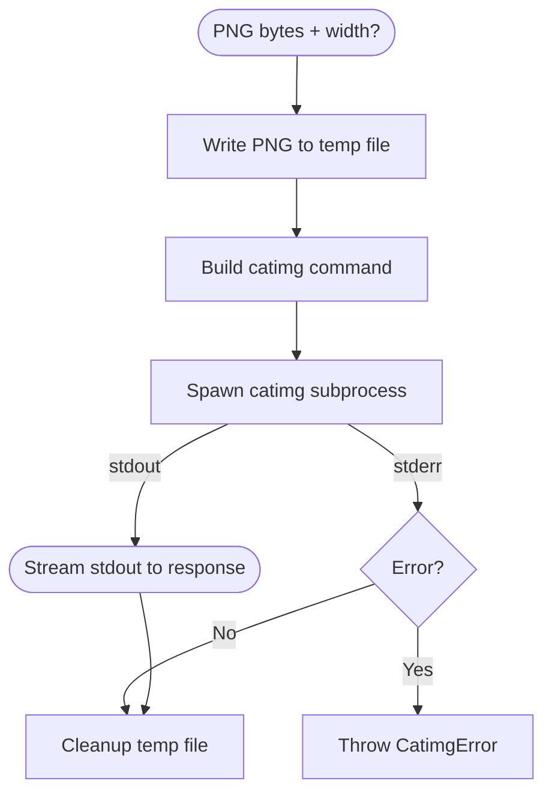

# Add catimg Terminal Output for CLI Display

## Status
**Proposed** - 2024-12-24

## Problem/Requirement

Users want to display diagrams directly in their terminal without opening a browser or image viewer. The use case is:
- Render diagram (mermaid/d2) to PNG
- Convert PNG to terminal-displayable output using catimg
- Stream the result so users can pipe it or display inline

This enables workflows like:
```bash
curl -X POST http://localhost:3000/render/terminal \
  -d '{"source": "graph TD; A-->B;", "format": "mermaid"}'
# Output: ANSI/Unicode art displayed in terminal
```

## Exploration Journey

**Initial hypothesis:** Add `catimg` as a new `outputType` alongside `svg` and `png`.

**Explored:**
- c3-107 (Renderer) - Current pipeline: format → renderer → bytes
- c3-103 (Render Flow) - Current flow: render → cache → shortlink
- c3-105 (Cache) - Stores binary output for retrieval via shortlink
- Current outputType handling - Validation, content-type mapping, caching

**Discovered:**
- catimg output is fundamentally different: text/ANSI stream vs binary bytes
- Caching catimg output is questionable (terminal-dependent, width-sensitive)
- Shortlink retrieval doesn't make sense for terminal output
- Streaming response is the natural fit (not store-and-retrieve)

## Solution

**Add a new streaming endpoint** rather than extending outputType:

```
POST /render/terminal
```

**Why not extend outputType:**
1. catimg output is terminal-dependent (width, color support)
2. Caching makes less sense (same diagram looks different on different terminals)
3. Shortlink retrieval is awkward (what content-type? how to display?)
4. Response model is streaming, not JSON with shortlink

**Pipeline:**
```
mermaid/d2 source → Renderer (PNG) → catimg CLI → Stream response
```

## Design Decisions

### 1. New Endpoint vs New OutputType

**Decision:** New endpoint `/render/terminal`

**Rationale:**
- Keeps existing `/render` semantics clean (shortlink-based)
- Streaming response naturally fits new endpoint
- No caching overhead for terminal output
- Clear separation of concerns

### 2. catimg as External Dependency

**Decision:** Spawn catimg CLI (like d2)

**Rationale:**
- catimg is a well-maintained tool ([posva/catimg](https://github.com/posva/catimg))
- No Node.js equivalent with same quality
- Consistent with existing d2 subprocess pattern
- Easy to install: `apt install catimg` or build from source

### 3. Response Format

**Decision:** Stream raw catimg output with `Content-Type: text/plain; charset=utf-8`

**Rationale:**
- ANSI escape codes work directly in terminal
- Users can pipe: `curl ... | cat`
- No JSON wrapper needed for streaming

### 4. Sync-Only Mode

**Decision:** Only sync mode (no async/jobs)

**Rationale:**
- Streaming is inherently synchronous
- Job polling doesn't make sense for terminal output
- Keep it simple: request → stream → done

### 5. Optional Width Parameter

**Decision:** Accept optional `width` parameter, default to catimg's default

**Rationale:**
- Terminal widths vary
- catimg supports `-w WIDTH` flag
- Let users control output size

## Changes Across Layers

### Context Level (c3-0)
- New external dependency: catimg CLI
- Update system architecture diagram to show catimg

### Container Level (c3-1)
- New endpoint: `POST /render/terminal`
- New component: Terminal Renderer (c3-115)

### Component Level

| Component | Change |
|-----------|--------|
| c3-101 (Bun Server) | Add `/render/terminal` route with streaming response |
| c3-107 (Renderer) | No change - still produces PNG |
| c3-115 (NEW) | Terminal Renderer - orchestrates PNG → catimg pipeline |
| c3-108 (Config) | Optional: CATIMG_PATH env var for custom catimg location |

## API Contract

### Request

```http
POST /render/terminal
Content-Type: application/json

{
  "source": "graph TD; A-->B;",
  "format": "mermaid",  // or "d2"
  "width": 80           // optional, terminal width
}
```

### Response (Streaming)

```http
HTTP/1.1 200 OK
Content-Type: text/plain; charset=utf-8
Transfer-Encoding: chunked

[ANSI escape codes and Unicode characters representing the diagram]
```

### Errors

| Error | Status | When |
|-------|--------|------|
| ValidationError | 400 | Invalid source/format |
| RenderError | 500 | PNG rendering fails |
| CatimgError | 500 | catimg subprocess fails |
| BackpressureError | 429 | Queue full |

## Verification

- [ ] catimg CLI available in container/environment
- [ ] PNG rendering still works (existing tests)
- [ ] Terminal output displays correctly in common terminals (bash, zsh, iTerm, etc.)
- [ ] Streaming response works with curl
- [ ] Width parameter affects output
- [ ] Proper error handling for missing catimg

## Implementation Plan

### Code Changes

| Layer Change | Code Location | Action | Details |
|--------------|---------------|--------|---------|
| Config | src/config/tags.ts | Add tag | `catimgPathTag` for custom catimg path (optional) |
| Terminal Renderer | src/atoms/terminal-renderer.ts | Create | PNG bytes → catimg → stream |
| Server Route | src/server.ts | Add route | `POST /render/terminal` with streaming |
| Render Terminal Flow | src/flows/render-terminal.ts | Create | Orchestrate: validate → render PNG → catimg → stream |

### New Component: Terminal Renderer (c3-115)



### Acceptance Criteria

| Verification Item | Criterion | How to Test |
|-------------------|-----------|-------------|
| Basic rendering | Mermaid diagram renders to terminal | curl POST, observe output |
| D2 support | D2 diagram renders to terminal | curl POST with format=d2 |
| Width control | Width parameter affects output | Compare outputs with different widths |
| Error handling | Missing catimg returns 500 | Rename catimg, observe error |
| Streaming | Large diagram streams progressively | Watch curl output during render |

## Related

- [c3-107 Renderer](../c3-1-api-server/c3-107-renderer.md) - Existing renderer (produces PNG)
- [c3-101 Bun Server](../c3-1-api-server/c3-101-bun-server.md) - Route handling
- [catimg GitHub](https://github.com/posva/catimg) - External tool documentation
