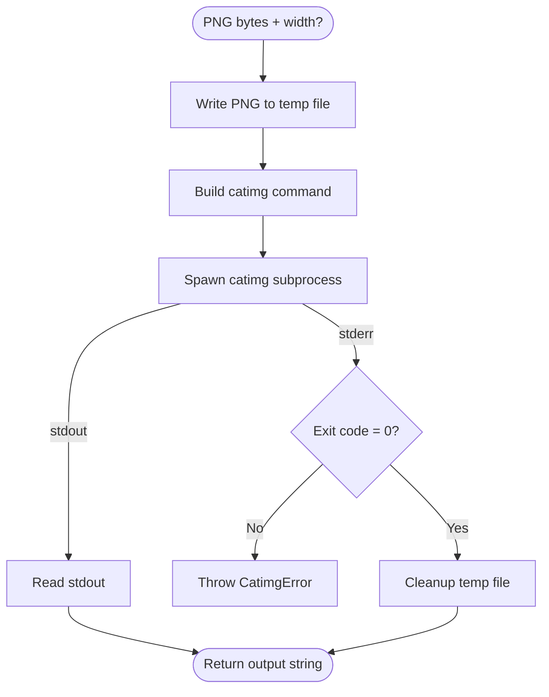

# catimg Terminal Output Implementation Plan

> **For Claude:** REQUIRED SUB-SKILL: Use superpowers:executing-plans to implement this plan task-by-task.

**Goal:** Add `/render/terminal` endpoint that renders diagrams and streams catimg output for terminal display.

**Architecture:** New streaming endpoint separate from existing shortlink flow. Pipeline: render PNG → write temp file → spawn catimg → stream stdout to response. Uses queue for backpressure control.

**Tech Stack:** Bun, @pumped-fn/lite, catimg CLI (external)

---

## Task 1: Add catimgPathTag to Config

**Files:**
- Modify: `src/config/tags.ts`
- Test: `src/__tests__/config.test.ts`

**Step 1: Write the failing test**

Add to `src/__tests__/config.test.ts` inside `describe("loadConfigTags")`:

```typescript
it("parses CATIMG_PATH from env", () => {
  const env = {
    CATIMG_PATH: "/usr/local/bin/catimg",
  };

  const tagged = loadConfigTags(env);
  expect(catimgPathTag.find(tagged)).toBe("/usr/local/bin/catimg");
});

it("defaults CATIMG_PATH to 'catimg'", () => {
  const env = {};

  const tagged = loadConfigTags(env);
  expect(catimgPathTag.find(tagged)).toBe("catimg");
});
```

**Step 2: Run test to verify it fails**

Run: `bun test src/__tests__/config.test.ts`
Expected: FAIL with "catimgPathTag is not defined"

**Step 3: Write implementation**

In `src/config/tags.ts`:

1. Add tag definition after `baseUrlTag`:
```typescript
export const catimgPathTag = tag<string>({
  label: "catimg-path",
  default: "catimg",
});
```

2. In `loadConfigTags`, add before the return statement:
```typescript
const catimgPath = getEnv(env, "CATIMG_PATH") ?? "catimg";
```

3. Add to the return array:
```typescript
catimgPathTag(catimgPath),
```

**Step 4: Update test imports**

Add `catimgPathTag` to the import in config.test.ts.

**Step 5: Run test to verify it passes**

Run: `bun test src/__tests__/config.test.ts`
Expected: PASS

**Step 6: Commit**

```bash
git add src/config/tags.ts src/__tests__/config.test.ts
git commit -m "feat(config): add CATIMG_PATH environment variable"
```

---

## Task 2: Create CatimgError Class

**Files:**
- Create: `src/errors/catimg-error.ts`
- Test: `src/__tests__/catimg-error.test.ts`

**Step 1: Write the failing test**

Create `src/__tests__/catimg-error.test.ts`:

```typescript
import { describe, it, expect } from "bun:test";
import { CatimgError } from "../errors/catimg-error";

describe("CatimgError", () => {
  it("has correct name and message", () => {
    const error = new CatimgError("catimg failed");
    expect(error.name).toBe("CatimgError");
    expect(error.message).toBe("catimg failed");
  });

  it("is an instance of Error", () => {
    const error = new CatimgError("test");
    expect(error).toBeInstanceOf(Error);
  });
});
```

**Step 2: Run test to verify it fails**

Run: `bun test src/__tests__/catimg-error.test.ts`
Expected: FAIL with "Cannot find module"

**Step 3: Write implementation**

Create `src/errors/catimg-error.ts`:

```typescript
export class CatimgError extends Error {
  constructor(message: string) {
    super(message);
    this.name = "CatimgError";
  }
}
```

**Step 4: Run test to verify it passes**

Run: `bun test src/__tests__/catimg-error.test.ts`
Expected: PASS

**Step 5: Commit**

```bash
git add src/errors/catimg-error.ts src/__tests__/catimg-error.test.ts
git commit -m "feat: add CatimgError class"
```

---

## Task 3: Create Terminal Renderer Atom

**Files:**
- Create: `src/atoms/terminal-renderer.ts`
- Test: `src/__tests__/terminal-renderer.test.ts`

**Step 1: Write the failing test**

Create `src/__tests__/terminal-renderer.test.ts`:

```typescript
import { describe, it, expect, mock } from "bun:test";
import { createScope, preset } from "@pumped-fn/lite";
import { terminalRendererAtom, type TerminalRendererResult } from "../atoms/terminal-renderer";
import { mockLoggerAtom } from "./helpers/mocks";
import { loggerAtom } from "../atoms/logger";
import { logLevelTag, nodeEnvTag, spawnFnTag, catimgPathTag, type SpawnFn } from "../config/tags";

describe("Terminal Renderer", () => {
  const createTestScope = (mockSpawn: any) => {
    return createScope({
      tags: [
        logLevelTag("error"),
        nodeEnvTag("test"),
        spawnFnTag(mockSpawn as unknown as SpawnFn),
        catimgPathTag("catimg"),
      ],
      presets: [preset(loggerAtom, mockLoggerAtom)],
    });
  };

  it("converts PNG bytes to terminal output via catimg", async () => {
    const mockOutput = "\x1b[38;2;255;0;0m█\x1b[0m"; // ANSI red block
    let capturedCmd: string[] = [];
    let capturedInputPath: string = "";

    const mockSpawn = mock((cmd: string[], _opts?: unknown) => {
      capturedCmd = cmd;
      capturedInputPath = cmd[cmd.length - 1] || "";

      return {
        exited: Promise.resolve(0),
        exitCode: 0,
        stdout: new ReadableStream({
          start(controller) {
            controller.enqueue(new TextEncoder().encode(mockOutput));
            controller.close();
          }
        }),
        stderr: new ReadableStream({
          start(controller) { controller.close(); }
        }),
      };
    });

    const scope = createTestScope(mockSpawn);
    const terminalRenderer = await scope.resolve(terminalRendererAtom);

    const pngBytes = new Uint8Array([0x89, 0x50, 0x4E, 0x47]); // PNG magic bytes
    const result = await terminalRenderer.render(pngBytes);

    expect(capturedCmd[0]).toBe("catimg");
    expect(capturedInputPath).toContain(".png");
    expect(result.output).toBe(mockOutput);

    await scope.dispose();
  });

  it("passes width parameter to catimg", async () => {
    let capturedCmd: string[] = [];

    const mockSpawn = mock((cmd: string[], _opts?: unknown) => {
      capturedCmd = cmd;
      return {
        exited: Promise.resolve(0),
        exitCode: 0,
        stdout: new ReadableStream({
          start(controller) {
            controller.enqueue(new TextEncoder().encode("output"));
            controller.close();
          }
        }),
        stderr: new ReadableStream({
          start(controller) { controller.close(); }
        }),
      };
    });

    const scope = createTestScope(mockSpawn);
    const terminalRenderer = await scope.resolve(terminalRendererAtom);

    const pngBytes = new Uint8Array([0x89, 0x50, 0x4E, 0x47]);
    await terminalRenderer.render(pngBytes, { width: 80 });

    expect(capturedCmd).toContain("-w");
    expect(capturedCmd).toContain("80");

    await scope.dispose();
  });

  it("throws CatimgError on non-zero exit code", async () => {
    const mockSpawn = mock(() => ({
      exited: Promise.resolve(1),
      exitCode: 1,
      stdout: new ReadableStream({
        start(controller) { controller.close(); }
      }),
      stderr: new ReadableStream({
        start(controller) {
          controller.enqueue(new TextEncoder().encode("catimg: error"));
          controller.close();
        }
      }),
    }));

    const scope = createTestScope(mockSpawn);
    const terminalRenderer = await scope.resolve(terminalRendererAtom);

    const pngBytes = new Uint8Array([0x89, 0x50, 0x4E, 0x47]);

    await expect(terminalRenderer.render(pngBytes)).rejects.toThrow("catimg");

    await scope.dispose();
  });
});
```

**Step 2: Run test to verify it fails**

Run: `bun test src/__tests__/terminal-renderer.test.ts`
Expected: FAIL with "Cannot find module"

**Step 3: Write implementation**

Create `src/atoms/terminal-renderer.ts`:

```typescript
import { atom, tags, type Lite } from "@pumped-fn/lite";
import { loggerAtom } from "./logger";
import { spawnFnTag, catimgPathTag } from "../config/tags";
import { CatimgError } from "../errors/catimg-error";
import { tmpdir } from "os";
import { join } from "path";
import { randomUUID } from "crypto";

export interface TerminalRendererOptions {
  width?: number;
}

export interface TerminalRendererResult {
  output: string;
}

export interface TerminalRenderer extends Lite.ServiceMethods {
  render: (pngBytes: Uint8Array, options?: TerminalRendererOptions) => Promise<TerminalRendererResult>;
}

const readStream = async (stream: ReadableStream): Promise<string> => {
  const reader = stream.getReader();
  let result = "";
  const decoder = new TextDecoder();
  while (true) {
    const { done, value } = await reader.read();
    if (done) break;
    result += decoder.decode(value);
  }
  return result;
};

export const terminalRendererAtom = atom({
  deps: {
    logger: loggerAtom,
    spawn: tags.required(spawnFnTag),
    catimgPath: tags.required(catimgPathTag),
  },
  factory: (_ctx, { logger, spawn, catimgPath }): TerminalRenderer => ({
    render: async (pngBytes: Uint8Array, options?: TerminalRendererOptions): Promise<TerminalRendererResult> => {
      const id = randomUUID();
      const tempDir = tmpdir();
      const inputPath = join(tempDir, `diashort-catimg-${id}.png`);

      try {
        // Write PNG to temp file
        await Bun.write(inputPath, pngBytes);
        logger.debug({ inputPath }, "Wrote PNG to temp file for catimg");

        // Build catimg command
        const cmd: string[] = [catimgPath];
        if (options?.width) {
          cmd.push("-w", String(options.width));
        }
        cmd.push(inputPath);

        logger.debug({ cmd }, "Spawning catimg");

        let proc;
        try {
          proc = spawn(cmd, {
            stdout: "pipe",
            stderr: "pipe",
          });
        } catch (e: any) {
          throw new CatimgError(`Failed to spawn catimg: ${e.message}`);
        }

        const exitCode = await proc.exited;

        if (exitCode !== 0) {
          const stderr = await readStream(proc.stderr);
          logger.error({ exitCode, stderr }, "catimg failed");
          throw new CatimgError(`catimg failed with exit code ${exitCode}: ${stderr}`);
        }

        const output = await readStream(proc.stdout);
        logger.debug({ outputLength: output.length }, "catimg finished");

        return { output };
      } finally {
        // Cleanup temp file
        try {
          const exists = await Bun.file(inputPath).exists();
          if (exists) await Bun.file(inputPath).delete();
          logger.debug({ inputPath }, "Cleaned up catimg temp file");
        } catch (cleanupError) {
          logger.warn({ cleanupError }, "Failed to cleanup catimg temp file");
        }
      }
    },
  }),
});
```

**Step 4: Run test to verify it passes**

Run: `bun test src/__tests__/terminal-renderer.test.ts`
Expected: PASS

**Step 5: Commit**

```bash
git add src/atoms/terminal-renderer.ts src/__tests__/terminal-renderer.test.ts
git commit -m "feat: add terminal renderer atom for catimg conversion"
```

---

## Task 4: Create Terminal Render Flow

**Files:**
- Create: `src/flows/render-terminal.ts`
- Test: `src/__tests__/render-terminal.test.ts`

**Step 1: Write the failing test**

Create `src/__tests__/render-terminal.test.ts`:

```typescript
import { describe, it, expect, beforeEach, afterEach } from "bun:test";
import { createScope, preset, atom } from "@pumped-fn/lite";
import { renderTerminalFlow, TerminalRenderInput } from "../flows/render-terminal";
import { mockLoggerAtom } from "./helpers/mocks";
import { loggerAtom } from "../atoms/logger";
import { rendererService, type RendererService } from "../atoms/renderer";
import { terminalRendererAtom, type TerminalRenderer } from "../atoms/terminal-renderer";
import { queueAtom } from "../atoms/queue";
import { logLevelTag, nodeEnvTag, queueConfigTag } from "../config/tags";

describe("render-terminal-flow", () => {
  const createTestScope = (
    mockRenderer: Partial<RendererService>,
    mockTerminalRenderer: Partial<TerminalRenderer>
  ) => {
    const mockRendererAtom = atom({
      factory: () => mockRenderer as RendererService,
    });

    const mockTerminalRendererAtom = atom({
      factory: () => mockTerminalRenderer as TerminalRenderer,
    });

    return createScope({
      tags: [
        logLevelTag("error"),
        nodeEnvTag("test"),
        queueConfigTag({ maxConcurrent: 10, maxWaiting: 50 }),
      ],
      presets: [
        preset(loggerAtom, mockLoggerAtom),
        preset(rendererService, mockRendererAtom),
        preset(terminalRendererAtom, mockTerminalRendererAtom),
      ],
    });
  };

  it("renders mermaid to terminal output", async () => {
    const mockPng = new Uint8Array([0x89, 0x50, 0x4E, 0x47]);
    const mockTerminalOutput = "\x1b[38;2;255;0;0m█\x1b[0m";

    const mockRenderer = {
      render: async () => mockPng,
    };

    const mockTerminalRenderer = {
      render: async () => ({ output: mockTerminalOutput }),
    };

    const scope = createTestScope(mockRenderer, mockTerminalRenderer);
    const ctx = scope.createContext();

    const result = await ctx.exec({
      flow: renderTerminalFlow,
      rawInput: {
        source: "graph TD; A-->B;",
        format: "mermaid",
      },
    });

    expect(result.output).toBe(mockTerminalOutput);

    await ctx.close();
    await scope.dispose();
  });

  it("passes width option to terminal renderer", async () => {
    let capturedWidth: number | undefined;

    const mockRenderer = {
      render: async () => new Uint8Array([0x89, 0x50, 0x4E, 0x47]),
    };

    const mockTerminalRenderer = {
      render: async (_bytes: Uint8Array, options?: { width?: number }) => {
        capturedWidth = options?.width;
        return { output: "output" };
      },
    };

    const scope = createTestScope(mockRenderer, mockTerminalRenderer);
    const ctx = scope.createContext();

    await ctx.exec({
      flow: renderTerminalFlow,
      rawInput: {
        source: "graph TD; A-->B;",
        format: "mermaid",
        width: 120,
      },
    });

    expect(capturedWidth).toBe(120);

    await ctx.close();
    await scope.dispose();
  });

  it("throws ValidationError for invalid format", async () => {
    const scope = createTestScope({}, {});
    const ctx = scope.createContext();

    await expect(
      ctx.exec({
        flow: renderTerminalFlow,
        rawInput: {
          source: "test",
          format: "invalid",
        },
      })
    ).rejects.toThrow("format must be 'mermaid' or 'd2'");

    await ctx.close();
    await scope.dispose();
  });
});
```

**Step 2: Run test to verify it fails**

Run: `bun test src/__tests__/render-terminal.test.ts`
Expected: FAIL with "Cannot find module"

**Step 3: Write implementation**

Create `src/flows/render-terminal.ts`:

```typescript
import { flow } from "@pumped-fn/lite";
import { queueAtom } from "../atoms/queue";
import { rendererService } from "../atoms/renderer";
import { terminalRendererAtom } from "../atoms/terminal-renderer";
import { loggerAtom } from "../atoms/logger";
import { ValidationError } from "./render";

export type DiagramFormat = "mermaid" | "d2";

export interface TerminalRenderInput {
  source: string;
  format: DiagramFormat;
  width?: number;
}

export interface TerminalRenderResult {
  output: string;
}

function parseTerminalRenderInput(body: unknown): TerminalRenderInput {
  if (!body || typeof body !== "object") {
    throw new ValidationError("Request body must be a JSON object");
  }

  const obj = body as Record<string, unknown>;

  if (typeof obj.source !== "string" || obj.source.trim() === "") {
    throw new ValidationError("source is required and must be a non-empty string");
  }

  const format = obj.format;
  if (format !== "mermaid" && format !== "d2") {
    throw new ValidationError("format must be 'mermaid' or 'd2'");
  }

  let width: number | undefined;
  if (obj.width !== undefined) {
    if (typeof obj.width !== "number" || obj.width <= 0) {
      throw new ValidationError("width must be a positive number");
    }
    width = obj.width;
  }

  return {
    source: obj.source,
    format,
    width,
  };
}

export const renderTerminalFlow = flow({
  name: "render-terminal",
  deps: {
    queue: queueAtom,
    renderer: rendererService,
    terminalRenderer: terminalRendererAtom,
    logger: loggerAtom,
  },
  parse: parseTerminalRenderInput,
  factory: async (ctx, { queue, renderer, terminalRenderer, logger }): Promise<TerminalRenderResult> => {
    const { input } = ctx;

    logger.debug({ format: input.format, width: input.width }, "Starting terminal render");

    // Acquire queue slot for backpressure
    const release = await queue.acquire();
    ctx.onClose(() => release());

    // Render to PNG first
    const pngBytes = await ctx.exec({
      fn: renderer.render,
      params: [input.source, input.format, "png"],
      name: "renderer.render",
    });

    logger.debug({ pngSize: pngBytes.length }, "PNG rendered, converting to terminal output");

    // Convert PNG to terminal output via catimg
    const result = await terminalRenderer.render(pngBytes, { width: input.width });

    logger.info({ format: input.format, outputLength: result.output.length }, "Terminal render complete");

    return result;
  },
});
```

**Step 4: Run test to verify it passes**

Run: `bun test src/__tests__/render-terminal.test.ts`
Expected: PASS

**Step 5: Commit**

```bash
git add src/flows/render-terminal.ts src/__tests__/render-terminal.test.ts
git commit -m "feat: add terminal render flow for catimg output"
```

---

## Task 5: Add /render/terminal Route to Server

**Files:**
- Modify: `src/server.ts`

**Step 1: Add import**

Add to imports at top of `src/server.ts`:

```typescript
import { renderTerminalFlow } from "./flows/render-terminal";
import { CatimgError } from "./errors/catimg-error";
```

**Step 2: Add error mapping for CatimgError**

In `mapErrorToResponse` function, add before the final `else` block:

```typescript
if (error instanceof CatimgError) {
  return new Response(JSON.stringify({ error: error.message }), {
    status: 500,
    headers: { "Content-Type": "application/json" },
  });
}
```

**Step 3: Add route handler**

Add the new route after the existing `/render` route handler (around line 207):

```typescript
if (req.method === "POST" && url.pathname === "/render/terminal") {
  if (authConfig.enabled && authConfig.credentials) {
    const authHeader = req.headers.get("authorization");
    checkBasicAuth(authHeader, authConfig.credentials.username, authConfig.credentials.password);
  }

  const body = await req.json();

  const ctx = scope.createContext({ tags: [requestIdTag(requestId)] });

  try {
    const result = await ctx.exec({
      flow: renderTerminalFlow,
      rawInput: body,
    });

    return new Response(result.output, {
      status: 200,
      headers: {
        "Content-Type": "text/plain; charset=utf-8",
        "X-Request-Id": requestId,
      },
    });
  } finally {
    await ctx.close();
  }
}
```

**Step 4: Run all tests to verify no regressions**

Run: `bun test`
Expected: All tests PASS

**Step 5: Commit**

```bash
git add src/server.ts
git commit -m "feat(server): add /render/terminal endpoint for catimg output"
```

---

## Task 6: Add Integration Test for /render/terminal

**Files:**
- Modify: `src/__tests__/integration.test.ts`

**Step 1: Add integration test**

Add a new describe block to `src/__tests__/integration.test.ts`:

```typescript
describe("Terminal rendering", () => {
  it("POST /render/terminal returns text/plain output", async () => {
    const res = await fetch(`${baseUrl}/render/terminal`, {
      method: "POST",
      headers: {
        "Content-Type": "application/json",
        "Authorization": authHeader,
      },
      body: JSON.stringify({
        source: "graph TD; A-->B;",
        format: "mermaid",
      }),
    });

    // Note: This test will fail if catimg is not installed
    // In CI, you may need to skip this or mock catimg
    if (res.status === 500) {
      const body = await res.json();
      // If catimg is not installed, we expect this specific error
      if (body.error?.includes("catimg")) {
        console.log("catimg not installed, skipping integration test");
        return;
      }
    }

    expect(res.status).toBe(200);
    expect(res.headers.get("Content-Type")).toBe("text/plain; charset=utf-8");

    const body = await res.text();
    // Output should contain ANSI escape codes or Unicode characters
    expect(body.length).toBeGreaterThan(0);
  });

  it("POST /render/terminal with width parameter", async () => {
    const res = await fetch(`${baseUrl}/render/terminal`, {
      method: "POST",
      headers: {
        "Content-Type": "application/json",
        "Authorization": authHeader,
      },
      body: JSON.stringify({
        source: "graph TD; A-->B;",
        format: "mermaid",
        width: 40,
      }),
    });

    if (res.status === 500) {
      const body = await res.json();
      if (body.error?.includes("catimg")) {
        console.log("catimg not installed, skipping integration test");
        return;
      }
    }

    expect(res.status).toBe(200);
  });

  it("POST /render/terminal returns 400 for invalid format", async () => {
    const res = await fetch(`${baseUrl}/render/terminal`, {
      method: "POST",
      headers: {
        "Content-Type": "application/json",
        "Authorization": authHeader,
      },
      body: JSON.stringify({
        source: "test",
        format: "invalid",
      }),
    });

    expect(res.status).toBe(400);
    const body = await res.json();
    expect(body.error).toContain("format");
  });
});
```

**Step 2: Run integration tests**

Run: `bun test src/__tests__/integration.test.ts`
Expected: PASS (or graceful skip if catimg not installed)

**Step 3: Commit**

```bash
git add src/__tests__/integration.test.ts
git commit -m "test: add integration tests for /render/terminal endpoint"
```

---

## Task 7: Update C3 Documentation

**Files:**
- Modify: `.c3/c3-1-api-server/c3-108-config.md`
- Create: `.c3/c3-1-api-server/c3-115-terminal-renderer.md`
- Modify: `.c3/README.md`
- Modify: `.c3/TOC.md`

**Step 1: Add CATIMG_PATH to config documentation**

In `.c3/c3-1-api-server/c3-108-config.md`, add to the Configuration Settings table:

```markdown
| catimgPathTag | CATIMG_PATH | catimg | string |
```

**Step 2: Create terminal renderer component doc**

Create `.c3/c3-1-api-server/c3-115-terminal-renderer.md`:

```markdown
---
id: c3-115
c3-version: 3
title: Terminal Renderer
type: component
parent: c3-1
summary: >
  Converts PNG bytes to terminal-displayable output via catimg CLI.
  Used by /render/terminal endpoint for CLI diagram display.
---

# Terminal Renderer

## Contract

From Container (c3-1): "Convert PNG diagram to terminal-displayable ANSI output"

## How It Works

### Flow



### Dependencies

| Dependency | Component | Purpose |
|------------|-----------|---------|
| Logger | c3-109 | Log conversion progress |
| Config | c3-108 | Get catimg path (CATIMG_PATH) |

### Decision Points

| Decision | Condition | Outcome |
|----------|-----------|---------|
| Width flag | width option provided | Add -w flag to catimg command |

## Edge Cases

| Scenario | Behavior | Rationale |
|----------|----------|-----------|
| catimg not installed | CatimgError on spawn | Missing dependency |
| Invalid PNG | catimg error message | Pass through catimg error |
| Large image | May take time | No timeout currently |

## Error Handling

| Error | Detection | Recovery |
|-------|-----------|----------|
| CatimgError | Spawn fails or non-zero exit | Return to caller (becomes 500) |

## External Tools

| Tool | Usage Pattern | Purpose |
|------|---------------|---------|
| catimg | catimg [-w WIDTH] input.png | Convert PNG to ANSI terminal output |

## References

- src/atoms/terminal-renderer.ts - Implementation
- [catimg GitHub](https://github.com/posva/catimg) - External tool
```

**Step 3: Update README.md to add catimg to external dependencies**

In `.c3/README.md`, update the System Architecture diagram to include catimg, and add to External Dependencies:

```markdown
Catimg["catimg<br/>(Terminal Output)"]
```

**Step 4: Update TOC.md**

Add to the Components table under Services:

```markdown
| [c3-115](c3-1-api-server/c3-115-terminal-renderer.md) | Terminal Renderer | PNG to terminal via catimg |
```

**Step 5: Commit**

```bash
git add .c3/
git commit -m "docs(c3): add terminal renderer component documentation"
```

---

## Task 8: Final Verification and ADR Update

**Step 1: Run full test suite**

Run: `bun test`
Expected: All tests PASS

**Step 2: Manual verification (if catimg installed)**

```bash
# Install catimg if not present
# Ubuntu/Debian: sudo apt install catimg
# macOS: brew install catimg

# Start server
bun run src/server.ts &

# Test terminal rendering
curl -X POST http://localhost:3000/render/terminal \
  -H "Content-Type: application/json" \
  -d '{"source": "graph TD; A-->B;", "format": "mermaid"}'

# Expected: ANSI art displayed in terminal

# Test with width
curl -X POST http://localhost:3000/render/terminal \
  -H "Content-Type: application/json" \
  -d '{"source": "graph TD; A-->B;", "format": "mermaid", "width": 40}'
```

**Step 3: Update ADR status**

Change ADR status from "proposed" to "accepted" in `.c3/adr/adr-20251224-catimg-terminal-output.md`.

**Step 4: Final commit**

```bash
git add .c3/adr/adr-20251224-catimg-terminal-output.md
git commit -m "docs: mark catimg terminal output ADR as accepted"
```

---

## Summary

| Task | Description | Files |
|------|-------------|-------|
| 1 | Add catimgPathTag to config | tags.ts, config.test.ts |
| 2 | Create CatimgError class | catimg-error.ts, catimg-error.test.ts |
| 3 | Create terminal renderer atom | terminal-renderer.ts, terminal-renderer.test.ts |
| 4 | Create terminal render flow | render-terminal.ts, render-terminal.test.ts |
| 5 | Add /render/terminal route | server.ts |
| 6 | Add integration tests | integration.test.ts |
| 7 | Update C3 documentation | c3-108, c3-115 (new), README, TOC |
| 8 | Final verification | ADR status update |
