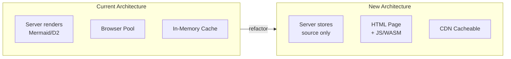

# Client-Side Diagram Rendering

## Overview



## Status

**Implemented** - 2026-01-06

## Problem

| Situation | Impact |
|-----------|--------|
| Server-side Mermaid rendering requires Puppeteer + Chromium | Heavy Docker image, memory overhead, slow cold starts |
| D2 rendering via subprocess | CPU-bound, blocks other requests |
| Queue/backpressure needed for load management | Complexity, configuration burden |
| In-memory cache loses data on restart | TTL expiration, re-rendering overhead |
| /render/terminal rarely used | Maintenance burden for niche feature |

## Decision Drivers

- Simplify infrastructure (no Chromium, no browser pool)
- Enable CDN caching for infinite scalability
- Reduce server CPU load to near-zero
- Permanent diagram storage (source is small, compressible)
- Modern browsers can render Mermaid natively

## Decision

**Move all diagram rendering to client-side.**

1. **POST /render** stores diagram source in SQLite, returns shortlink
2. **GET /d/:shortlink** returns HTML page with:
   - Embedded diagram source
   - Mermaid.js for Mermaid diagrams
   - D2 WASM for D2 diagrams
   - LocalStorage caching for repeat views
3. **Remove** server-side rendering, queue, browser pool, job system
4. **Remove** /render/terminal endpoint
5. **SQLite** stores diagram source permanently (30-day cleanup configurable)

## Rationale

| Consideration | Decision |
|---------------|----------|
| Mermaid rendering | Client-side JS - official Mermaid.js works in all browsers |
| D2 rendering | D2 compiles to WASM - can run in browser |
| Caching strategy | HTML pages are static, CDN-cacheable forever |
| Storage | Source code is tiny (<10KB typical), SQLite scales fine |
| Terminal users | Feature cut - rare usage doesn't justify complexity |

## Affected Layers

### Context (c3-0)
- Remove Actor A3 (CLI User)
- Remove External Systems E1 (Chromium), E2 (d2 CLI), E3 (chafa)
- Update system diagram
- Remove backpressure from cross-cutting concerns

### Container c3-1 (API Server)
**Remove:**
- c3-104 Queue
- c3-105 Cache
- c3-107 Browser Pool
- c3-109 Renderer
- c3-110 Mermaid Renderer
- c3-111 Terminal Renderer
- c3-113 Job Processor
- c3-115 Async Render Flow
- c3-117 Job Status Flow
- c3-118 Terminal Flow

**Modify:**
- c3-112 Job Store → Diagram Store (source persistence)
- c3-114 Render Flow → Create Flow (store source, return shortlink)
- c3-116 Retrieve Flow → View Flow (generate HTML page)

**Add:**
- c3-119 HTML Page Generator (template with Mermaid.js + D2 WASM)

### Container c3-2 (SQLite Database)
**Schema change:**
```sql
-- Before: jobs table with status workflow
-- After: diagrams table with source storage

CREATE TABLE diagrams (
  id TEXT PRIMARY KEY,           -- shortlink
  source TEXT NOT NULL,          -- diagram source code
  format TEXT NOT NULL,          -- 'mermaid' | 'd2'
  createdAt INTEGER NOT NULL,    -- Unix timestamp ms
  accessedAt INTEGER NOT NULL    -- Last access for cleanup
);

CREATE INDEX idx_diagrams_accessed ON diagrams(accessedAt);
```

## API Changes

| Endpoint | Before | After | Breaking? |
|----------|--------|-------|-----------|
| POST /render | Returns `{shortlink, cached}` to rendered image | Returns `{shortlink, url}` to HTML page | Yes - output format |
| GET /d/:id | Returns SVG/PNG binary | Returns HTML page | Yes - content type |
| GET /jobs/:id | Job status polling | **REMOVED** | Yes - endpoint gone |
| POST /render/terminal | Terminal graphics | **REMOVED** | Yes - endpoint gone |

## Configuration Changes

**Remove:**
- `QUEUE_MAX_CONCURRENT`, `QUEUE_MAX_WAITING`
- `BROWSER_POOL_SIZE`
- `CACHE_TTL`, `CACHE_GC_INTERVAL`
- `JOB_POLL_INTERVAL_MS`, `JOB_RETENTION_MS`, `JOB_CLEANUP_INTERVAL_MS`
- `CHAFA_PATH`

**Add:**
- `DIAGRAM_RETENTION_DAYS` (default: 30)
- `CLEANUP_INTERVAL_MS` (default: 86400000 / daily)

## Consequences

### Positive
- Docker image shrinks dramatically (no Chromium)
- Server CPU near-zero (just store/serve)
- Infinite horizontal scale via CDN
- No queue management complexity
- Diagrams persist across restarts
- Client browser does the work

### Negative
- Breaking API change for existing consumers
- D2 WASM bundle size (~2MB) increases page load
- Client needs modern browser with WASM support
- No terminal output for CLI users

### Mitigations
- Document migration path for API consumers
- Lazy-load D2 WASM only when needed
- Provide minimum browser requirements in docs

## Verification

- [x] POST /render stores source, returns shortlink
- [x] GET /d/:shortlink returns HTML with embedded source
- [x] Mermaid diagrams render in browser (via Mermaid.js CDN)
- [x] D2 diagrams render via WASM in browser (via d2-wasm CDN)
- [x] Old endpoints return 404
- [x] Docker image simplified (Alpine-only, no Chromium/d2/chafa)
- [x] 30-day cleanup implemented (via cleanup interval)

## References Affected

| File | Change |
|------|--------|
| `src/server.ts` | Remove routes, simplify handlers |
| `src/atoms/queue.ts` | Delete |
| `src/atoms/cache.ts` | Delete |
| `src/atoms/browser-pool.ts` | Delete |
| `src/atoms/renderer.ts` | Delete |
| `src/atoms/mermaid-renderer.ts` | Delete |
| `src/atoms/terminal-renderer.ts` | Delete |
| `src/atoms/job-processor.ts` | Delete |
| `src/atoms/job-store.ts` | Rename to diagram-store.ts, modify |
| `src/flows/render.ts` | Modify to create flow |
| `src/flows/render-async.ts` | Delete |
| `src/flows/retrieve.ts` | Modify to view flow |
| `src/flows/job-status.ts` | Delete |
| `src/flows/render-terminal.ts` | Delete |
| `src/config/tags.ts` | Remove unused tags, add new ones |
| `Dockerfile` | Remove Chromium, d2, chafa installs |
