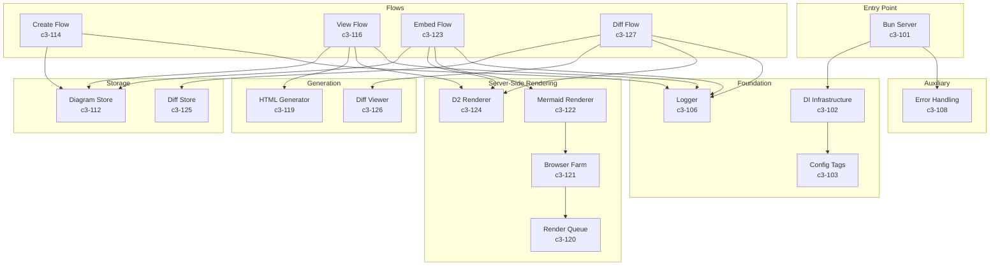
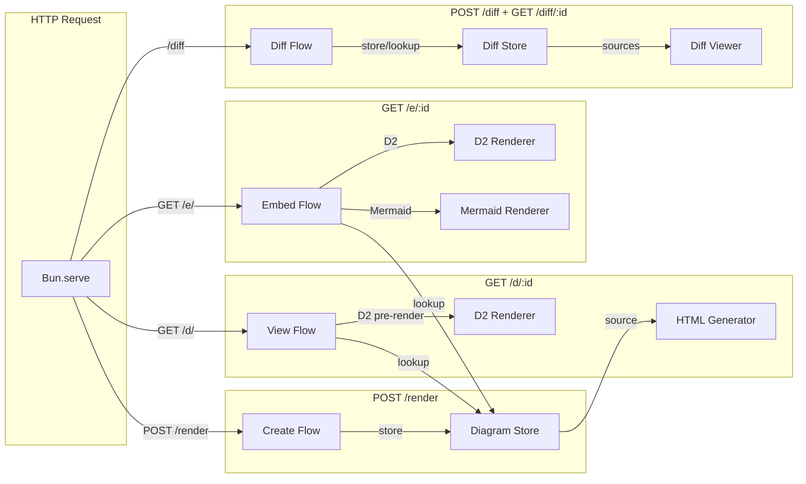

# API Server

HTTP service built on Bun.serve. Accepts diagram source code, stores in SQLite, returns shortlink. Serves HTML pages that render diagrams client-side using Mermaid.js or D2 WASM. Provides server-side SVG rendering for embedding, and side-by-side diff comparison.

## Overview

## Components

### Foundation
> Primitives others build on. High impact when changed.

| ID | Name | Status | Responsibility |
|----|------|--------|----------------|
| c3-101 | Bun Server | active | HTTP entry point, routing, request/response handling |
| c3-102 | DI Infrastructure | active | @pumped-fn/lite atoms, tags, flows, scopes, contexts |
| c3-103 | Config Tags | active | Environment-based configuration via tag system |
| c3-106 | Logger | active | Pino-based structured logging |

### Auxiliary
> Conventions for using external tools. "How we use X here."

| ID | Name | Status | Responsibility |
|----|------|--------|----------------|
| c3-108 | Error Handling | active | Typed error classes with HTTP status code mapping |

### Feature
> Domain-specific. Uses Foundation + Auxiliary.

| ID | Name | Status | Responsibility |
|----|------|--------|----------------|
| c3-112 | Diagram Store | active | SQLite CRUD for diagram source storage |
| c3-114 | Create Flow | active | Validate input -> store source -> return shortlink |
| c3-116 | View Flow | active | Lookup source -> generate HTML page |
| c3-119 | HTML Generator | active | Generate HTML pages with Mermaid.js/D2 WASM |
| c3-120 | Render Queue | active | SQLite-backed job queue for Mermaid SSR |
| c3-121 | Browser Farm | active | Pool of headless Chromium browsers for rendering |
| c3-122 | Mermaid Renderer | active | DI atom wrapper for Mermaid SSR via browser farm |
| c3-123 | Embed Flow | active | Render diagram to embeddable SVG |
| c3-124 | D2 Renderer | active | Server-side D2 rendering via d2 CLI |
| c3-125 | Diff Store | active | SQLite CRUD for diagram diff pairs |
| c3-126 | Diff Viewer | active | Generate HTML pages for side-by-side comparison |
| c3-127 | Diff Flow | active | Create and view diagram comparisons |

## Fulfillment

| Link (from c3-0) | Fulfilled By | Constraints |
|------------------|--------------|-------------|
| POST /render | c3-101 -> c3-114 | Auth if enabled |
| GET /d/:id | c3-101 -> c3-116 | No auth, CDN-cacheable |
| GET /e/:id | c3-101 -> c3-123 | No auth, CDN-cacheable |
| POST /diff | c3-101 -> c3-127 | Auth if enabled |
| GET /diff/:id | c3-101 -> c3-127 | No auth, CDN-cacheable |
| GET /health | c3-101 | No auth |
| SQLite integration | c3-112, c3-125 | via c3-2 container |

## Linkages

| From | To | Reasoning |
|------|-----|-----------|
| Bun Server -> Flows | DI context | Each request creates isolated execution context |
| Create Flow -> Diagram Store | Persistence | Source survives restarts |
| View Flow -> HTML Generator | Rendering | Client-side rendering via JS/WASM |
| View Flow -> D2 Renderer | Pre-rendering | D2 SVGs pre-rendered for light/dark themes |
| Embed Flow -> D2/Mermaid Renderer | SVG output | Server-side rendering for embedding |
| Diff Flow -> Diff Store | Persistence | Diff pairs survive restarts |
| Diff Flow -> Diff Viewer | Comparison | Side-by-side HTML generation |

## Testing Strategy

**Integration scope:**
- Flow-level tests for create/view/embed/diff
- Diagram store and diff store CRUD operations
- HTML generator output validation
- Render queue claim/complete cycle

**Mocking approach:**
- Flows can be executed with custom scopes/tags
- In-memory SQLite for tests

**Fixtures:**
- Valid Mermaid/D2 source strings
- Invalid input for validation tests
