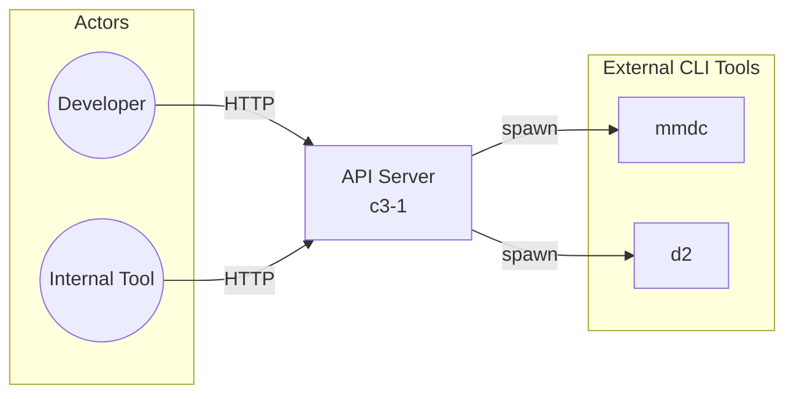
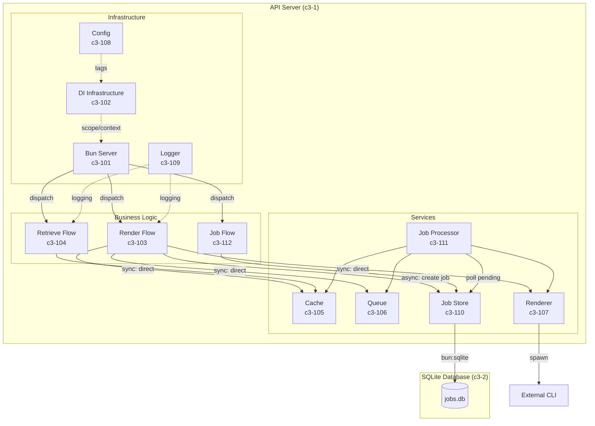

# API Server

## Inherited From Context

- **Boundary:** HTTP interface for all actors; subprocess spawning to mmdc/d2 CLI tools
- **Protocols:** HTTP (provider - POST /render, GET /d/:id, GET /health); Subprocess (consumer - mmdc, d2)
- **Cross-cutting:**
  - Auth: Optional Basic Auth (AUTH_ENABLED, AUTH_USER, AUTH_PASS)
  - Logging: Pino logger (pretty in dev, JSON in prod)
  - Errors: Typed error classes with HTTP status mapping
  - Config: Environment-based via @pumped-fn/lite tags

## Overview

The API Server is the primary compute container in Diashort. It handles the complete request lifecycle: receiving HTTP requests, validating input, orchestrating diagram rendering via external CLI tools, caching rendered output, and serving cached diagrams via shortlinks. Built using Bun's native HTTP server with @pumped-fn/lite for dependency injection.

**Note:** Job persistence is delegated to the SQLite Database container (c3-2). This separation follows C4 conventions where data storage is a distinct container responsibility.

## Technology Stack

| Technology | Version | Purpose |
|------------|---------|---------|
| Bun | 1.3.3+ | Runtime - HTTP server, file I/O, subprocess spawning |
| bun:sqlite | (bundled) | Client for SQLite Database container (c3-2) |
| @pumped-fn/lite | 1.11.2 | DI framework - atoms (singletons), tags (config), flows (orchestration) |
| Pino | 10.1.0 | Structured logging |
| TypeScript | 5.x | Type safety |

## Container Dependencies

| Container | ID | Protocol | Purpose |
|-----------|-----|----------|---------|
| SQLite Database | c3-2 | bun:sqlite | Job persistence (async render jobs) |

## Architecture

### External Relationships

### Internal Structure

## Components

### Infrastructure

| Component | ID | Responsibility |
|-----------|-----|----------------|
| Bun Server | c3-101 | Server lifecycle, routing, auth, error mapping |
| DI Infrastructure | c3-102 | @pumped-fn/lite patterns - scopes, atoms, flows, tags |
| Config | c3-108 | Load environment variables into tags |
| Logger | c3-109 | Pino logger with environment-aware formatting |

### Business Logic

| Component | ID | Responsibility |
|-----------|-----|----------------|
| Render Flow | c3-103 | Orchestrate rendering: sync mode (direct) or async mode (create job) |
| Retrieve Flow | c3-104 | Fetch cached diagram by shortlink |
| Job Flow | c3-112 | Look up job status by job ID |

### Services

| Component | ID | Responsibility |
|-----------|-----|----------------|
| Cache | c3-105 | In-memory storage with TTL and GC |
| Queue | c3-106 | Backpressure control - concurrency limits |
| Renderer | c3-107 | Spawn CLI tools, manage temp files |
| Job Store | c3-110 | Job persistence client - uses SQLite Database container (c3-2) |
| Job Processor | c3-111 | Background processor polling pending jobs, invoking renderer |

## Key Flows

### Render Flow (Async Mode - Default)
1. Bun Server (c3-101) receives POST /render (no mode param or mode=async)
2. (If auth enabled) Validate Basic Auth
3. Dispatch to Render Flow (c3-103)
4. Render Flow creates job in Job Store (c3-110) with status "pending"
5. Return 202 Accepted with jobId and statusUrl

### Render Flow (Sync Mode - Backward Compatible)
1. Bun Server (c3-101) receives POST /render?mode=sync
2. (If auth enabled) Validate Basic Auth
3. Dispatch to Render Flow (c3-103)
4. Queue (c3-106) acquire slot
5. Renderer (c3-107) spawns CLI, produces bytes
6. Cache (c3-105) stores result, returns shortlink
7. Bun Server returns 200 with shortlink

### Job Processing (Background)
1. Job Processor (c3-111) polls Job Store (c3-110) for pending jobs
2. Marks job as "rendering"
3. Queue (c3-106) acquire slot
4. Renderer (c3-107) spawns CLI, produces bytes
5. Cache (c3-105) stores result
6. Job Store (c3-110) updated with status "completed" and shortlink
7. (On failure) Job Store updated with status "failed" and error

### Job Status Lookup
1. Bun Server (c3-101) receives GET /jobs/:jobId
2. Dispatch to Job Flow (c3-112)
3. Job Store (c3-110) lookup
4. Return job status (pending/rendering/completed/failed) or 404

### Retrieve Flow
1. Bun Server (c3-101) receives GET /d/:shortlink
2. Dispatch to Retrieve Flow (c3-104)
3. Cache (c3-105) lookup
4. Return bytes or 404
