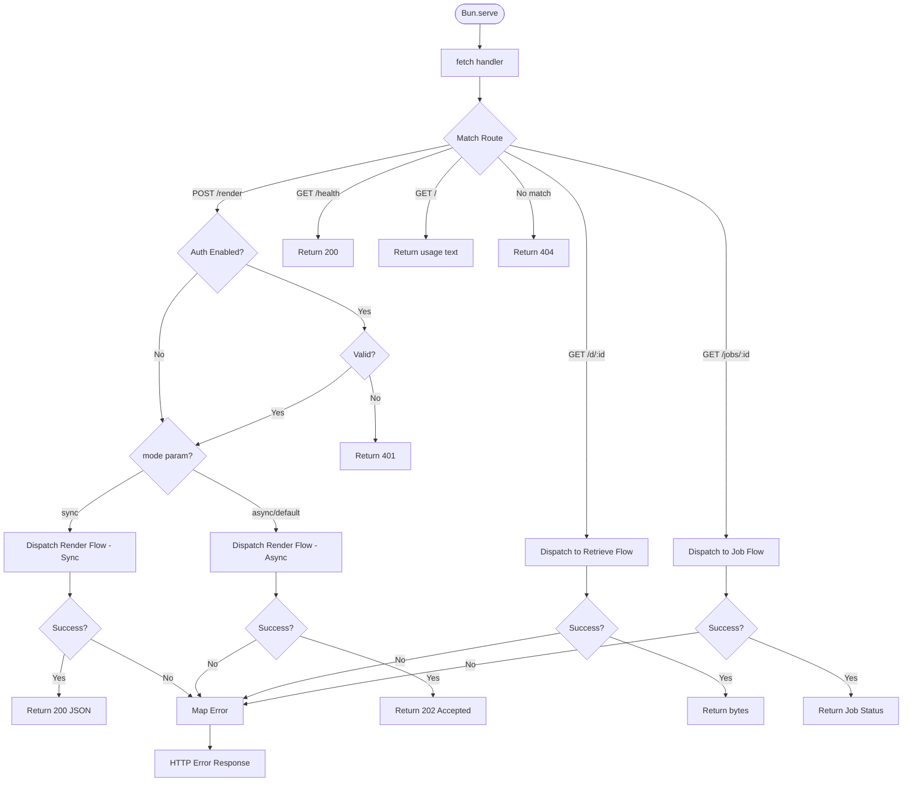

# Bun Server

## Contract

From Container (c3-1): "Server lifecycle, request handling, routing to flows"

## How It Works

### Flow

### Dependencies

| Dependency | Component | Purpose |
|------------|-----------|---------|
| Render Flow | c3-103 | Business logic for rendering (sync/async) |
| Retrieve Flow | c3-104 | Business logic for retrieval |
| Job Flow | c3-112 | Business logic for job status lookup |
| Config | c3-108 | Auth settings, port |
| Logger | c3-109 | Error logging |

### Decision Points

| Decision | Condition | Outcome |
|----------|-----------|---------|
| Routing | URL + method | Dispatch to flow or static response |
| Auth gate | AUTH_ENABLED=true | Validate before render |
| Render mode | ?mode=sync query param | Sync (blocking) vs async (job) |
| Error mapping | Error class | Appropriate HTTP status |

## Concerns

### Routing

| Route | Method | Handler | Response |
|-------|--------|---------|----------|
| /render | POST | Render Flow | 202 (async) or 200 (sync) |
| /render?mode=sync | POST | Render Flow (sync) | 200 with shortlink |
| /jobs/:id | GET | Job Flow | 200 with job status or 404 |
| /d/:id | GET | Retrieve Flow | 200 with bytes or 404 |
| /health | GET | Static 200 | 200 |
| / | GET | Usage text | 200 |

### Authentication

| Aspect | Behavior |
|--------|----------|
| Scheme | Basic Auth |
| Scope | POST /render only |
| Toggle | AUTH_ENABLED env var |

### Error Mapping

| Error Class | HTTP Status | Headers |
|-------------|-------------|---------|
| AuthError | 401 | WWW-Authenticate |
| ValidationError | 400 | - |
| NotFoundError | 404 | - |
| JobNotFoundError | 404 | - |
| BackpressureError | 429 | Retry-After |
| RenderError | 500 | - |

## Edge Cases

| Scenario | Behavior | Rationale |
|----------|----------|-----------|
| Malformed JSON body | 400 via ParseError | Invalid input |
| Missing auth header | 401 with challenge | Basic Auth spec |

## Error Handling

| Error | Detection | Recovery |
|-------|-----------|----------|
| Flow errors | try/catch in fetch | Map to HTTP response |
| Unhandled errors | Catch-all | 500 with message |

## References

- src/server.ts - Implementation
