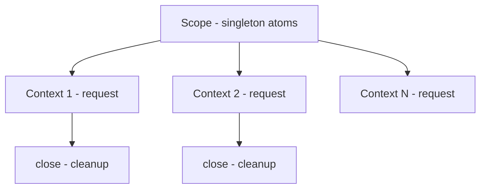

# DI Infrastructure

## Contract

From Container (c3-1): "Dependency injection patterns and service lifecycle"

## How It Works

### Flow

```mermaid
flowchart TD
    subgraph Bootstrap["Server Bootstrap"]
        LoadEnv[Load env vars] --> CreateTags[Create tag instances]
        CreateTags --> CreateScope[createScope with tags]
        CreateScope --> ResolveAtoms[Resolve singleton atoms]
    end

    subgraph Request["Per-Request"]
        Req([Request]) --> CreateCtx[scope.createContext]
        CreateCtx --> ExecFlow[ctx.exec flow]
        ExecFlow --> CloseCtx[ctx.close]
    end

    subgraph Shutdown["Shutdown"]
        Signal([SIGTERM]) --> DisposeScope[scope.dispose]
        DisposeScope --> Cleanup[Run cleanup handlers]
    end
```

### Dependencies

| Dependency | Component | Purpose |
|------------|-----------|---------|
| Config | c3-108 | Provides tag values |

### Decision Points

| Decision | Condition | Outcome |
|----------|-----------|---------|
| Atom vs Service | Stateless vs methods | atom for values, service for methods |
| Tag vs hardcode | Configurable? | Tags for env-driven config |
| Flow vs function | Orchestration needed? | Flows for multi-step with DI |

## Patterns

### Primitives

| Primitive | Purpose | Lifecycle |
|-----------|---------|-----------|
| tag | Configuration injection | Defined at scope creation |
| atom | Singleton service | Created once per scope |
| service | Methods with DI | Created once, methods called per-use |
| flow | Orchestrated operation | Executed per-request |

### Scope Hierarchy

### Tag Flow

| Stage | What Happens |
|-------|--------------|
| loadConfigTags | Parse env → create tag instances |
| createScope | Inject tags into scope |
| atom deps | tags.required(someTag) → resolved value |

### Cleanup

| Level | Trigger | Handler |
|-------|---------|---------|
| Context | ctx.close() | ctx.onClose callbacks |
| Scope | scope.dispose() | ctx.cleanup callbacks |

## Edge Cases

| Scenario | Behavior | Rationale |
|----------|----------|-----------|
| Missing required tag | Startup error | Fail fast |
| Context not closed | Resources leak | Must close in finally |

## Error Handling

| Error | Detection | Recovery |
|-------|-----------|----------|
| Tag resolution | Missing required | Throw at startup |
| Cleanup failure | Handler throws | Log and continue |

## References

- src/config/tags.ts - Tag definitions
- src/server.ts - Scope and context usage
