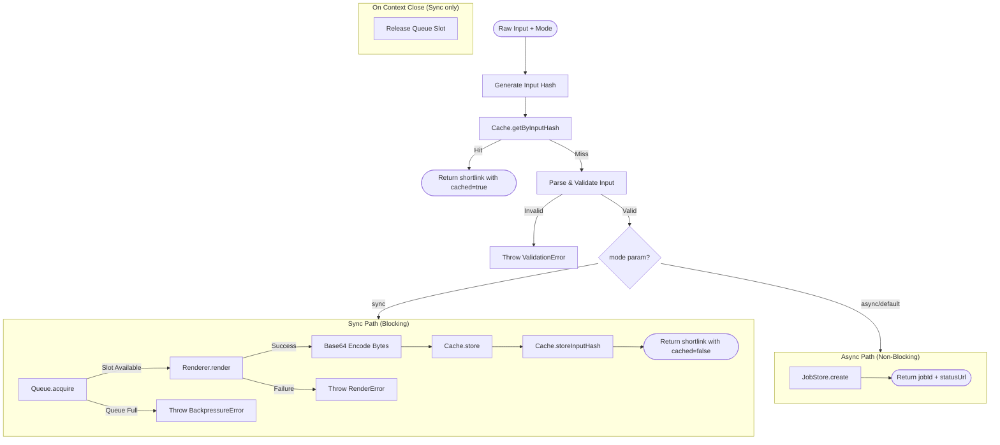

# Render Flow

## Contract

From Container (c3-1): "Orchestrate diagram rendering: sync mode (direct) or async mode (create job)"

## How It Works

### Flow (Mode Selection)



### Dependencies

| Dependency | Component | Purpose |
|------------|-----------|---------|
| Queue | c3-106 | Acquire concurrency slot (sync mode) |
| Renderer | c3-107 | Execute diagram rendering (sync mode) |
| Cache | c3-105 | Store rendered output (sync mode) |
| Job Store | c3-110 | Create pending job (async mode) |
| Logger | c3-109 | Log render progress |

### Decision Points

| Decision | Condition | Outcome |
|----------|-----------|---------|
| Input cache check | Input hash exists in cache | Return cached result immediately, skip rendering |
| Input validation | source empty, format invalid, outputType invalid | Reject with ValidationError |
| Mode selection | ?mode=sync query param | Sync path (blocking) vs async path (job creation) |
| Queue acquisition | Slots available vs queue full vs waiting allowed | Proceed, wait, or reject (sync only) |
| Output type | svg or png | Determines content-type for cache |

## Edge Cases

| Scenario | Behavior | Rationale |
|----------|----------|-----------|
| Input cache hit | Return immediately with cached=true | Avoids redundant rendering |
| Empty source string | Reject with ValidationError | Nothing to render |
| Unknown format | Reject with ValidationError | Only mermaid/d2 supported |
| outputType defaults | Use svg if not specified | Most common use case |
| mode=async (explicit) | Same as default | Explicit async behaves like default |
| Invalid mode value | Treat as async | Graceful degradation to default |

## Error Handling

| Error | Detection | Recovery |
|-------|-----------|----------|
| ValidationError | Input parsing fails | Return to caller (becomes 400) |
| BackpressureError | Queue.acquire rejects (sync only) | Return to caller (becomes 429) |
| RenderError | Renderer throws (sync only) | Return to caller (becomes 500) |

**Note:** In async mode, BackpressureError and RenderError are handled by Job Processor (c3-111) and stored in the job record, not returned directly.

## Response Contracts

### Async Mode (Default)

```json
// HTTP 202 Accepted
{
  "jobId": "job_abc123",
  "status": "pending",
  "statusUrl": "/jobs/job_abc123"
}
```

### Sync Mode

```json
// HTTP 200 OK
{
  "shortlink": "abc12345",
  "url": "/d/abc12345",
  "cached": false  // true if returned from input cache
}
```

## References

- src/flows/render.ts - Implementation
