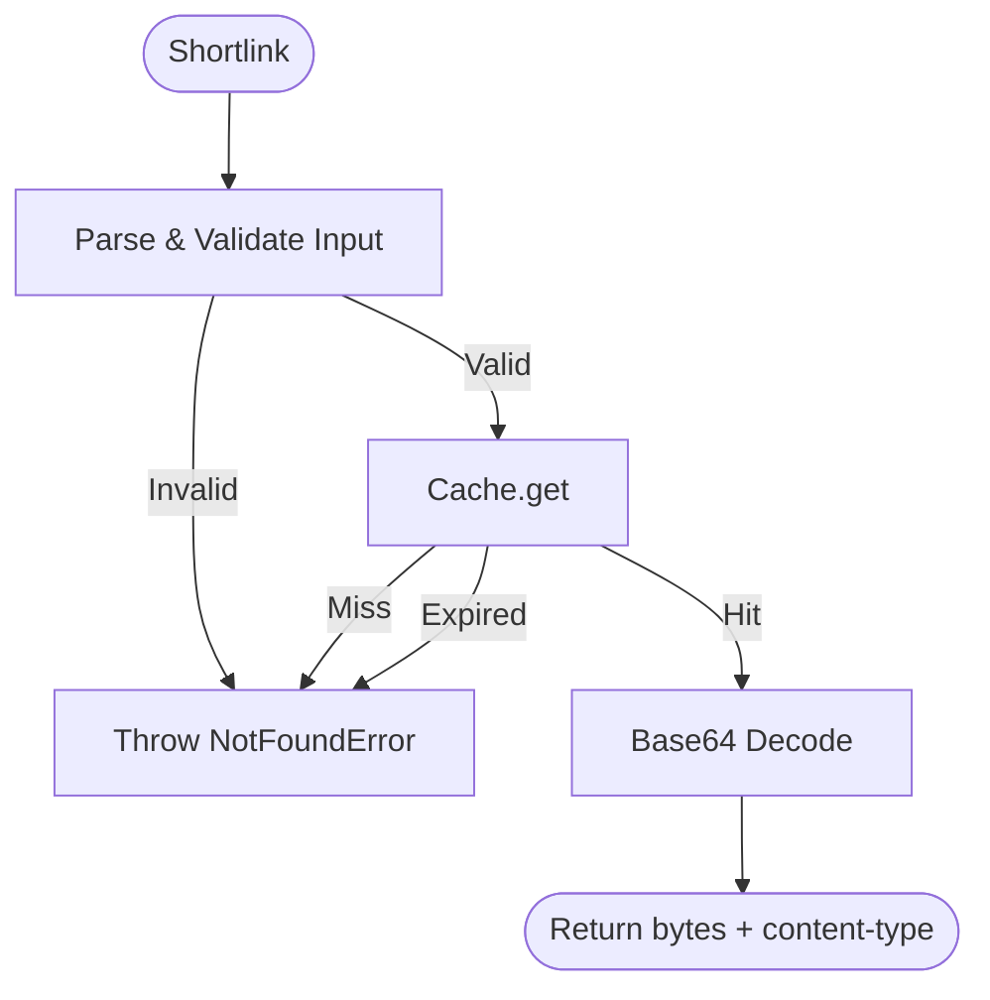

# Retrieve Flow

## Contract

From Container (c3-1): "Fetch cached diagram by shortlink, handle cache misses"

## How It Works

### Flow

### Dependencies

| Dependency | Component | Purpose |
|------------|-----------|---------|
| Cache | c3-104 | Look up stored diagram |
| Logger | c3-108 | Log cache hit/miss |

### Decision Points

| Decision | Condition | Outcome |
|----------|-----------|---------|
| Shortlink validation | Empty or missing | Reject with NotFoundError |
| Cache lookup | Entry exists and not expired | Return data or throw NotFoundError |

## Edge Cases

| Scenario | Behavior | Rationale |
|----------|----------|-----------|
| Empty shortlink | NotFoundError | Invalid request |
| Expired entry | NotFoundError | TTL enforcement |
| Non-existent shortlink | NotFoundError | Never rendered or already GC'd |

## Error Handling

| Error | Detection | Recovery |
|-------|-----------|----------|
| NotFoundError | Shortlink invalid or cache miss | Return to caller (becomes 404) |

## References

- src/flows/retrieve.ts - Implementation
