# Cache

## Contract

From Container (c3-1): "In-memory storage with TTL expiration and periodic garbage collection"

### Methods

**Output Cache:**
- `store(data: string, contentType: string): string` - Store rendered output, returns shortlink
- `get(shortlink: string): { data: string, contentType: string } | undefined` - Retrieve by shortlink

**Input Hash Cache:**
- `storeInputHash(inputHash: string, shortlink: string): void` - Map input hash to shortlink
- `getByInputHash(inputHash: string): string | undefined` - Check if input was previously rendered

Both cache types share the same TTL configuration. When an output expires, its input hash mapping also expires.

## How It Works

### Flow

```mermaid
flowchart TD
    subgraph Store["store(data, contentType)"]
        GenID[Generate 8-char UUID] --> CreateEntry[Create Entry with timestamp]
        CreateEntry --> MapSet[Map.set]
        MapSet --> ReturnID([Return shortlink])
    end

    subgraph Get["get(shortlink)"]
        Lookup[Map.get] --> Exists{Entry Exists?}
        Exists -->|No| ReturnUndefined([Return undefined])
        Exists -->|Yes| CheckTTL{Expired?}
        CheckTTL -->|Yes| Delete[Delete Entry]
        Delete --> ReturnUndefined
        CheckTTL -->|No| ReturnData([Return data + contentType])
    end

    subgraph InputHash["Input Hash Cache"]
        StoreHash[storeInputHash] --> HashMap[Map input hash to shortlink]
        GetHash[getByInputHash] --> LookupHash{Hash Exists?}
        LookupHash -->|Yes| ReturnShortlink([Return shortlink])
        LookupHash -->|No| ReturnNone([Return undefined])
    end

    subgraph GC["Periodic GC"]
        Timer[Interval Timer] --> Iterate[Iterate all entries]
        Iterate --> CheckEach{Entry Expired?}
        CheckEach -->|Yes| DeleteEntry[Delete from both maps]
        CheckEach -->|No| Skip[Skip]
        DeleteEntry --> Next[Next Entry]
        Skip --> Next
    end
```

### Dependencies

| Dependency | Component | Purpose |
|------------|-----------|---------|
| Config | c3-107 | Get TTL and GC interval settings |
| Logger | c3-108 | Log cache operations |

### Decision Points

| Decision | Condition | Outcome |
|----------|-----------|---------|
| Entry expiration | now - storedAt > ttlMs | Entry considered expired |
| GC trigger | Every gcIntervalMs | Scan and remove expired entries |
| Shortlink format | First 8 chars of UUID | Collision-resistant, URL-safe |
| Input hash lookup | Hash exists in map | Return cached shortlink, skip rendering |

## Edge Cases

| Scenario | Behavior | Rationale |
|----------|----------|-----------|
| Get expired entry | Delete and return undefined | Lazy expiration on access |
| Input hash for expired output | Returns undefined (cleaned up by GC) | TTL applies to both caches |
| GC during high load | Runs on interval regardless | Background cleanup |
| Scope disposal | Clear GC interval | Prevent memory leaks |

## Error Handling

| Error | Detection | Recovery |
|-------|-----------|----------|
| None | Cache operations are synchronous and safe | N/A |

## Configuration

| Setting | Environment Variable | Default | Purpose |
|---------|---------------------|---------|---------|
| TTL | CACHE_TTL | 300000 (5 min) | Entry lifetime in ms |
| GC Interval | CACHE_GC_INTERVAL | 60000 (1 min) | Cleanup frequency in ms |

## References

- src/atoms/cache.ts - Implementation
