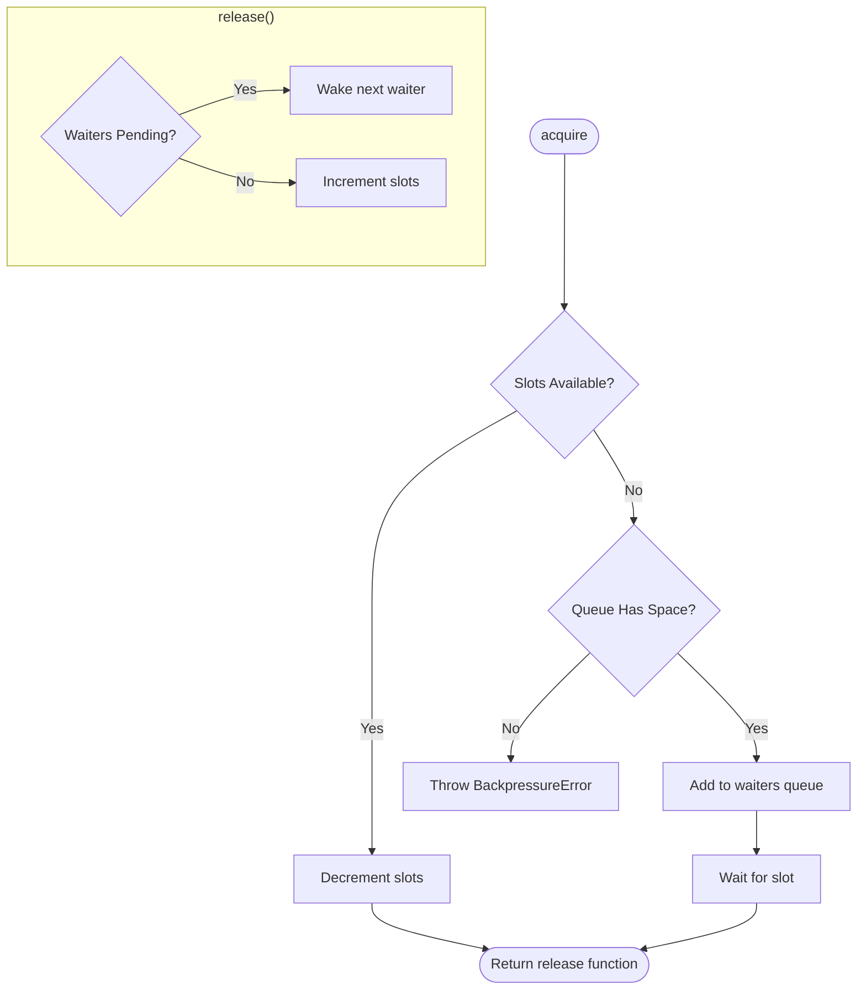

# Queue

## Contract

From Container (c3-1): "Backpressure control - limit concurrent renders, queue waiting requests"

## How It Works

### Flow

### Dependencies

| Dependency | Component | Purpose |
|------------|-----------|---------|
| Config | c3-107 | Get maxConcurrent and maxWaiting settings |
| Logger | c3-108 | Log queue full events |

### Decision Points

| Decision | Condition | Outcome |
|----------|-----------|---------|
| Immediate grant | slots > 0 | Decrement and return release |
| Queue request | slots = 0, waiters < maxWaiting | Add to queue, wait |
| Reject request | slots = 0, waiters >= maxWaiting | Throw BackpressureError |

## Edge Cases

| Scenario | Behavior | Rationale |
|----------|----------|-----------|
| Release with waiters | Wake next waiter instead of incrementing slots | FIFO fairness |
| Scope disposal | Reject all waiters with error | Clean shutdown |
| Multiple releases | Each release wakes one waiter or increments | Correct slot accounting |

## Error Handling

| Error | Detection | Recovery |
|-------|-----------|----------|
| BackpressureError | Queue full | Return to caller (becomes 429) |
| Queue destroyed | Scope disposal | Reject waiting promises |

## Configuration

| Setting | Environment Variable | Default | Purpose |
|---------|---------------------|---------|---------|
| Max Concurrent | QUEUE_MAX_CONCURRENT | 10 | Maximum parallel renders |
| Max Waiting | QUEUE_MAX_WAITING | 50 | Maximum queued requests |

## References

- src/atoms/queue.ts - Implementation
