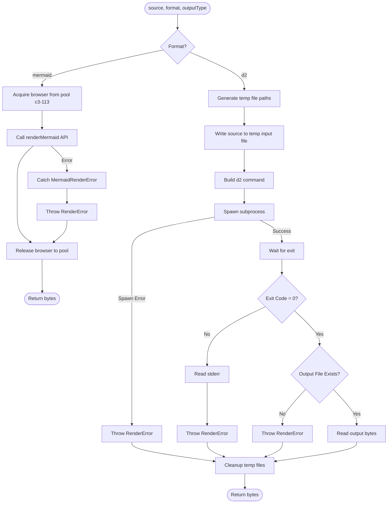

# Renderer

## Contract

From Container (c3-1): "Orchestrate diagram rendering using browser pool for mermaid and subprocess for d2"

## How It Works

### Flow

### Dependencies

| Dependency | Component | Purpose |
|------------|-----------|---------|
| Mermaid Renderer | c3-114 | Render mermaid diagrams using browser pool |
| Browser Pool | c3-113 | (via c3-114) Provide Puppeteer browsers for mermaid |
| Config | c3-108 | Get spawn function (injectable for testing) |
| Logger | c3-109 | Log render progress and errors |

### Decision Points

| Decision | Condition | Outcome |
|----------|-----------|---------|
| Render path | format = mermaid or d2 | Use browser pool or subprocess |
| Output format | outputType = svg or png | Pass to renderMermaid or set file extension |
| Browser acquisition | mermaid format | Acquire from pool before rendering |

## Edge Cases

| Scenario | Behavior | Rationale |
|----------|----------|-----------|
| Mermaid render fails | MermaidRenderError caught, re-thrown as RenderError | Consistent error interface |
| Browser pool exhausted | Wait in mermaidRenderer until browser available | Handled by c3-113 |
| D2 CLI not found | RenderError on spawn | Missing dependency |
| D2 CLI timeout | Depends on CLI behavior | No explicit timeout in renderer |
| Invalid diagram syntax | Format-specific: mermaid via API error, d2 via stderr | Different error paths |
| Temp file cleanup fails (d2) | Log warning, continue | Best effort cleanup |

## Error Handling

| Error | Detection | Recovery |
|-------|-----------|----------|
| RenderError | Mermaid API error, d2 spawn fails, non-zero exit, missing output | Return to caller |
| MermaidRenderError | Browser rendering fails | Caught and converted to RenderError |
| Cleanup warning (d2) | File deletion fails | Log and continue |

## External Tools & APIs

| Tool/API | Usage Pattern | Purpose |
|----------|---------------|---------|
| @mermaid-js/mermaid-cli | renderMermaid(browser, source, outputType, opts) | Mermaid rendering via browser pool |
| d2 | d2 input.d2 output.{ext} | D2 rendering via subprocess |

## References

- src/atoms/renderer.ts - Implementation
- src/atoms/mermaid-renderer.ts - Mermaid-specific rendering (c3-114)
- [ADR: Mermaid Browser Pool](../adr/adr-20251223-mermaid-browser-pool.md)
