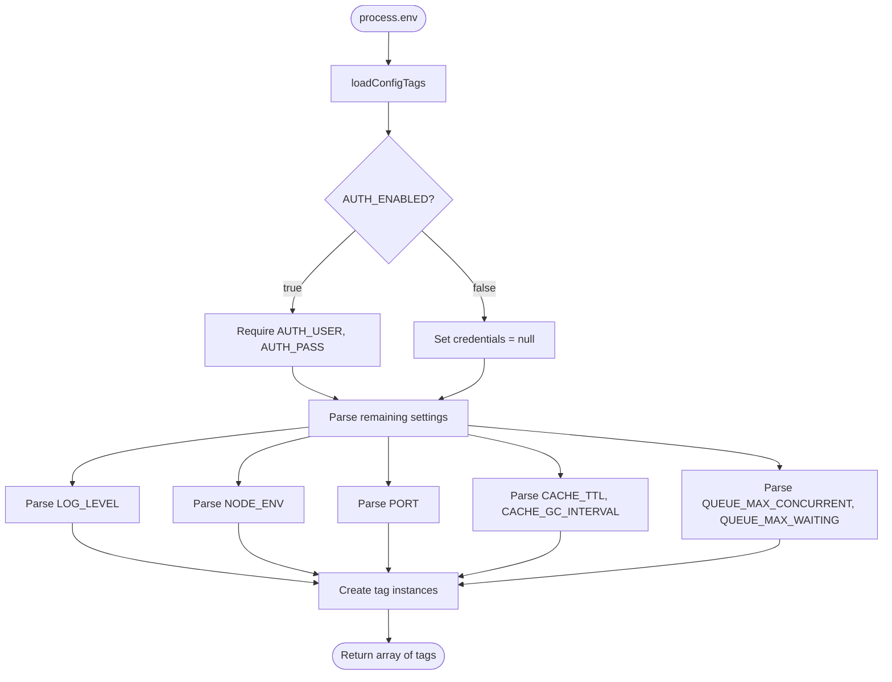

# Config

## Contract

From Container (c3-1): "Load environment variables into @pumped-fn/lite tags"

## How It Works

### Flow

### Dependencies

| Dependency | Component | Purpose |
|------------|-----------|---------|
| None | - | Config is a leaf dependency |

### Decision Points

| Decision | Condition | Outcome |
|----------|-----------|---------|
| Auth required | AUTH_ENABLED=true | Require AUTH_USER and AUTH_PASS |
| Invalid number | parseInt returns NaN | Throw error |
| Missing optional | Env var empty or undefined | Use default value |
| Log level unknown | Value not in debug/info/warn/error | Default to info |

## Edge Cases

| Scenario | Behavior | Rationale |
|----------|----------|-----------|
| Empty string env var | Treated as undefined | Avoid false positives |
| AUTH_ENABLED without credentials | Startup error | Security requirement |
| Invalid LOG_LEVEL | Default to info | Safe fallback |
| Invalid number for PORT | Startup error | Must be valid |

## Error Handling

| Error | Detection | Recovery |
|-------|-----------|----------|
| Missing required env | AUTH_ENABLED=true without creds | Throw at startup |
| Invalid number | parseInt NaN | Throw at startup |

## Configuration Settings

| Tag | Environment Variable | Default | Type |
|-----|---------------------|---------|------|
| logLevelTag | LOG_LEVEL | info | debug, info, warn, error |
| nodeEnvTag | NODE_ENV | development | string |
| serverPortTag | PORT | 3000 | number |
| authEnabledTag | AUTH_ENABLED | false | boolean |
| authCredentialsTag | AUTH_USER, AUTH_PASS | null | object or null |
| cacheConfigTag | CACHE_TTL, CACHE_GC_INTERVAL | 300000, 60000 | object |
| queueConfigTag | QUEUE_MAX_CONCURRENT, QUEUE_MAX_WAITING | 10, 50 | object |

## References

- src/config/tags.ts - Implementation
