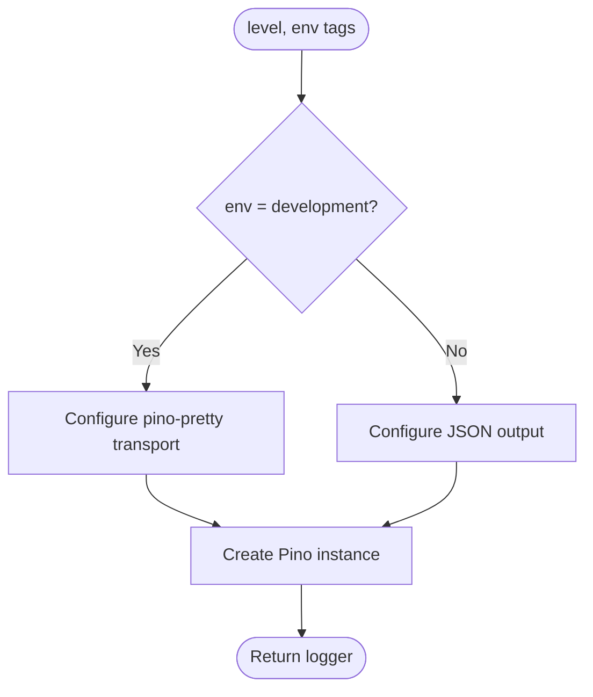

# Logger

## Contract

From Container (c3-1): "Pino logger instance with environment-aware formatting"

## How It Works

### Flow

### Dependencies

| Dependency | Component | Purpose |
|------------|-----------|---------|
| Config | c3-107 | Get log level and environment |

### Decision Points

| Decision | Condition | Outcome |
|----------|-----------|---------|
| Pretty printing | NODE_ENV = development | Use pino-pretty with colors |
| JSON output | NODE_ENV != development | Plain JSON logs |
| Log level | LOG_LEVEL env var | Filter log output |

## Edge Cases

| Scenario | Behavior | Rationale |
|----------|----------|-----------|
| Unknown log level | Pino handles gracefully | Library default behavior |
| Missing pino-pretty | Startup error in dev | Dev dependency required |

## Error Handling

| Error | Detection | Recovery |
|-------|-----------|----------|
| None | Logger creation is synchronous | N/A |

## Log Levels

| Level | Usage |
|-------|-------|
| debug | Detailed tracing (temp files, cache operations) |
| info | Normal operations (server start, render complete) |
| warn | Recoverable issues (cleanup failures) |
| error | Failures (render errors, request errors) |

## References

- src/atoms/logger.ts - Implementation
