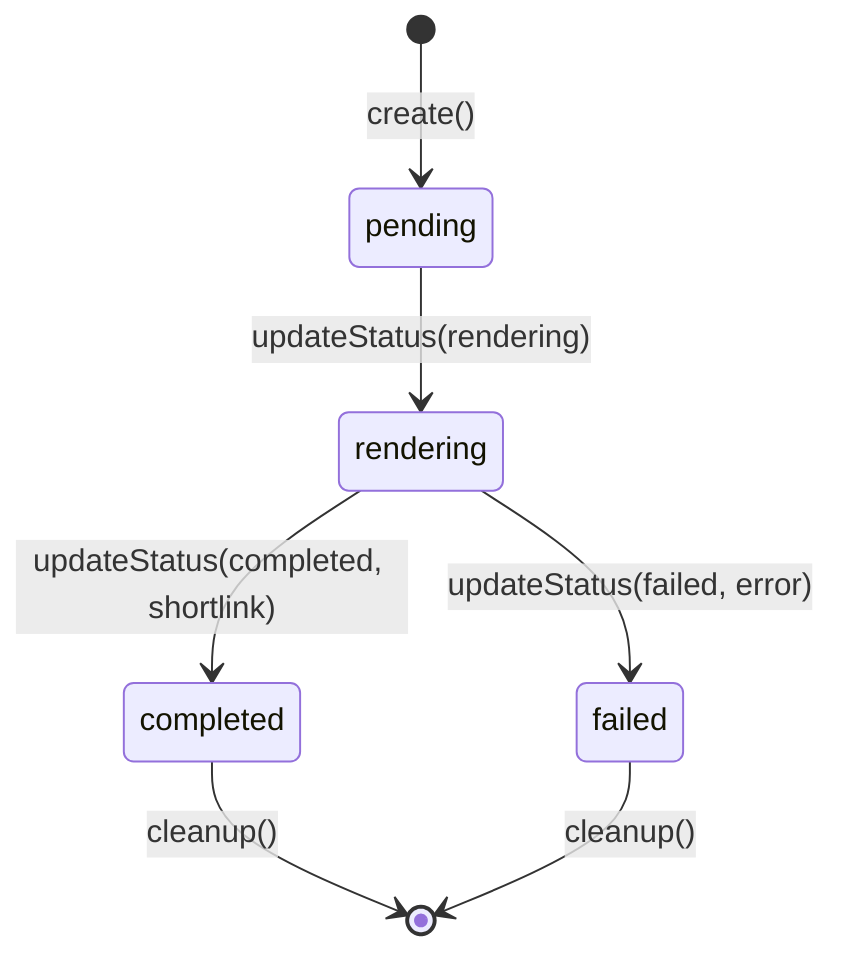

# Job Store

## Contract

From Container (c3-1): "Job persistence (create, update, query, cleanup)"

**External Dependency:** This component USES the SQLite Database container (c3-2) for persistent storage. It does not contain the database - it is a client of it.

## How It Works

### Flow

```mermaid
flowchart TD
    subgraph Create["create(input)"]
        C1[Generate job_<uuid8> ID]
        C1 --> C2[Insert row with status=pending]
        C2 --> C3([Return jobId])
    end

    subgraph Get["get(jobId)"]
        G1[Query by ID]
        G1 -->|Found| G2([Return job record])
        G1 -->|Not Found| G3([Return null])
    end

    subgraph Update["updateStatus(jobId, status, result?)"]
        U1[Update status column]
        U1 --> U2{status?}
        U2 -->|rendering| U3[Set started_at]
        U2 -->|completed| U4[Set completed_at, shortlink]
        U2 -->|failed| U5[Set completed_at, error]
    end

    subgraph Pending["getPending()"]
        P1[Query WHERE status=pending]
        P1 --> P2[ORDER BY created_at ASC]
        P2 --> P3([Return oldest pending job])
    end

    subgraph Cleanup["cleanup()"]
        CL1[Calculate expiry threshold]
        CL1 --> CL2[DELETE WHERE completed_at < threshold]
        CL2 --> CL3([Return deleted count])
    end
```

### Dependencies

| Dependency | Type | Purpose |
|------------|------|---------|
| SQLite Database | Container (c3-2) | Persistent storage for job records |
| Config | Component (c3-108) | Get JOB_DB_PATH and JOB_RETENTION_MS settings |
| Logger | Component (c3-109) | Log job lifecycle events |

### Decision Points

| Decision | Condition | Outcome |
|----------|-----------|---------|
| Job ID format | Always | Generate as job_<8-char-uuid> |
| Pending selection | Multiple pending jobs | Return oldest (FIFO) |
| Cleanup eligibility | completed_at older than retention period | Delete |

## Schema

**Note:** Schema is owned by the SQLite Database container (c3-2). See `.c3/c3-2-sqlite-db/README.md` for full schema definition.

This component queries and modifies the `jobs` table with the following columns:
- `id`, `status`, `source`, `format`, `output_type`
- `shortlink`, `error`
- `created_at`, `started_at`, `completed_at`

## Job States

## Edge Cases

| Scenario | Behavior | Rationale |
|----------|----------|-----------|
| Get non-existent job | Return null | Let caller decide error handling |
| Update non-existent job | No-op (0 rows affected) | Idempotent operation |
| Cleanup with no expired jobs | Return 0 | Normal operation |
| Database file missing | Create on first access | Auto-initialization |
| Concurrent create | SQLite serializes writes | No conflicts |

## Error Handling

| Error | Detection | Recovery |
|-------|-----------|----------|
| SQLite write error | Database exception | Propagate to caller |
| Invalid job ID format | Not possible (internal generation) | N/A |

## Configuration

| Setting | Environment Variable | Default | Purpose |
|---------|---------------------|---------|---------|
| Database Path | JOB_DB_PATH | ./data/jobs.db | SQLite file location |
| Job Retention | JOB_RETENTION_MS | 3600000 (1 hour) | How long to keep completed/failed jobs |

## References

- src/atoms/job-store.ts - Implementation
- .c3/c3-2-sqlite-db/README.md - Database container (schema, retention policy)
