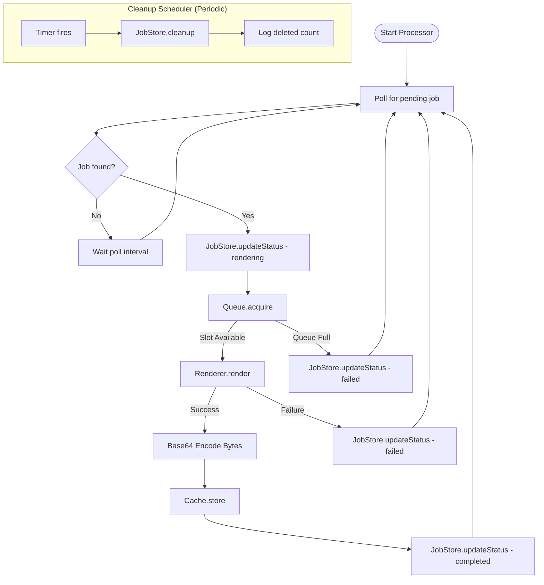
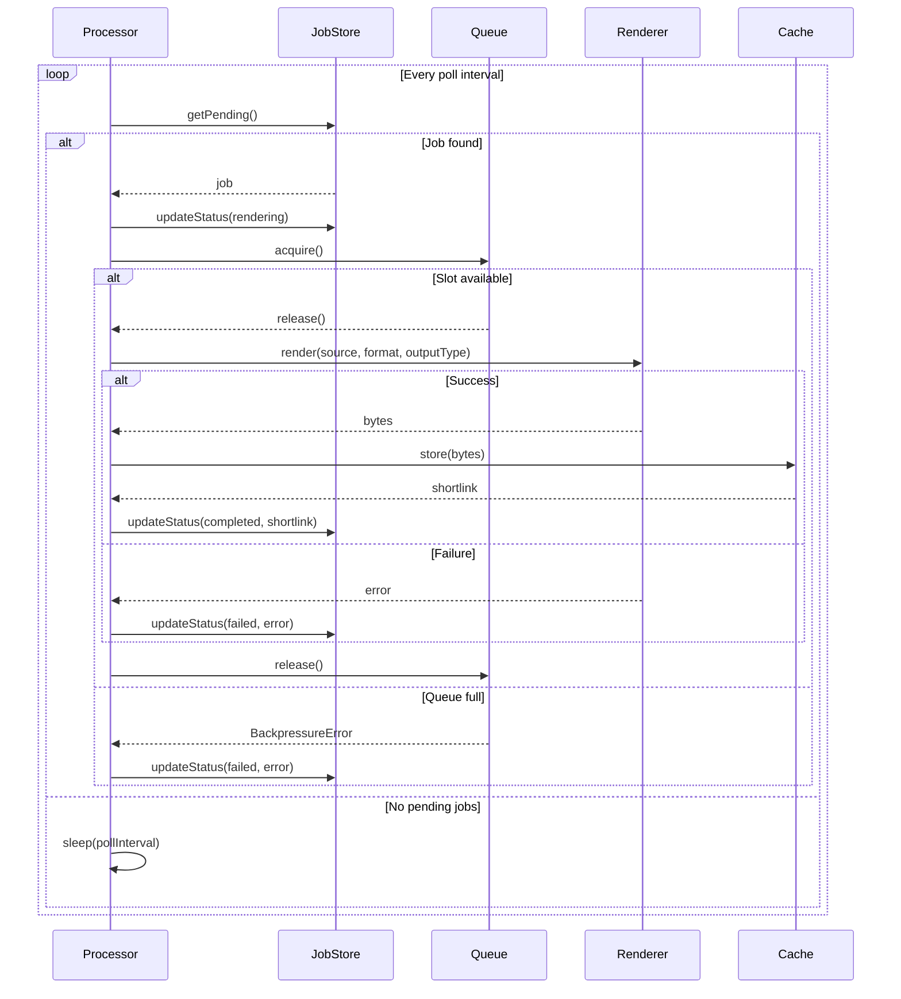

# Job Processor

## Contract

From Container (c3-1): "Background processor polling pending jobs, invoking renderer"

## How It Works

### Flow

### Dependencies

| Dependency | Component | Purpose |
|------------|-----------|---------|
| Job Store | c3-110 | Get pending jobs, update status |
| Queue | c3-106 | Acquire concurrency slot |
| Renderer | c3-107 | Execute diagram rendering |
| Cache | c3-105 | Store rendered output |
| Config | c3-108 | Get poll interval settings |
| Logger | c3-109 | Log processing events |

### Decision Points

| Decision | Condition | Outcome |
|----------|-----------|---------|
| Job selection | Multiple pending | Process oldest first (FIFO via Job Store) |
| Queue full | No slots available | Mark job failed with BackpressureError |
| Render failure | CLI returns error | Mark job failed with error message |
| Successful render | CLI produces output | Store in cache, mark completed with shortlink |

## Processing Loop

## Edge Cases

| Scenario | Behavior | Rationale |
|----------|----------|-----------|
| No pending jobs | Sleep and retry | Normal idle state |
| Queue full on acquire | Mark job failed | Don't block indefinitely |
| Render timeout | Mark job failed with timeout error | Prevent stuck jobs |
| Server shutdown | Stop polling, finish current job | Graceful shutdown |
| Concurrent processors | Each gets different pending job | JobStore returns FIFO |
| Job disappears mid-process | updateStatus is no-op | Race condition safety |

## Error Handling

| Error | Detection | Recovery |
|-------|-----------|----------|
| BackpressureError | Queue.acquire rejects | Mark job failed, continue polling |
| RenderError | Renderer throws | Mark job failed with message, continue polling |
| Database error | JobStore throws | Log and retry next poll |
| Unhandled error | Catch-all in loop | Log, don't crash processor |

## Configuration

| Setting | Environment Variable | Default | Purpose |
|---------|---------------------|---------|---------|
| Poll Interval | JOB_POLL_INTERVAL_MS | 100 | How often to check for pending jobs |
| Cleanup Interval | JOB_CLEANUP_INTERVAL_MS | 60000 (1 min) | How often to run job cleanup |

## Lifecycle

| Event | Behavior |
|-------|----------|
| Server start | Start polling loop |
| Server shutdown | Stop polling, wait for current job |
| Scope disposal | Clean up timers and resources |

## References

- src/atoms/job-processor.ts - Implementation
