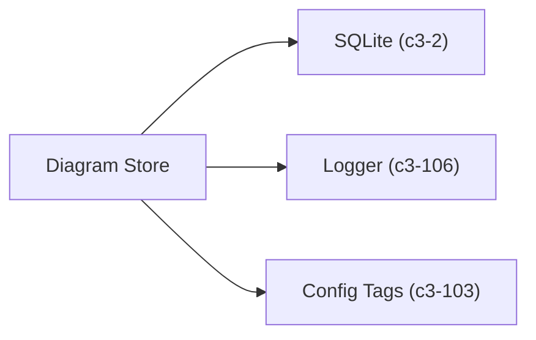
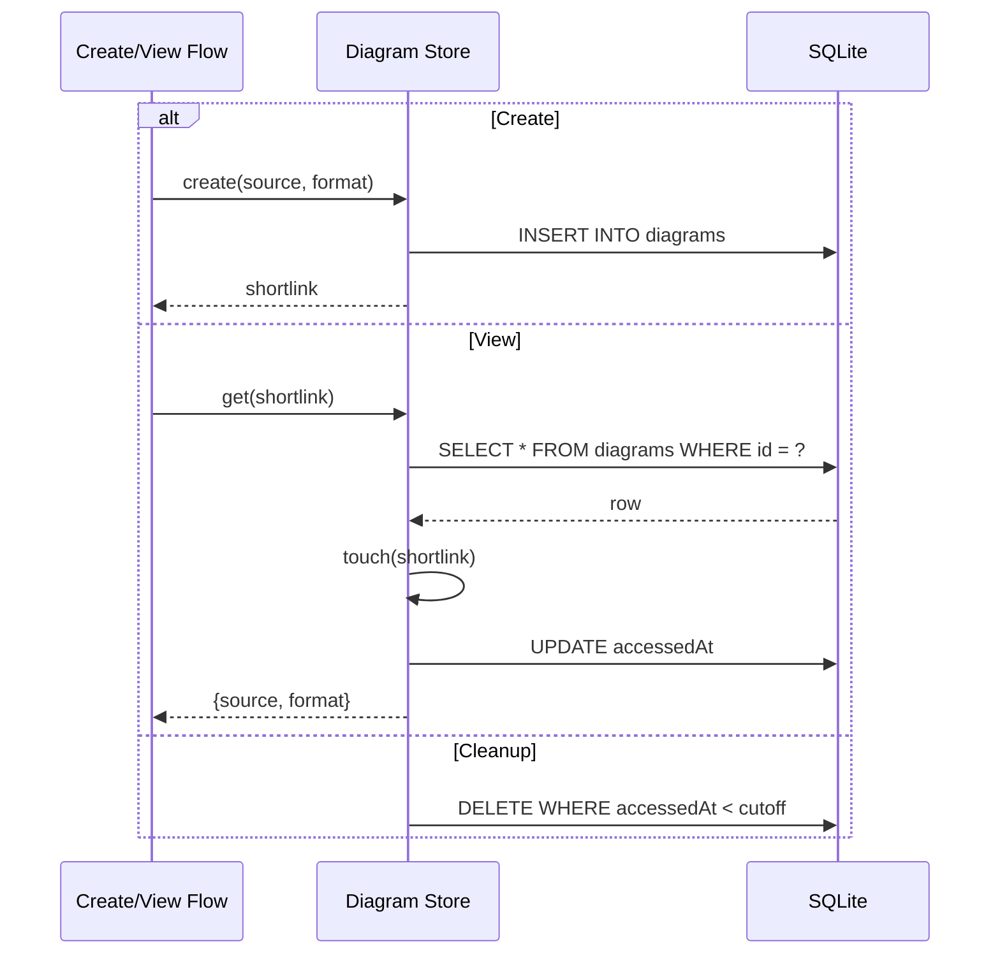

# Diagram Store

Provides CRUD operations for diagram source code. Diagrams are stored permanently until cleanup removes old entries based on last access time.

## Dependencies



## Interface

```typescript
interface DiagramStore {
  create(source: string, format: "mermaid" | "d2"): string;  // Returns shortlink
  get(id: string): { source: string; format: string } | null;
  touch(id: string): void;  // Update accessedAt
  cleanup(): void;          // Delete old diagrams
}
```

## Behavior



## References

- `diagramStoreAtom` - `src/atoms/diagram-store.ts`
- Schema creation - `src/atoms/diagram-store.ts`

## Testing Strategy

**Unit scope:**
- CRUD operations with in-memory SQLite
- Cleanup respects retention window
- Touch updates accessedAt

**Isolation:** Use `:memory:` database path for tests
