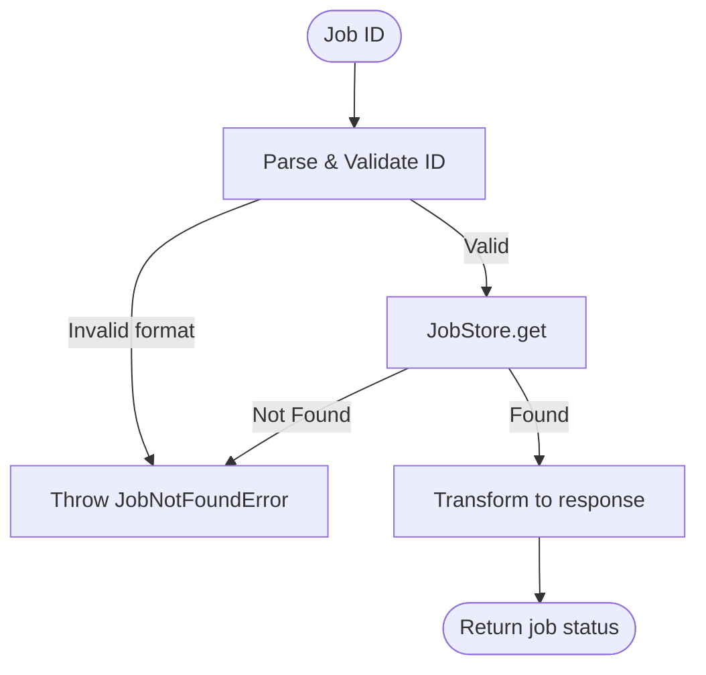

# Job Flow

## Contract

From Container (c3-1): "Look up job status by job ID"

## How It Works

### Flow



### Dependencies

| Dependency | Component | Purpose |
|------------|-----------|---------|
| Job Store | c3-110 | Look up job by ID |
| Logger | c3-109 | Log lookup events |

### Decision Points

| Decision | Condition | Outcome |
|----------|-----------|---------|
| ID validation | Format matches job_<uuid8> | Proceed or reject |
| Job lookup | Exists in store | Return status or throw NotFoundError |
| Response shape | Job status | Include appropriate fields |

## Response Shapes

### Pending

```json
{
  "jobId": "job_abc123",
  "status": "pending",
  "createdAt": "2025-12-23T10:00:00Z"
}
```

### Rendering

```json
{
  "jobId": "job_abc123",
  "status": "rendering",
  "createdAt": "2025-12-23T10:00:00Z",
  "startedAt": "2025-12-23T10:00:01Z"
}
```

### Completed

```json
{
  "jobId": "job_abc123",
  "status": "completed",
  "createdAt": "2025-12-23T10:00:00Z",
  "completedAt": "2025-12-23T10:00:05Z",
  "result": {
    "shortlink": "abc12345",
    "url": "/d/abc12345"
  }
}
```

### Failed

```json
{
  "jobId": "job_abc123",
  "status": "failed",
  "createdAt": "2025-12-23T10:00:00Z",
  "completedAt": "2025-12-23T10:00:05Z",
  "error": "Syntax error in diagram"
}
```

## Edge Cases

| Scenario | Behavior | Rationale |
|----------|----------|-----------|
| Empty job ID | JobNotFoundError | Invalid request |
| Malformed ID (not job_*) | JobNotFoundError | Invalid format |
| Expired job (cleaned up) | JobNotFoundError | Job no longer exists |
| Job in transition | Return current status | Eventually consistent |

## Error Handling

| Error | Detection | Recovery |
|-------|-----------|----------|
| JobNotFoundError | ID invalid or job not in store | Return to caller (becomes 404) |

## References

- src/flows/job.ts - Implementation
