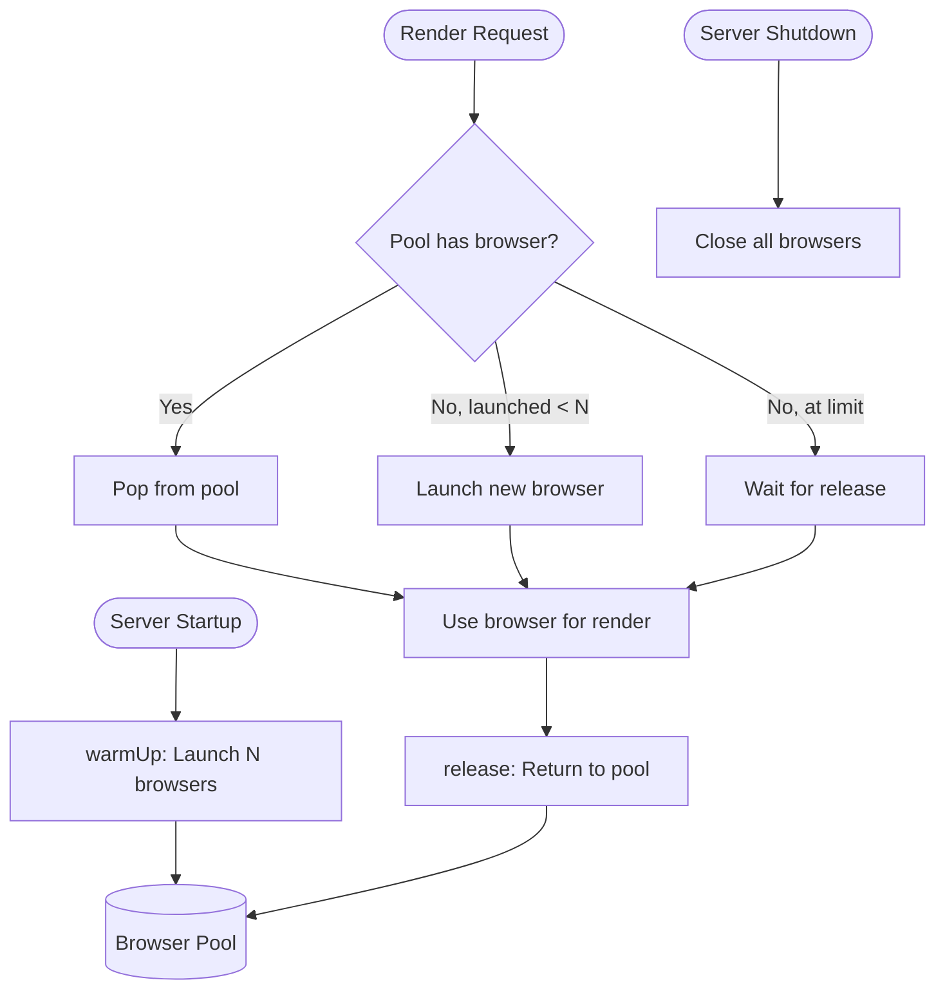

# Browser Pool

## Contract

From Container (c3-1): "Manage pool of Puppeteer browser instances for mermaid rendering"

## How It Works

### Flow

### Dependencies

| Dependency | Component | Purpose |
|------------|-----------|---------|
| Config | c3-108 | Get BROWSER_POOL_SIZE |
| Logger | c3-109 | Log pool operations |

### Configuration

| Setting | Environment Variable | Default | Purpose |
|---------|---------------------|---------|---------|
| Pool Size | BROWSER_POOL_SIZE | QUEUE_MAX_CONCURRENT | Number of browser instances |

## Edge Cases

| Scenario | Behavior | Rationale |
|----------|----------|-----------|
| Browser crash during render | Error propagates, browser not returned | Caller handles retry |
| Pool exhausted | New requests wait for release | Backpressure via queue |
| Shutdown with active renders | Wait for cleanup, then close | Graceful shutdown |

## References

- src/atoms/browser-pool.ts - Implementation
- [ADR: Mermaid Browser Pool](../adr/adr-20251223-mermaid-browser-pool.md)
