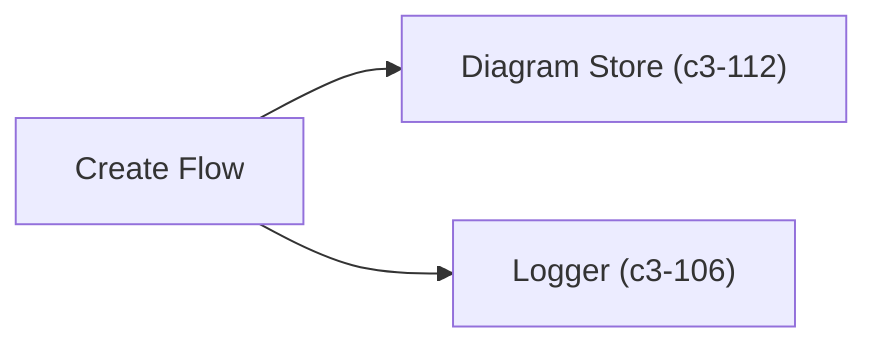
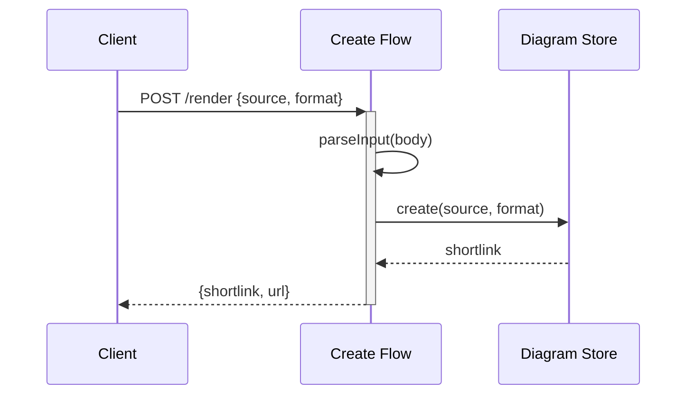

# Create Flow

Validates diagram input, stores source code in SQLite, and returns a shortlink for viewing.

## Dependencies



## Behavior



## Input/Output

**Input (parsed from JSON body):**
```typescript
interface CreateInput {
  source: string;              // Diagram source code (required)
  format: "mermaid" | "d2";    // Diagram format (required)
}
```

**Output:**
```typescript
interface CreateResult {
  shortlink: string;  // 8-char UUID
  url: string;        // Full URL to view page
}
```

## References

- `createFlow` - `src/flows/create.ts`
- `parseCreateInput()` - `src/flows/create.ts`

## Testing Strategy

**Unit scope:**
- Input validation (missing source, invalid format)
- Shortlink generation
- URL construction with baseUrl

**Integration scope:**
- Full flow with real diagram store
