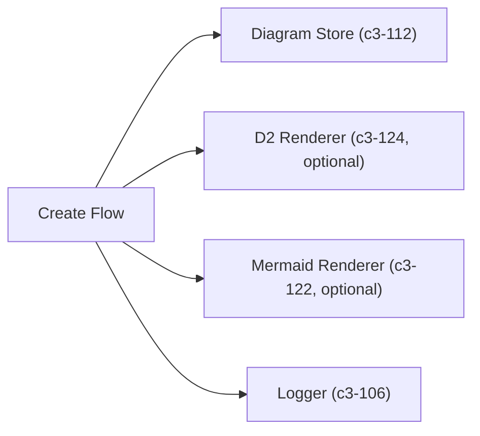
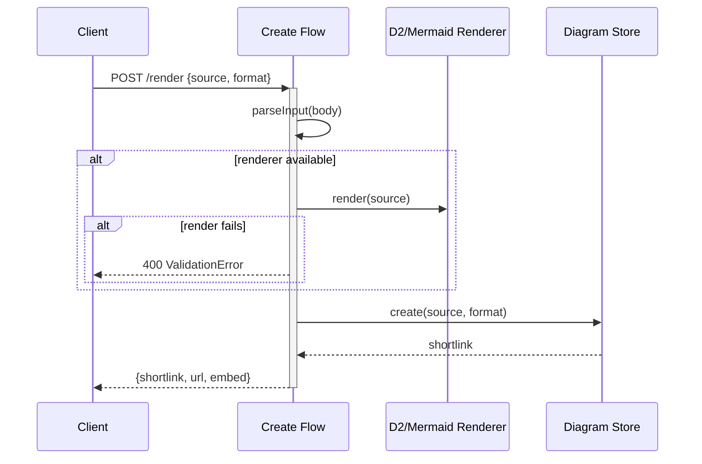

# Create Flow

Validates diagram input, renders to validate source syntax, stores source code in SQLite, and returns a shortlink for viewing and embedding.

## Goal

Validate input and diagram source, store diagram, return shortlink.

## Dependencies


```mermaid
graph LR
    CreateFlow["Create Flow"] --> DiagramStore["Diagram Store (c3-112)"]
    CreateFlow --> D2Renderer["D2 Renderer (c3-124, optional)"]
    CreateFlow --> MermaidRenderer["Mermaid Renderer (c3-122, optional)"]
    CreateFlow --> Logger["Logger (c3-106)"]
```
## Behavior


```mermaid
sequenceDiagram
    participant Client
    participant Flow as Create Flow
    participant Renderer as D2/Mermaid Renderer
    participant Store as Diagram Store

    Client->>+Flow: POST /render {source, format}
    Flow->>Flow: parseInput(body)
    alt renderer available
        Flow->>Renderer: render(source)
        alt render fails
            Flow-->>Client: 400 ValidationError
        end
    end
    Flow->>Store: create(source, format)
    Store-->>Flow: shortlink
    Flow-->>-Client: {shortlink, url, embed}
```
## Input/Output

**Input (parsed from JSON body):**

```typescript
interface CreateInput {
  source: string;              // Diagram source code (required)
  format: "mermaid" | "d2";    // Diagram format (required)
  shortlink?: string;          // Existing shortlink for versioning
  version?: string;            // Custom version name
}
```
**Output:**

```typescript
interface CreateResult {
  shortlink: string;  // 8-char UUID
  url: string;        // Full URL to view page (/d/:id)
  embed: string;      // Full URL to embed SVG (/e/:id)
  version: string;    // Version name (auto or custom)
}
```
## Render Validation

Best-effort validation at create time using optional renderer atoms:

- **D2**: Uses `optionalD2RendererAtom` — skips if `d2` CLI not on PATH
- **Mermaid**: Uses `optionalMermaidRendererAtom` — skips if CHROME_PATH not configured
- On render failure, throws `ValidationError` (400) with the renderer error message
- The rendered SVG is not cached (re-rendered at view time)
## References

- `createFlow` - `src/flows/create.ts:83`
- `parseCreateInput()` - `src/flows/create.ts:32`
- `ValidationError` - `src/flows/create.ts:21`
## Testing Strategy

**Unit scope:**

- Input validation (missing source, invalid format)
- Render validation (invalid D2/mermaid rejected with 400)
- Graceful skip when renderer unavailable
- Shortlink generation and URL construction
**Integration scope:**

- Full flow with real diagram store
