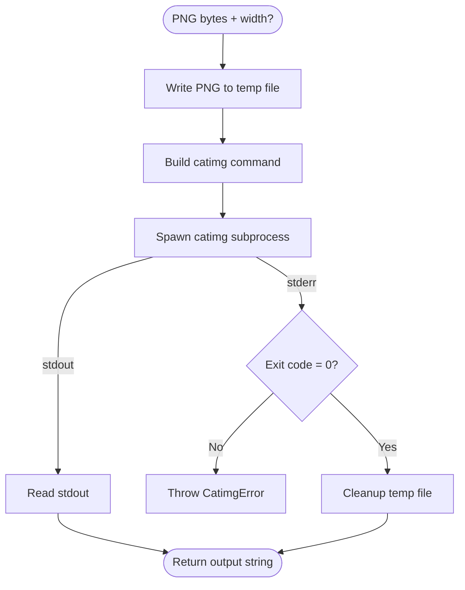

# Terminal Renderer

## Contract

From Container (c3-1): "Convert PNG diagram to terminal-displayable ANSI output"

## How It Works

### Flow

### Dependencies

| Dependency | Component | Purpose |
|------------|-----------|---------|
| Logger | c3-109 | Log conversion progress |
| Config | c3-108 | Get catimg path (CATIMG_PATH) |

### Decision Points

| Decision | Condition | Outcome |
|----------|-----------|---------|
| Width flag | width option provided | Add -w flag to catimg command |

## Edge Cases

| Scenario | Behavior | Rationale |
|----------|----------|-----------|
| catimg not installed | CatimgError on spawn | Missing dependency |
| Invalid PNG | catimg error message | Pass through catimg error |
| Large image | May take time | No timeout currently |

## Error Handling

| Error | Detection | Recovery |
|-------|-----------|----------|
| CatimgError | Spawn fails or non-zero exit | Return to caller (becomes 500) |

## External Tools

| Tool | Usage Pattern | Purpose |
|------|---------------|---------|
| catimg | catimg [-w WIDTH] input.png | Convert PNG to ANSI terminal output |

## References

- src/atoms/terminal-renderer.ts - Implementation
- [catimg GitHub](https://github.com/posva/catimg) - External tool
