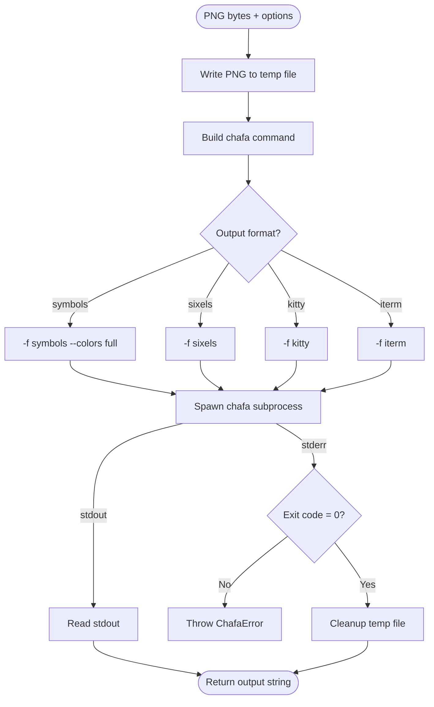

# Terminal Renderer

## Contract

From Container (c3-1): "Convert PNG diagram to terminal-displayable output"

## How It Works

### Flow

### Dependencies

| Dependency | Component | Purpose |
|------------|-----------|---------|
| Logger | c3-109 | Log conversion progress |
| Config | c3-108 | Get chafa path (CHAFA_PATH) |

### Decision Points

| Decision | Condition | Outcome |
|----------|-----------|---------|
| Output format | format option | Select chafa -f flag |
| Width | width option provided | Add -s WIDTHx flag |
| Colors | symbols format | Add --colors full for quality |

## Output Formats

| Format | Flag | Use Case |
|--------|------|----------|
| symbols | -f symbols | Default, works everywhere |
| sixels | -f sixels | High quality for xterm, mlterm, foot |
| kitty | -f kitty | Native protocol for Kitty terminal |
| iterm | -f iterm | Native protocol for iTerm2 |

## Edge Cases

| Scenario | Behavior | Rationale |
|----------|----------|-----------|
| chafa not installed | ChafaError on spawn | Missing dependency |
| Invalid PNG | chafa error message | Pass through chafa error |
| Unknown terminal | Use symbols | Most compatible fallback |

## Error Handling

| Error | Detection | Recovery |
|-------|-----------|----------|
| ChafaError | Spawn fails or non-zero exit | Return to caller (becomes 500) |

## External Tools

| Tool | Usage Pattern | Purpose |
|------|---------------|---------|
| chafa | chafa -f FORMAT -s WIDTHx input.png | Convert PNG to terminal output |

## References

- src/atoms/terminal-renderer.ts - Implementation
- [chafa GitHub](https://github.com/hpjansson/chafa) - External tool
- [chafa man page](https://hpjansson.org/chafa/man/) - Documentation
