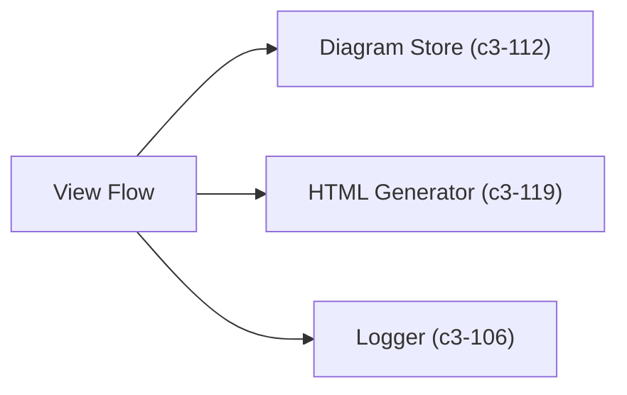
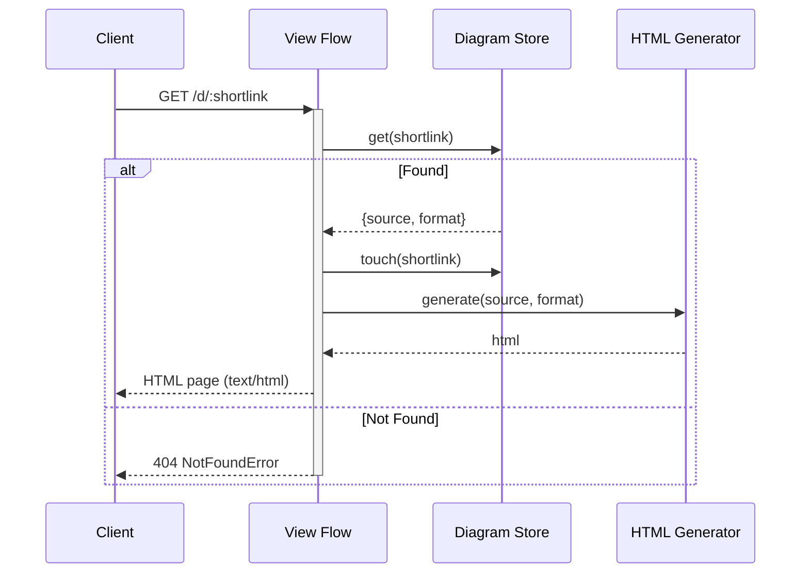

# View Flow

Looks up diagram source by shortlink and generates an HTML page that renders the diagram client-side.

## Dependencies



## Behavior



## Input/Output

**Input:**
```typescript
interface ViewInput {
  shortlink: string;  // From URL path
}
```

**Output:**
```typescript
interface ViewResult {
  html: string;
  contentType: "text/html";
}
```

## References

- `viewFlow` - `src/flows/view.ts`
- NotFoundError - `src/flows/view.ts`

## Testing Strategy

**Unit scope:**
- Shortlink lookup
- NotFoundError on missing
- HTML generation delegation

**Integration scope:**
- Full flow with real store and generator
- HTML output contains diagram source
