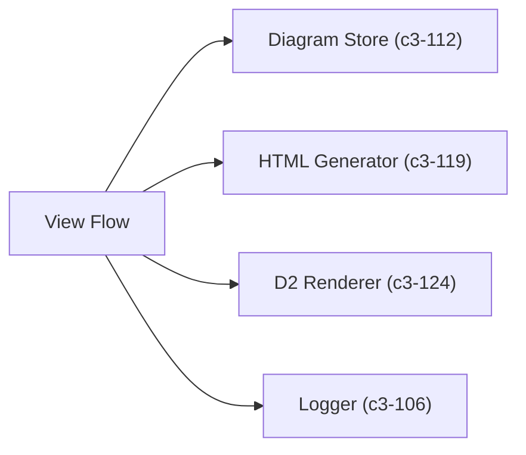
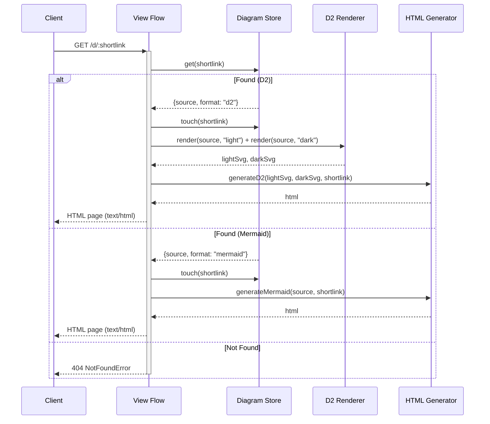

# View Flow

Looks up diagram source by shortlink and generates an HTML page that renders the diagram client-side. D2 diagrams are pre-rendered server-side for both light/dark themes.

## Dependencies



## Behavior



## Input/Output

**Input:**
```typescript
interface ViewInput {
  shortlink: string;  // From URL path
}
```

**Output:**
```typescript
interface ViewOutput {
  html: string;
  contentType: "text/html";
}
```

## References

- `viewFlow` - `src/flows/view.ts:39`
- `NotFoundError` - `src/flows/view.ts:8`

## Testing Strategy

**Unit scope:**
- Shortlink lookup
- NotFoundError on missing
- D2 pre-rendering delegation
- Mermaid client-side HTML generation

**Integration scope:**
- Full flow with real store, D2 renderer, and generator
- HTML output contains diagram source
