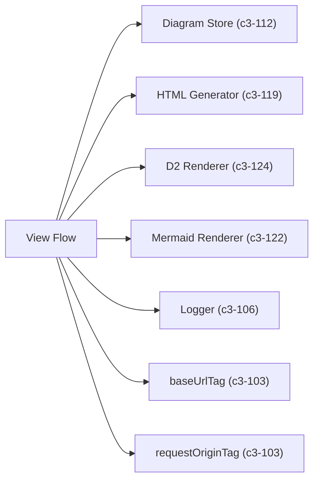
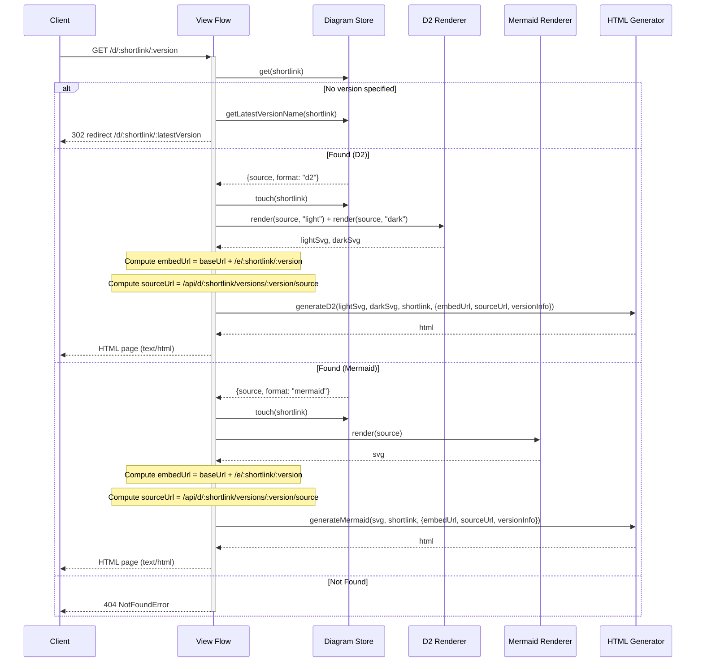

# View Flow

Looks up diagram source by shortlink, renders the diagram server-side, and generates an HTML page with the SVG inlined. Both D2 and Mermaid diagrams are pre-rendered server-side.

## Goal

Lookup diagram source and generate HTML page with server-rendered SVG.

## Dependencies


```mermaid
graph LR
    ViewFlow["View Flow"] --> DiagramStore["Diagram Store (c3-112)"]
    ViewFlow --> HTMLGen["HTML Generator (c3-119)"]
    ViewFlow --> D2Renderer["D2 Renderer (c3-124)"]
    ViewFlow --> MermaidRenderer["Mermaid Renderer (c3-122)"]
    ViewFlow --> Logger["Logger (c3-106)"]
    ViewFlow --> BaseUrlTag["baseUrlTag (c3-103)"]
    ViewFlow --> RequestOriginTag["requestOriginTag (c3-103)"]
```
| Dependency | Purpose |
| --- | --- |
| Diagram Store (c3-112) | Lookup diagram by shortlink, get version source, touch for retention |
| HTML Generator (c3-119) | Generate complete HTML page from rendered SVGs |
| D2 Renderer (c3-124) | Server-side render D2 source to SVG (light + dark) |
| Mermaid Renderer (c3-122) | Server-side render Mermaid source to SVG |
| Logger (c3-106) | Debug logging |
| baseUrlTag (c3-103) | Configured base URL for constructing embed/source URLs |
| requestOriginTag (c3-103) | Request-origin fallback when baseUrlTag is not configured |
## Behavior


```mermaid
sequenceDiagram
    participant Client
    participant Flow as View Flow
    participant Store as Diagram Store
    participant D2 as D2 Renderer
    participant Mermaid as Mermaid Renderer
    participant Gen as HTML Generator

    Client->>+Flow: GET /d/:shortlink/:version
    Flow->>Store: get(shortlink)
    alt No version specified
        Flow->>Store: getLatestVersionName(shortlink)
        Flow-->>Client: 302 redirect /d/:shortlink/:latestVersion
    else Found (D2)
        Store-->>Flow: {source, format: "d2"}
        Flow->>Store: touch(shortlink)
        Flow->>D2: render(source, "light") + render(source, "dark")
        D2-->>Flow: lightSvg, darkSvg
        Note over Flow: Compute embedUrl = baseUrl + /e/:shortlink/:version
        Note over Flow: Compute sourceUrl = /api/d/:shortlink/versions/:version/source
        Flow->>Gen: generateD2(lightSvg, darkSvg, shortlink, {embedUrl, sourceUrl, versionInfo})
        Gen-->>Flow: html
        Flow-->>Client: HTML page (text/html)
    else Found (Mermaid)
        Store-->>Flow: {source, format: "mermaid"}
        Flow->>Store: touch(shortlink)
        Flow->>Mermaid: render(source)
        Mermaid-->>Flow: svg
        Note over Flow: Compute embedUrl = baseUrl + /e/:shortlink/:version
        Note over Flow: Compute sourceUrl = /api/d/:shortlink/versions/:version/source
        Flow->>Gen: generateMermaid(svg, shortlink, {embedUrl, sourceUrl, versionInfo})
        Gen-->>Flow: html
        Flow-->>Client: HTML page (text/html)
    else Not Found
        Flow-->>-Client: 404 NotFoundError
    end
```
## Input/Output

**Input:**

```typescript
interface ViewInput {
  shortlink: string;
  versionName?: string;
}
```
**Output:**

```typescript
interface ViewOutput {
  html: string;
  contentType: "text/html";
  redirect?: string;
}
```
## URL Computation

| URL | Pattern | Purpose |
| --- | --- | --- |
| embedUrl | {baseUrl}/e/{shortlink}/{version} | OpenGraph embed for link previews |
| sourceUrl | /api/d/{shortlink}/versions/{version}/source | Programmatic/LLM source discovery via <link rel="source"> |
`baseUrl` is resolved as `baseUrlTag ?? requestOriginTag ?? ""`. If empty, `embedUrl` is omitted.

## Error Handling

| Error | Status | Condition |
| --- | --- | --- |
| NotFoundError | 404 | Diagram or version not found |
| RenderNotAvailableError | 503 | Mermaid SSR not configured (CHROME_PATH not set) |
## References

- `viewFlow` - `src/flows/view.ts`
- `NotFoundError` - `src/flows/view.ts`
- `RenderNotAvailableError` - `src/flows/view.ts`
## Testing Strategy

**Unit scope:**

- Shortlink lookup
- NotFoundError on missing
- D2 pre-rendering delegation
- Mermaid server-side rendering delegation
- 503 when mermaid renderer not available
- Redirect to latest version when no version specified
- sourceUrl and embedUrl correctly computed and passed to HTML generator
**Integration scope:**

- Full flow with real store, renderers, and generator
- HTML output contains rendered SVG
