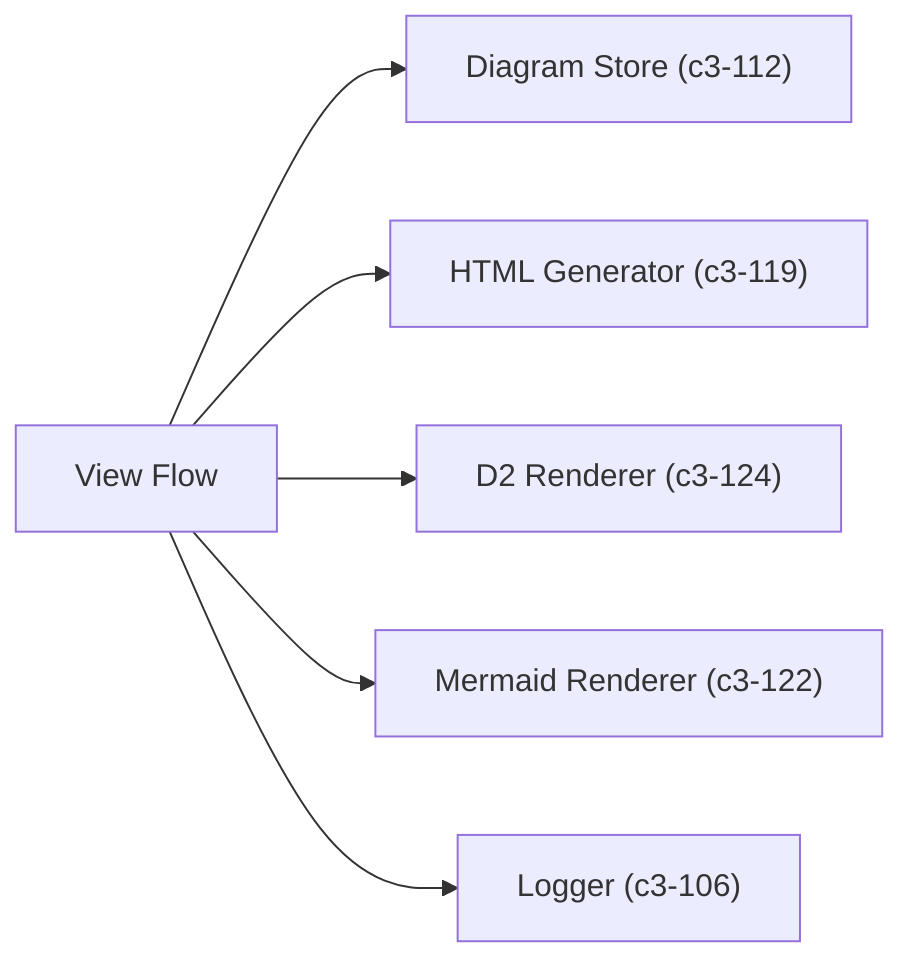
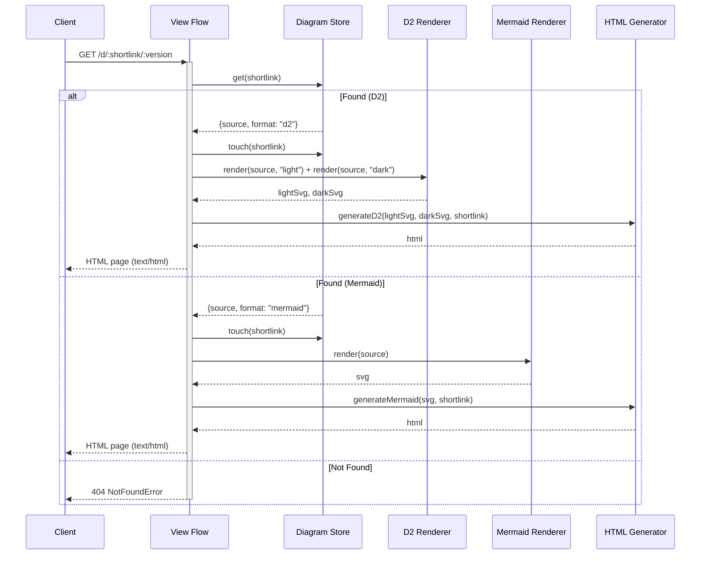

# View Flow

Looks up diagram source by shortlink, renders the diagram server-side, and generates an HTML page with the SVG inlined. Both D2 and Mermaid diagrams are pre-rendered server-side.

## Dependencies


```mermaid
graph LR
    ViewFlow["View Flow"] --> DiagramStore["Diagram Store (c3-112)"]
    ViewFlow --> HTMLGen["HTML Generator (c3-119)"]
    ViewFlow --> D2Renderer["D2 Renderer (c3-124)"]
    ViewFlow --> MermaidRenderer["Mermaid Renderer (c3-122)"]
    ViewFlow --> Logger["Logger (c3-106)"]
```

## Behavior


```mermaid
sequenceDiagram
    participant Client
    participant Flow as View Flow
    participant Store as Diagram Store
    participant D2 as D2 Renderer
    participant Mermaid as Mermaid Renderer
    participant Gen as HTML Generator

    Client->>+Flow: GET /d/:shortlink/:version
    Flow->>Store: get(shortlink)
    alt Found (D2)
        Store-->>Flow: {source, format: "d2"}
        Flow->>Store: touch(shortlink)
        Flow->>D2: render(source, "light") + render(source, "dark")
        D2-->>Flow: lightSvg, darkSvg
        Flow->>Gen: generateD2(lightSvg, darkSvg, shortlink)
        Gen-->>Flow: html
        Flow-->>Client: HTML page (text/html)
    else Found (Mermaid)
        Store-->>Flow: {source, format: "mermaid"}
        Flow->>Store: touch(shortlink)
        Flow->>Mermaid: render(source)
        Mermaid-->>Flow: svg
        Flow->>Gen: generateMermaid(svg, shortlink)
        Gen-->>Flow: html
        Flow-->>Client: HTML page (text/html)
    else Not Found
        Flow-->>-Client: 404 NotFoundError
    end
```

## Input/Output

**Input:**
```typescript
interface ViewInput {
  shortlink: string;
  versionName?: string;
}
```

**Output:**
```typescript
interface ViewOutput {
  html: string;
  contentType: "text/html";
  redirect?: string;
}
```

## Error Handling

| Error | Status | Condition |
|-------|--------|-----------|
| `NotFoundError` | 404 | Diagram or version not found |
| `RenderNotAvailableError` | 503 | Mermaid SSR not configured (CHROME_PATH not set) |

## References

- `viewFlow` - `src/flows/view.ts`
- `NotFoundError` - `src/flows/view.ts`
- `RenderNotAvailableError` - `src/flows/view.ts`

## Testing Strategy

**Unit scope:**
- Shortlink lookup
- NotFoundError on missing
- D2 pre-rendering delegation
- Mermaid server-side rendering delegation
- 503 when mermaid renderer not available

**Integration scope:**
- Full flow with real store, renderers, and generator
- HTML output contains rendered SVG
