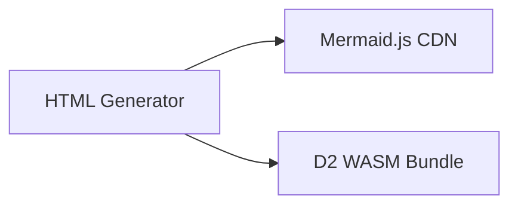
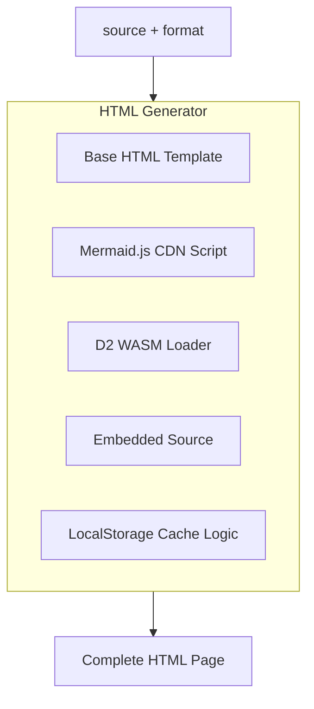

# HTML Generator

Generates complete HTML pages that render diagrams client-side. Includes Mermaid.js for Mermaid diagrams and D2 WASM for D2 diagrams.

## Dependencies



## Interface

```typescript
interface HTMLGenerator {
  generate(source: string, format: "mermaid" | "d2"): string;
}
```

## Behavior



## HTML Structure

```html
<!DOCTYPE html>
<html>
<head>
  <meta charset="utf-8">
  <meta name="viewport" content="width=device-width, initial-scale=1">
  <title>Diagram - {shortlink}</title>
  <style>/* responsive styles */</style>
</head>
<body>
  <div id="diagram"></div>

  <!-- For Mermaid -->
  <script src="https://cdn.jsdelivr.net/npm/mermaid/dist/mermaid.min.js"></script>

  <!-- For D2 -->
  <script src="/d2-wasm.js"></script>

  <script>
    const source = `{escaped_source}`;
    const format = "{format}";

    // LocalStorage caching
    const cacheKey = `diagram-{shortlink}`;
    const cached = localStorage.getItem(cacheKey);

    if (cached) {
      document.getElementById('diagram').innerHTML = cached;
    } else {
      // Render based on format
      if (format === 'mermaid') {
        mermaid.render('mermaid-svg', source).then(({svg}) => {
          document.getElementById('diagram').innerHTML = svg;
          localStorage.setItem(cacheKey, svg);
        });
      } else {
        // D2 WASM rendering
        d2.render(source).then(svg => {
          document.getElementById('diagram').innerHTML = svg;
          localStorage.setItem(cacheKey, svg);
        });
      }
    }
  </script>
</body>
</html>
```

## Features

| Feature | Implementation |
|---------|----------------|
| Responsive | CSS flexbox centering, max-width constraints |
| LocalStorage | Caches rendered SVG for instant repeat views |
| CDN caching | HTML is static, cacheable forever |
| Dark mode | Respects `prefers-color-scheme` |
| Error handling | Shows parse errors in UI |

## References

- `htmlGeneratorAtom` - `src/atoms/html-generator.ts`
- Template string - `src/atoms/html-generator.ts`

## Testing Strategy

**Unit scope:**
- HTML contains source
- Format detection selects correct renderer script
- Source is properly escaped (XSS prevention)

**Integration scope:**
- Rendered page in headless browser (optional)
