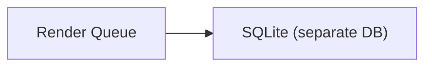

# Render Queue

Persistent job queue backed by SQLite for managing Mermaid render jobs. Uses lease-based claiming with browser ownership to prevent double-processing and enable crash recovery.

## Dependencies



## Interface

```typescript
function createRenderQueue(db: Database, config?: QueueConfig): {
  enqueue(source: string): string;           // Returns job ID
  claim(browserId: string): RenderJob | null; // Lease-based claim
  complete(id: string, browserId: string): boolean;
  retry(id: string, browserId: string): boolean;
  fail(id: string, browserId: string): boolean;
  recoverBrowser(browserId: string): number;  // Recover dead browser's jobs
  recoverStale(): number;                     // Recover expired leases
  hasPending(): boolean;
  countPending(): number;
  countProcessing(): number;
}
```

## Behavior

| Aspect | Implementation |
|--------|----------------|
| Storage | SQLite WAL mode with 5s busy timeout |
| Claiming | Browser ownership + lease TTL |
| Retry | Configurable max retries (default: 2) |
| Recovery | Stale lease recovery + per-browser recovery |
| Ordering | FIFO by `created_at` |

## Schema

```sql
CREATE TABLE render_jobs (
  id TEXT PRIMARY KEY,
  source TEXT NOT NULL,
  state TEXT DEFAULT 'pending',    -- pending | processing
  retries INTEGER DEFAULT 0,
  browser_id TEXT,
  created_at INTEGER NOT NULL,
  claimed_at INTEGER
);
```

## References

- `createRenderQueue()` - `src/atoms/render-queue.ts:15`

## Testing Strategy

**Unit scope:**
- Enqueue/claim/complete cycle
- Retry budget enforcement
- Browser ownership verification
- Stale lease recovery
