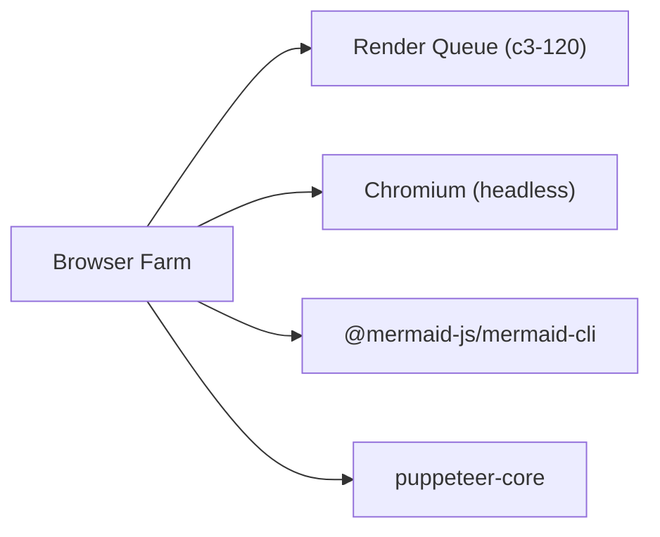

# Browser Farm

Manages a configurable pool of headless Chromium browsers for rendering Mermaid diagrams to SVG. Handles browser lifecycle, health checks, crash recovery, and input/output sanitization.

## Dependencies



## Interface

```typescript
function createBrowserFarm(config: FarmConfig): {
  start(): Promise<void>;
  stop(): Promise<void>;
  render(source: string): Promise<string>;  // Returns SVG
  isStarted(): boolean;
  getState(): FarmState;  // stopped | starting | running | stopping
}
```

## Behavior

| Aspect | Implementation |
|--------|----------------|
| Pool size | Configurable via `MERMAID_POOL_SIZE` (default: 2) |
| Memory | ~200-300MB per browser instance |
| Timeout | Per-render timeout kills browser, triggers retry |
| Health checks | 30s interval, 3 failures triggers respawn |
| Port range | 19222-19321, quarantined 5s after release |
| State machine | stopped → starting → running → stopping → stopped |

## Security

4-layer defense-in-depth:
1. **Input validation** - Blocks dangerous patterns (XSS, SSRF, injection)
2. **Mermaid securityLevel:strict** - Disables click handlers and links
3. **Page request interception** - Blocks external HTTP/HTTPS/FTP/WS requests
4. **Output validation** - Blocks dangerous SVG content (scripts, event handlers)

## Edge Cases

| Scenario | Behavior |
|----------|----------|
| Browser crash | Respawn, requeue job via `recoverBrowser()` |
| Render timeout | Kill browser, consume retry budget |
| Queue full | Reject with "queue full" error |
| Source > 100KB | Reject immediately |
| SVG > 5MB | Reject after render |
| Farm stopped during render | Reject pending promises |
| Double start | Throws error |

## References

- `createBrowserFarm()` - `src/atoms/browser-farm.ts:30`
- Input sanitization patterns - `src/atoms/browser-farm.ts:529-549`
- Output SVG validation - `src/atoms/browser-farm.ts:404-415`

## Testing Strategy

**Unit scope:**
- State machine transitions
- Input validation patterns
- Port allocation and quarantine

**Integration scope:**
- Full render cycle with real browser
- Timeout and retry behavior
- Health check recovery
