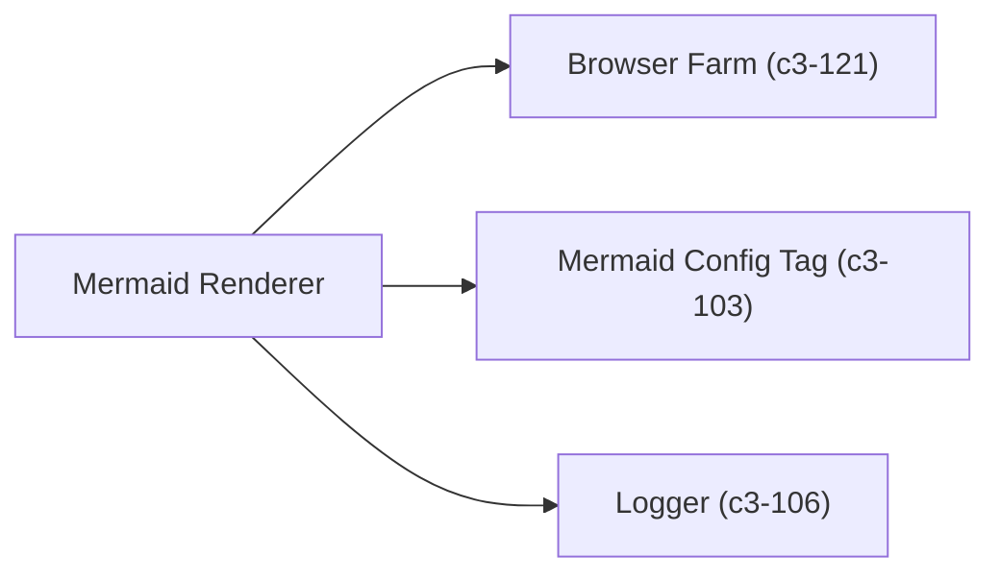

# Mermaid Renderer

DI atom that wraps the browser farm for `@pumped-fn/lite` integration. Provides both required and optional variants for different usage contexts.

## Dependencies



## Interface

```typescript
interface MermaidRenderer {
  render(source: string): Promise<string>;  // Returns SVG
}
```

## Atoms

| Atom | Tag Dependency | Returns |
|------|----------------|---------|
| `mermaidRendererAtom` | `tags.required(mermaidConfigTag)` | `MermaidRenderer` (fails if no config) |
| `optionalMermaidRendererAtom` | `tags.optional(mermaidConfigTag)` | `MermaidRenderer \| undefined` (graceful) |

## Behavior

- Creates dedicated SQLite database for render queue (`MERMAID_DB_PATH`)
- Starts browser farm on atom resolution (fail-fast)
- Registers cleanup hook to stop farm and close DB on scope disposal
- `optionalMermaidRendererAtom` returns `undefined` when `CHROME_PATH` not set

## Configuration

| Variable | Default | Purpose |
|----------|---------|---------|
| `CHROME_PATH` | _(required)_ | Path to Chromium executable |
| `MERMAID_DB_PATH` | `./data/mermaid-queue.db` | Queue database path |
| `MERMAID_POOL_SIZE` | `2` | Browser pool size |
| `MERMAID_TIMEOUT` | `30000` | Render timeout (ms) |
| `MERMAID_NO_SANDBOX` | `true` | Disable Chrome sandbox (for containers) |
| `MERMAID_MAX_QUEUE` | `1000` | Max pending queue size |

## References

- `mermaidRendererAtom` - `src/atoms/mermaid-renderer.ts:14`
- `optionalMermaidRendererAtom` - `src/atoms/mermaid-renderer.ts:61`
