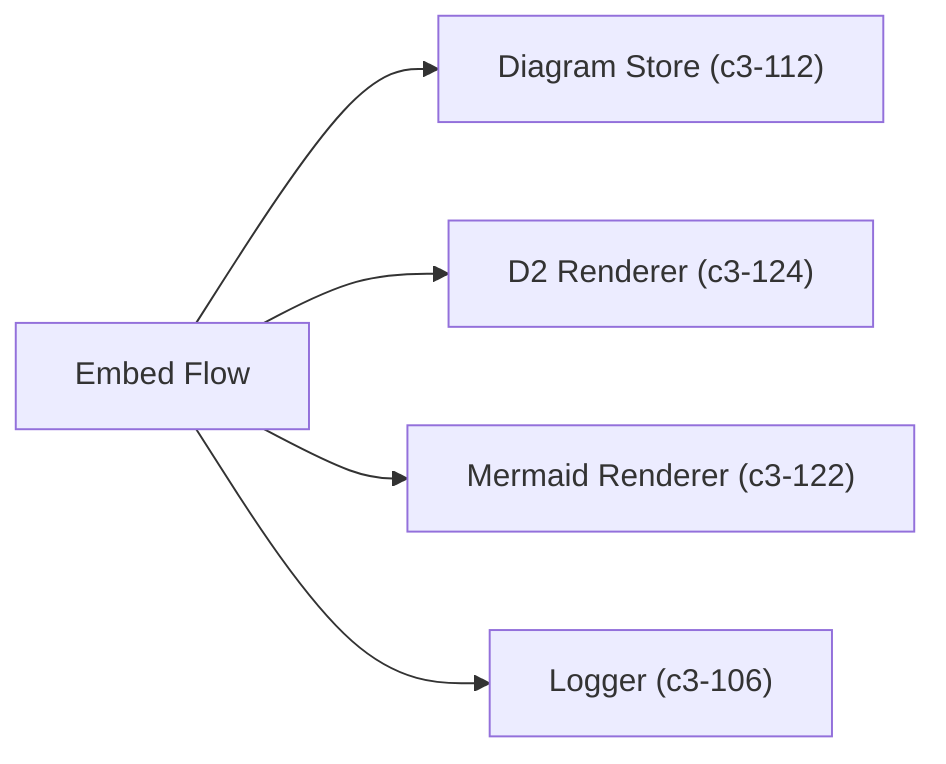
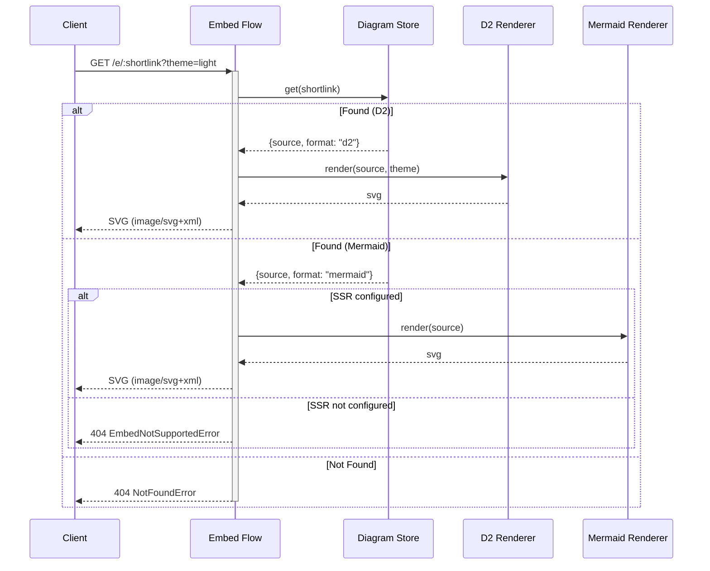

# Embed Flow

Looks up diagram source by shortlink and renders it server-side to SVG for embedding in markdown, docs, or img tags.

## Dependencies



## Behavior



## Input/Output

**Input:**
```typescript
interface EmbedInput {
  shortlink: string;
  theme?: "light" | "dark";  // D2 only, default "light"
}
```

**Output:**
```typescript
interface EmbedOutput {
  svg: string;
  contentType: "image/svg+xml";
}
```

## Error Mapping

| Error | Status | Trigger |
|-------|--------|---------|
| `NotFoundError` | 404 | Shortlink not in database |
| `EmbedNotSupportedError` | 404 | Mermaid without CHROME_PATH |
| `EmbedRenderError` | 400 | Forbidden content in source |
| `EmbedRenderError` | 503 | Queue full |
| `EmbedRenderError` | 504 | Render timeout |
| `EmbedRenderError` | 500 | Other render failure |

## References

- `embedFlow` - `src/flows/embed.ts:54`
- `EmbedNotSupportedError` - `src/flows/embed.ts:18`
- `EmbedRenderError` - `src/flows/embed.ts:26`

## Testing Strategy

**Unit scope:**
- D2 render delegation
- Mermaid render delegation
- Error mapping for render failures
- Missing mermaid renderer graceful handling

**Integration scope:**
- Full flow with real D2 CLI
- Mermaid SSR flow (requires Chromium)
