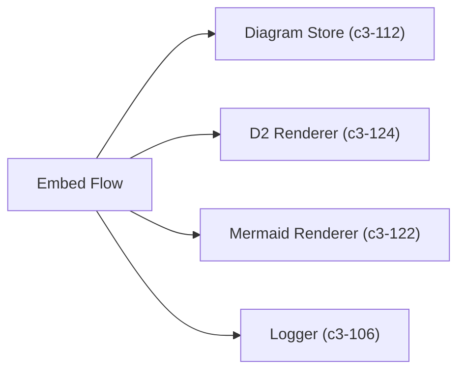
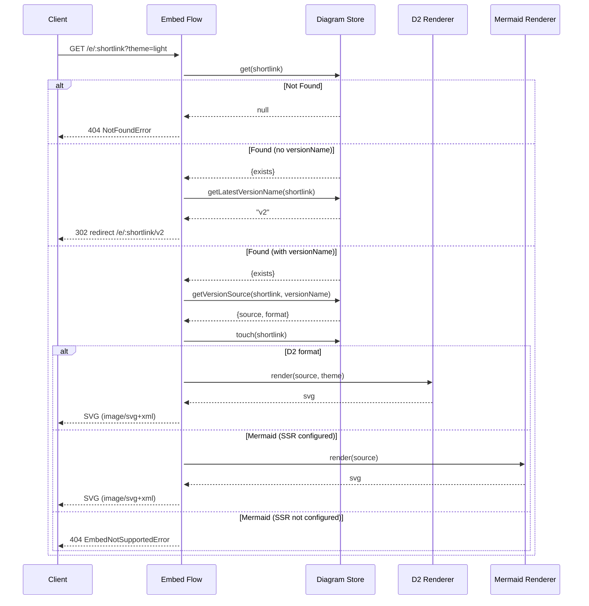

# Embed Flow

Looks up diagram source by shortlink and renders it server-side to SVG for embedding in markdown, docs, or img tags.

## Goal

Render diagram to embeddable SVG via server-side rendering (D2 CLI or Mermaid browser farm), enabling diagram embedding in markdown, documentation, and img tags.

## Dependencies


```mermaid
graph LR
    EmbedFlow["Embed Flow"] --> DiagramStore["Diagram Store (c3-112)"]
    EmbedFlow --> D2Renderer["D2 Renderer (c3-124)"]
    EmbedFlow --> MermaidRenderer["Mermaid Renderer (c3-122)"]
    EmbedFlow --> Logger["Logger (c3-106)"]
```
## Behavior


```mermaid
sequenceDiagram
    participant Client
    participant Flow as Embed Flow
    participant Store as Diagram Store
    participant D2 as D2 Renderer
    participant Mermaid as Mermaid Renderer

    Client->>+Flow: GET /e/:shortlink?theme=light
    Flow->>Store: get(shortlink)
    alt Not Found
        Store-->>Flow: null
        Flow-->>Client: 404 NotFoundError
    else Found (no versionName)
        Store-->>Flow: {exists}
        Flow->>Store: getLatestVersionName(shortlink)
        Store-->>Flow: "v2"
        Flow-->>Client: 302 redirect /e/:shortlink/v2
    else Found (with versionName)
        Store-->>Flow: {exists}
        Flow->>Store: getVersionSource(shortlink, versionName)
        Store-->>Flow: {source, format}
        Flow->>Store: touch(shortlink)
        alt D2 format
            Flow->>D2: render(source, theme)
            D2-->>Flow: svg
            Flow-->>Client: SVG (image/svg+xml)
        else Mermaid (SSR configured)
            Flow->>Mermaid: render(source)
            Mermaid-->>Flow: svg
            Flow-->>Client: SVG (image/svg+xml)
        else Mermaid (SSR not configured)
            Flow-->>Client: 404 EmbedNotSupportedError
        end
    end
```
## Input/Output

**Input:**

```typescript
interface EmbedInput {
  shortlink: string;
  versionName?: string;
  theme?: "light" | "dark";  // D2 only, default "light"
}
```
**Output:**

```typescript
interface EmbedOutput {
  svg: string;
  contentType: "image/svg+xml";
  redirect?: string;  // set when no versionName — 302 to /e/:shortlink/:latest
}
```
## Error Mapping

| Error | Status | Trigger |
| --- | --- | --- |
| NotFoundError | 404 | Shortlink not in database |
| EmbedNotSupportedError | 404 | Mermaid without CHROME_PATH |
| EmbedRenderError | 400 | Forbidden content in source |
| EmbedRenderError | 503 | Queue full |
| EmbedRenderError | 504 | Render timeout |
| EmbedRenderError | 500 | Other render failure |
## References

- `embedFlow` - `src/flows/embed.ts:61`
- `EmbedNotSupportedError` - `src/flows/embed.ts:20`
- `EmbedRenderError` - `src/flows/embed.ts:28`
## Testing Strategy

**Unit scope:**

- D2 render delegation
- Mermaid render delegation
- Error mapping for render failures
- Missing mermaid renderer graceful handling
- Redirect-to-latest when no versionName provided
**Integration scope:**

- Full flow with real D2 CLI
- Mermaid SSR flow (requires Chromium)
