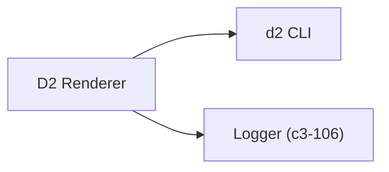

# D2 Renderer

Renders D2 diagram source to SVG by piping source through the `d2` CLI. Supports light and dark themes.

## Dependencies



## Interface

```typescript
interface D2Renderer {
  render(source: string, theme: "light" | "dark"): Promise<string>;  // Returns SVG
}
```

## Behavior

| Aspect | Implementation |
|--------|----------------|
| Execution | `echo $source \| d2 --theme=$id - -` via Bun.$ |
| Light theme | Theme ID `1` (Neutral Grey) |
| Dark theme | Theme ID `200` (Dark Mauve) |
| Validation | Checks SVG output contains `<svg` |
| Error handling | Wraps CLI errors with source preview |

## References

- `d2RendererAtom` - `src/atoms/d2-renderer.ts:9`
