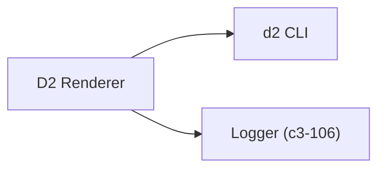

# D2 Renderer

Renders D2 diagram source to SVG by piping source through the `d2` CLI. Supports light and dark themes.

## Goal

Provide server-side D2 diagram rendering via the d2 CLI subprocess, converting D2 source to SVG with theme support.

## Dependencies


```mermaid
graph LR
    D2Renderer["D2 Renderer"] --> D2CLI["d2 CLI"]
    D2Renderer --> Logger["Logger (c3-106)"]
```
## Interface

```typescript
interface D2Renderer {
  render(source: string, theme: "light" | "dark"): Promise<string>;  // Returns SVG
}
```
## Atoms

| Atom | Returns | Purpose |
| --- | --- | --- |
| d2RendererAtom | D2Renderer | Required — for view/embed flows that must render |
| optionalD2RendererAtom | D2Renderer | undefined | Optional — returns undefined if d2 CLI not on PATH. Used for best-effort validation at create time |
Both share `createD2Renderer()` helper internally.

## Behavior

| Aspect | Implementation |
| --- | --- |
| Execution | echo $source | d2 --theme=$id - - via Bun.$ |
| Light theme | Theme ID 1 (Neutral Grey) |
| Dark theme | Theme ID 200 (Dark Mauve) |
| Validation | Checks SVG output contains <svg |
| Error handling | Wraps CLI errors with source preview |
## References

- `d2RendererAtom` - `src/atoms/d2-renderer.ts:35`
- `optionalD2RendererAtom` - `src/atoms/d2-renderer.ts:42`
- `createD2Renderer()` - `src/atoms/d2-renderer.ts:9`
