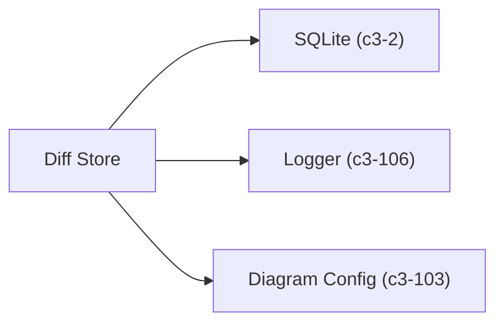

# Diff Store

Provides CRUD operations for diagram diffs (before/after pairs). Stored in the same SQLite database as diagrams, with the same retention-based cleanup strategy.

## Dependencies



## Interface

```typescript
interface DiffStore {
  create(input: CreateDiffInput): string;     // Returns shortlink
  get(id: string): { format: DiagramFormat; before: string; after: string } | null;
  touch(id: string): void;                    // Update accessedAt
  cleanup(): void;                            // Delete old diffs
}

interface CreateDiffInput {
  format: DiagramFormat;
  before: string;
  after: string;
}
```

## Schema

```sql
CREATE TABLE diagram_diffs (
  id TEXT PRIMARY KEY,           -- 8-char UUID shortlink
  format TEXT NOT NULL,          -- 'mermaid' | 'd2'
  source_before TEXT NOT NULL,   -- Before diagram source
  source_after TEXT NOT NULL,    -- After diagram source
  createdAt INTEGER NOT NULL,    -- Unix timestamp ms
  accessedAt INTEGER NOT NULL    -- Last access for cleanup
);

CREATE INDEX idx_diffs_accessed ON diagram_diffs(accessedAt);
```

## References

- `diffStoreAtom` - `src/atoms/diff-store.ts:29`

## Testing Strategy

**Unit scope:**
- CRUD operations with in-memory SQLite
- Cleanup respects retention window
- Touch updates accessedAt
