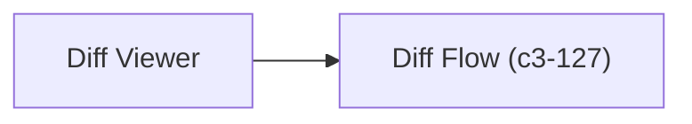

# Diff Viewer

Generates complete HTML pages for comparing two diagrams side-by-side. Both Mermaid and D2 formats receive pre-rendered SVGs from server-side rendering, with synchronized viewport controls.

## Goal

Generate HTML pages for side-by-side diagram comparison with synced zoom/pan, supporting both Mermaid and D2 formats with theme toggling.

## Dependencies


## Interface

```typescript
interface DiffViewer {
  generateMermaidDiff(input: MermaidDiffInput): string;  // Returns HTML
  generateD2Diff(input: D2DiffInput): string;            // Returns HTML
}

interface MermaidDiffInput {
  beforeSvg: string;   // Pre-rendered SVG
  afterSvg: string;    // Pre-rendered SVG
  shortlink: string;
}

interface D2DiffInput {
  beforeLightSvg: string;
  beforeDarkSvg: string;
  afterLightSvg: string;
  afterDarkSvg: string;
  shortlink: string;
}
```
## Features

| Feature | Implementation |
| --- | --- |
| Synced zoom/pan | Shared viewport state across both panels |
| Layout toggle | Horizontal (side-by-side) or vertical (top-to-bottom) |
| Theme toggle | Light/dark with localStorage persistence |
| Text selection | Toggle mode for selecting text in SVGs |
| Touch support | Pinch-to-zoom, drag-to-pan |
| Responsive | Adapts to viewport size |
## Behavior

| Format | Rendering | Dark Mode |
| --- | --- | --- |
| Mermaid | Pre-rendered before/after SVGs inlined | CSS filter inversion |
| D2 | Pre-rendered 4 SVG variants (before/after x light/dark) | Swaps on theme change |
## References

- `diffViewerAtom` - `src/atoms/diff-viewer.ts`
