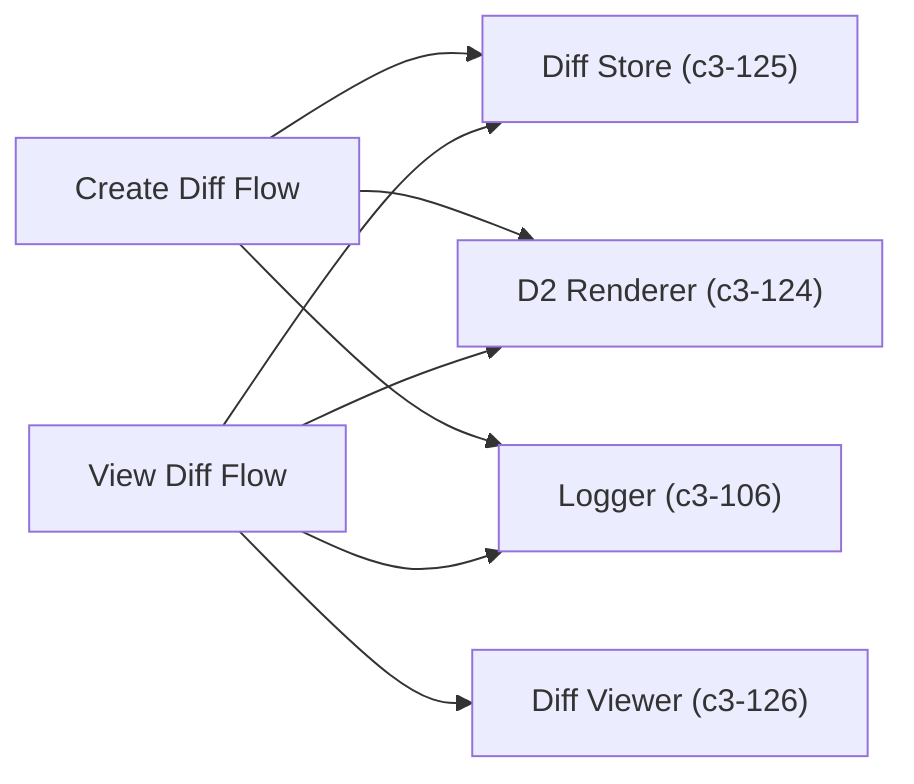

# Diff Flow

Two flows for the diff feature: `createDiffFlow` validates and stores a before/after pair, `viewDiffFlow` generates the comparison HTML page.

## Dependencies



## Create Diff

**Input:**
```typescript
interface CreateDiffInput {
  format: "mermaid" | "d2";
  before: string;   // Before diagram source
  after: string;    // After diagram source
}
```

**Output:**
```typescript
interface CreateDiffResult {
  shortlink: string;
  url: string;       // e.g., https://host/diff/abc12345
}
```

**Behavior:**
1. Validate input (format, non-empty before/after)
2. For D2: validate syntax by rendering both (rejects invalid D2)
3. Store in diff store
4. Return shortlink + URL

## View Diff

**Input:**
```typescript
interface ViewDiffInput {
  shortlink: string;
}
```

**Output:**
```typescript
interface ViewDiffResult {
  html: string;
  contentType: "text/html";
}
```

**Behavior:**
1. Lookup diff by shortlink
2. Touch for retention
3. For Mermaid: pass source to diff viewer (client-side rendering)
4. For D2: pre-render all 4 SVG variants (before/after x light/dark), pass to diff viewer

## References

- `createDiffFlow` - `src/flows/diff.ts:63`
- `viewDiffFlow` - `src/flows/diff.ts:127`
- `DiffValidationError` - `src/flows/diff.ts:9`
- `DiffNotFoundError` - `src/flows/diff.ts:17`

## Testing Strategy

**Unit scope:**
- Input validation (missing fields, invalid format)
- D2 syntax validation on create
- NotFound on missing shortlink

**Integration scope:**
- Full create → view cycle
- D2 pre-rendering with real CLI
