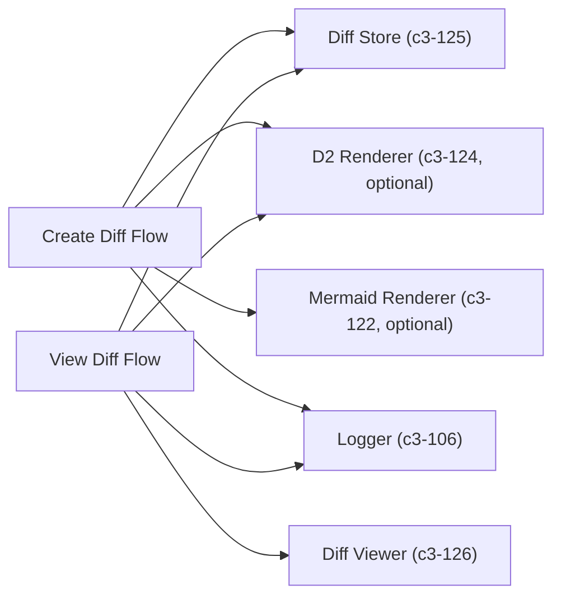

# Diff Flow

Two flows for the diff feature: `createDiffFlow` validates and stores a before/after pair, `viewDiffFlow` generates the comparison HTML page.

## Goal

Create and view side-by-side diagram comparisons, handling validation, storage, and HTML generation for both Mermaid and D2 formats.

## Dependencies


```mermaid
graph LR
    CreateDiff["Create Diff Flow"] --> DiffStore["Diff Store (c3-125)"]
    CreateDiff --> D2Renderer["D2 Renderer (c3-124, optional)"]
    CreateDiff --> MermaidRenderer["Mermaid Renderer (c3-122, optional)"]
    CreateDiff --> Logger["Logger (c3-106)"]

    ViewDiff["View Diff Flow"] --> DiffStore
    ViewDiff --> DiffViewer["Diff Viewer (c3-126)"]
    ViewDiff --> D2Renderer
    ViewDiff --> Logger
```
## Create Diff

**Input:**

```typescript
interface CreateDiffInput {
  format: "mermaid" | "d2";
  before: string;   // Before diagram source
  after: string;    // After diagram source
}
```
**Output:**

```typescript
interface CreateDiffResult {
  shortlink: string;
  url: string;       // e.g., https://host/diff/abc12345
}
```
**Behavior:**

1. Validate input (format, non-empty before/after)
2. Best-effort syntax validation: render both before/after in parallel via `Promise.allSettled`
  - D2: uses `optionalD2RendererAtom` (skips if d2 CLI not on PATH)
  - Mermaid: uses `optionalMermaidRendererAtom` (skips if CHROME_PATH not configured)
3. Store in diff store
4. Return shortlink + URL
## View Diff

**Input:**

```typescript
interface ViewDiffInput {
  shortlink: string;
}
```
**Output:**

```typescript
interface ViewDiffResult {
  html: string;
  contentType: "text/html";
}
```
**Behavior:**

1. Lookup diff by shortlink
2. Touch for retention
3. For Mermaid: render via browser farm, pass SVGs to diff viewer
4. For D2: pre-render all 4 SVG variants (before/after x light/dark), pass to diff viewer
## References

- `createDiffFlow` - `src/flows/diff.ts:65`
- `viewDiffFlow` - `src/flows/diff.ts:138`
- `DiffValidationError` - `src/flows/diff.ts:10`
- `DiffNotFoundError` - `src/flows/diff.ts:18`
## Testing Strategy

**Unit scope:**

- Input validation (missing fields, invalid format)
- D2 and mermaid syntax validation on create
- NotFound on missing shortlink
**Integration scope:**

- Full create → view cycle
- D2 pre-rendering with real CLI
