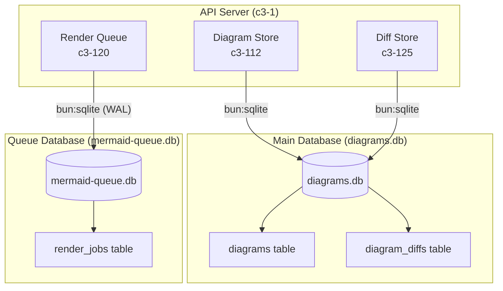
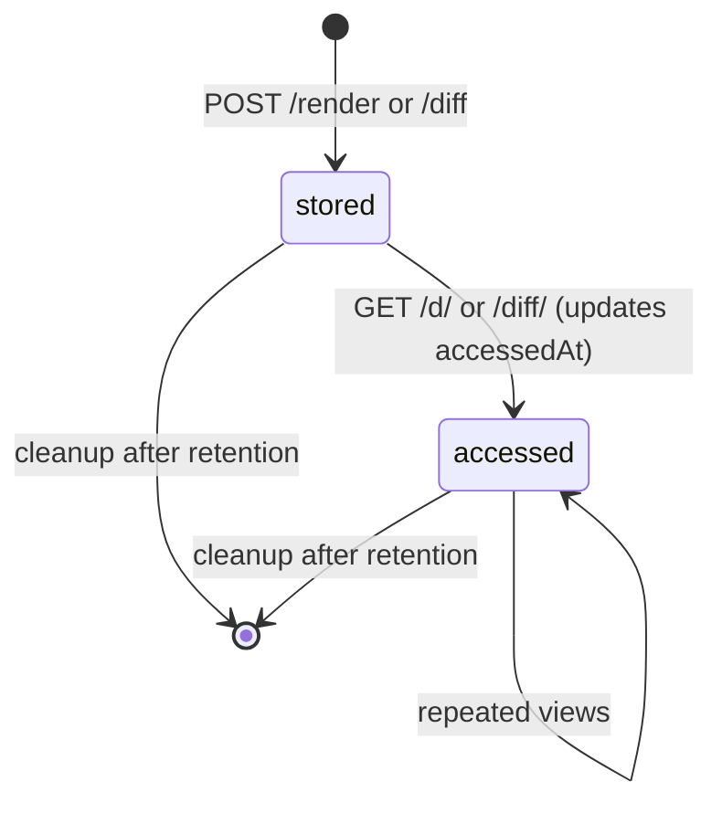

# SQLite Database

Embedded SQLite database storing diagram source code and diff pairs. Accessed via `bun:sqlite` which provides synchronous, in-process database access without external dependencies. A separate database file is used for the Mermaid render queue.

## Overview



## Schema

### diagrams table

```sql
CREATE TABLE diagrams (
  id TEXT PRIMARY KEY,           -- shortlink (8-char UUID)
  source TEXT NOT NULL,          -- diagram source code
  format TEXT NOT NULL,          -- 'mermaid' | 'd2'
  createdAt INTEGER NOT NULL,    -- Unix timestamp ms
  accessedAt INTEGER NOT NULL    -- Last access for cleanup
);

CREATE INDEX idx_diagrams_accessed ON diagrams(accessedAt);
```

### diagram_diffs table

```sql
CREATE TABLE diagram_diffs (
  id TEXT PRIMARY KEY,           -- shortlink (8-char UUID)
  format TEXT NOT NULL,          -- 'mermaid' | 'd2'
  source_before TEXT NOT NULL,   -- Before diagram source
  source_after TEXT NOT NULL,    -- After diagram source
  createdAt INTEGER NOT NULL,    -- Unix timestamp ms
  accessedAt INTEGER NOT NULL    -- Last access for cleanup
);

CREATE INDEX idx_diffs_accessed ON diagram_diffs(accessedAt);
```

### render_jobs table (separate database: mermaid-queue.db)

```sql
CREATE TABLE render_jobs (
  id TEXT PRIMARY KEY,           -- job UUID
  source TEXT NOT NULL,          -- Mermaid source to render
  state TEXT DEFAULT 'pending',  -- 'pending' | 'processing'
  retries INTEGER DEFAULT 0,    -- Retry count
  browser_id TEXT,               -- Claiming browser ID
  created_at INTEGER NOT NULL,   -- Unix timestamp ms
  claimed_at INTEGER             -- Lease timestamp ms
);

CREATE INDEX idx_jobs_state ON render_jobs(state);
CREATE INDEX idx_jobs_browser ON render_jobs(browser_id);
```

## Access Patterns

| Operation | Table | Query | Caller |
|-----------|-------|-------|--------|
| Create diagram | diagrams | `INSERT INTO diagrams ...` | Create Flow (c3-114) |
| Get diagram | diagrams | `SELECT * FROM diagrams WHERE id = ?` | View/Embed Flow |
| Touch access | diagrams | `UPDATE diagrams SET accessedAt = ? WHERE id = ?` | View/Embed Flow |
| Cleanup old | diagrams | `DELETE FROM diagrams WHERE accessedAt < ?` | Cleanup interval |
| Create diff | diagram_diffs | `INSERT INTO diagram_diffs ...` | Diff Flow (c3-127) |
| Get diff | diagram_diffs | `SELECT ... FROM diagram_diffs WHERE id = ?` | Diff Flow (c3-127) |
| Touch diff | diagram_diffs | `UPDATE diagram_diffs SET accessedAt = ? WHERE id = ?` | Diff Flow (c3-127) |
| Cleanup diffs | diagram_diffs | `DELETE FROM diagram_diffs WHERE accessedAt < ?` | Cleanup interval |
| Enqueue render | render_jobs | `INSERT INTO render_jobs ...` | Browser Farm (c3-121) |
| Claim job | render_jobs | `UPDATE ... SET state = 'processing' WHERE state = 'pending'` | Browser Farm (c3-121) |
| Complete job | render_jobs | `DELETE FROM render_jobs WHERE id = ?` | Browser Farm (c3-121) |

## Configuration

| Env Variable | Default | Purpose |
|--------------|---------|---------|
| `DIAGRAM_DB_PATH` | `./data/diagrams.db` | Main database file location |
| `DIAGRAM_RETENTION_DAYS` | `30` | How long to keep diagrams/diffs |
| `CLEANUP_INTERVAL_MS` | `86400000` (daily) | How often to run cleanup |
| `MERMAID_DB_PATH` | `./data/mermaid-queue.db` | Render queue database |

## Constraints

- **Single writer:** Bun process is the only writer for main DB. No WAL mode needed.
- **WAL mode:** Render queue DB uses WAL for concurrent browser access.
- **In-process:** No network latency, synchronous queries are fast.
- **File-based:** Database files must be on persistent volume in containerized deployments.
- **No migrations:** Schema created on first access via `CREATE TABLE IF NOT EXISTS`.

## Data Lifecycle



**Retention logic:** Diagrams and diffs deleted when `accessedAt` is older than retention period. Each view updates `accessedAt`, so actively viewed items persist indefinitely.

## Testing Strategy

**Unit tests:**
- Diagram Store CRUD operations
- Diff Store CRUD operations
- Cleanup retention logic
- Render queue claim/complete cycle

**Integration tests:**
- Lifecycle with real SQLite file
- Concurrent access patterns (render queue)
