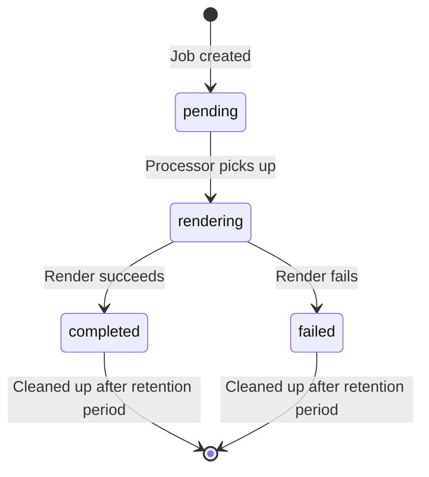
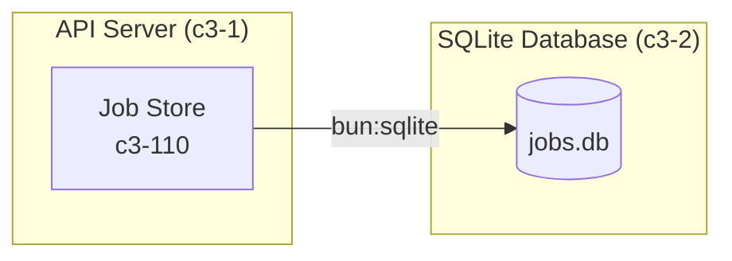

# SQLite Database

## Inherited From Context

- **Boundary:** Data persistence layer accessed by API Server container
- **Protocols:** SQL via bun:sqlite (in-process, no network)
- **Cross-cutting:**
  - Data retention: Completed/failed jobs cleaned after configurable period
  - Durability: SQLite WAL mode for crash recovery

## Overview

The SQLite Database is a separate container responsible for persistent data storage. Per C4 model conventions, databases are containers because they "store data" - a fundamentally different responsibility from compute containers that "execute behavior".

This container stores job records for the async rendering system. It is accessed by the API Server container via Bun's native `bun:sqlite` module.

## Technology Stack

| Technology | Version | Purpose |
|------------|---------|---------|
| SQLite | 3.x | Relational database engine |
| bun:sqlite | (bundled) | Bun's native SQLite bindings |

## Data Model

### Jobs Entity

Represents an async render request and its lifecycle.

| Attribute | Nature | Purpose |
|-----------|--------|---------|
| id | Unique identifier | Format: `job_<uuid8>` for external reference |
| status | State enum | Tracks job lifecycle: pending → rendering → completed/failed |
| source | Text blob | The diagram source code to render |
| format | Enum | Diagram type: mermaid or d2 |
| output_type | Enum | Desired output: svg or png |
| shortlink | Optional text | Result URL, populated on successful completion |
| error | Optional text | Failure reason, populated on error |
| created_at | Timestamp | When job was submitted (enables FIFO ordering) |
| started_at | Timestamp | When rendering began (enables timeout detection) |
| completed_at | Timestamp | When job finished (enables retention cleanup) |

### Access Patterns

| Pattern | Purpose | Indexed |
|---------|---------|---------|
| Lookup by ID | Status polling from clients | Primary key |
| Find oldest pending | Job processor picks next work | By status + created_at |
| Find expired completed | Cleanup old jobs | By completed_at |

## Data Lifecycle

### Job States

### Retention Policy

| Job Status | Retention | Cleanup Trigger |
|------------|-----------|-----------------|
| pending | Indefinite | N/A (waiting for processing) |
| rendering | Indefinite | N/A (in progress) |
| completed | JOB_RETENTION_MS (default 1 hour) | Periodic cleanup |
| failed | JOB_RETENTION_MS (default 1 hour) | Periodic cleanup |

**Cleanup behavior:** Jobs past retention period are deleted based on their `completed_at` timestamp.

## Configuration

| Setting | Environment Variable | Default | Purpose |
|---------|---------------------|---------|---------|
| Database Path | JOB_DB_PATH | ./data/jobs.db | SQLite file location |
| Job Retention | JOB_RETENTION_MS | 3600000 (1 hour) | How long to keep completed/failed jobs |

## Access Pattern

This container is accessed **only** by the API Server container (c3-1) via its Job Store component (c3-110).

## Operations

### Writes

| Operation | Frequency | Component |
|-----------|-----------|-----------|
| INSERT job | Per render request | Job Store (c3-110) |
| UPDATE status | Per job state transition | Job Store (c3-110) |
| DELETE expired | Periodic (cleanup interval) | Job Store (c3-110) |

### Reads

| Operation | Frequency | Component |
|-----------|-----------|-----------|
| SELECT by ID | Per status poll | Job Store (c3-110) |
| SELECT pending (oldest) | Per processor poll cycle | Job Processor (c3-111) via Job Store |

## Durability

- SQLite provides ACID transactions
- WAL mode recommended for concurrent read/write
- Database file auto-created on first access
- Bun runtime handles connection lifecycle

## References

- ADR: adr-20251223-async-render-with-job-polling.md
- Consumer: c3-1-api-server/c3-110-job-store.md
