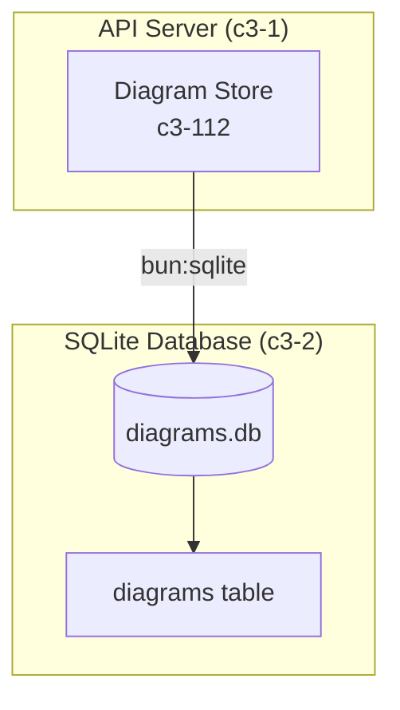
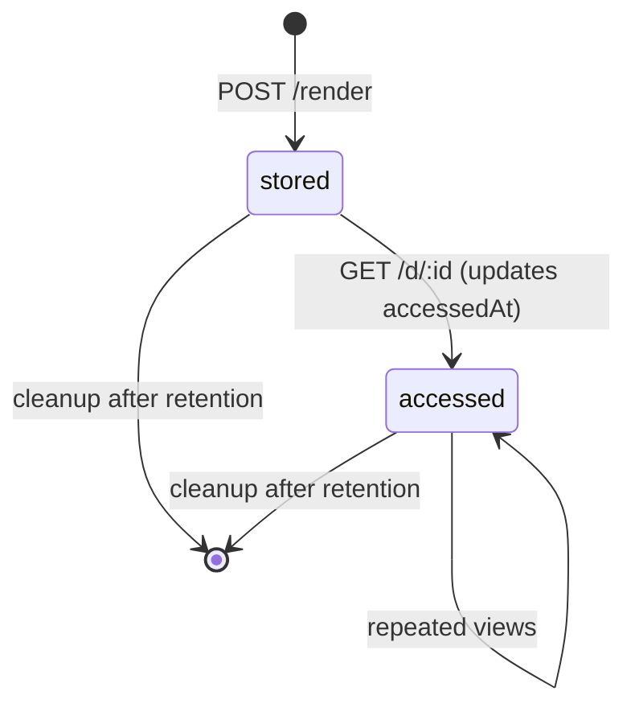

# SQLite Database

Embedded SQLite database storing diagram source code. Accessed via `bun:sqlite` which provides synchronous, in-process database access without external dependencies.

## Overview



## Schema

### diagrams table

```sql
CREATE TABLE diagrams (
  id TEXT PRIMARY KEY,           -- shortlink (8-char UUID)
  source TEXT NOT NULL,          -- diagram source code
  format TEXT NOT NULL,          -- 'mermaid' | 'd2'
  createdAt INTEGER NOT NULL,    -- Unix timestamp ms
  accessedAt INTEGER NOT NULL    -- Last access for cleanup
);

CREATE INDEX idx_diagrams_accessed ON diagrams(accessedAt);
```

## Access Patterns

| Operation | Query | Caller |
|-----------|-------|--------|
| Create diagram | `INSERT INTO diagrams ...` | Create Flow (c3-114) |
| Get diagram | `SELECT * FROM diagrams WHERE id = ?` | View Flow (c3-116) |
| Touch access | `UPDATE diagrams SET accessedAt = ? WHERE id = ?` | View Flow (c3-116) |
| Cleanup old | `DELETE FROM diagrams WHERE accessedAt < ?` | Cleanup job |

## Configuration

| Env Variable | Default | Purpose |
|--------------|---------|---------|
| `DIAGRAM_DB_PATH` | `./data/diagrams.db` | Database file location |
| `DIAGRAM_RETENTION_DAYS` | `30` | How long to keep diagrams |
| `CLEANUP_INTERVAL_MS` | `86400000` (daily) | How often to run cleanup |

## Constraints

- **Single writer:** Bun process is the only writer. No WAL mode needed.
- **In-process:** No network latency, synchronous queries are fast.
- **File-based:** Database file must be on persistent volume in containerized deployments.
- **No migrations:** Schema created on first access.

## Data Lifecycle



**Retention logic:** Diagrams deleted when `accessedAt` is older than retention period. Each view updates `accessedAt`, so actively viewed diagrams persist indefinitely.

## Testing Strategy

**Unit tests:**
- Diagram Store CRUD operations
- Cleanup retention logic
- Index usage verification

**Integration tests:**
- Lifecycle with real SQLite file
- Concurrent access patterns
