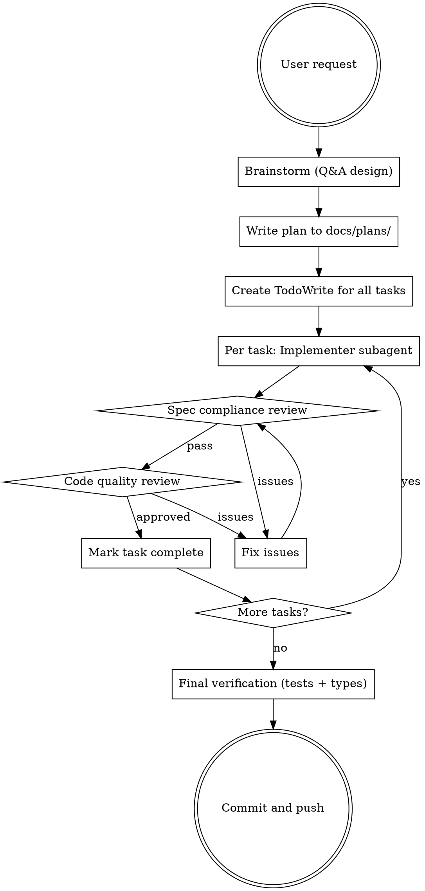

# Diashort Development Workflow

## Overview

End-to-end workflow for diashort changes: brainstorm → plan → implement with subagents → review → merge.

**Core principle:** Design before code, plan before implementation, review every task.

## When to Use

- Adding new features or endpoints
- Fixing bugs (non-trivial)
- Refactoring or modifying existing functionality
- Any change touching multiple files
- Any change requiring tests

## The Workflow

## Phase 1: Brainstorm

**REQUIRED:** Load `superpowers:brainstorming` skill.

- Ask questions one at a time to understand requirements
- Prefer multiple choice questions
- Explore 2-3 approaches with trade-offs
- Present design in 200-300 word sections, validate each

## Phase 2: Write Plan

**REQUIRED:** Load `superpowers:writing-plans` skill.

Save to: `docs/plans/YYYY-MM-DD-<feature-name>.md`

Plan structure:
- Goal, Architecture, Tech Stack header
- Bite-sized tasks (each 2-5 minutes)
- TDD steps: write test → run (fail) → implement → run (pass) → commit
- Exact file paths and code

## Phase 3: Execute with Subagents

**REQUIRED:** Load `superpowers:subagent-driven-development` skill.

For each task:
1. **Implementer subagent** - implements the task
2. **Spec compliance review** - verifies implementation matches spec exactly
3. **Code quality review** - checks patterns, maintainability
4. Fix any issues, re-review until approved
5. Mark task complete in TodoWrite

## Diashort Patterns

| Layer | Location | Pattern |
|-------|----------|---------|
| Storage | `src/atoms/` | SQLite with `CREATE TABLE IF NOT EXISTS` for auto-migration |
| Business Logic | `src/flows/` | `flow()` from @pumped-fn/lite with `parse` and `factory` |
| HTTP | `src/server.ts` | Add route, error handler, update `/` docs |
| Tests | `src/__tests__/` | Unit tests + integration tests |

## Checklist for New Endpoints

- [ ] Atom for storage (if needed)
- [ ] Flow for business logic
- [ ] Error classes with `statusCode`
- [ ] Route in server.ts with auth check
- [ ] Error handler in `mapErrorToResponse()`
- [ ] Initialize store and add to cleanup interval
- [ ] Update root `/` endpoint documentation
- [ ] Unit tests for atom/flow
- [ ] Integration tests for HTTP endpoints

## Final Steps

1. Run `bun test` - all tests must pass
2. Run `bunx @typescript/native-preview` - no type errors
3. Commit with conventional commits (`feat:`, `test:`, `docs:`)
4. Push to origin/main

## Quick Reference

| Skill | When |
|-------|------|
| `superpowers:brainstorming` | Understanding requirements |
| `superpowers:writing-plans` | Creating implementation plan |
| `superpowers:subagent-driven-development` | Executing tasks with reviews |
| `superpowers:finishing-a-development-branch` | Merge/PR/cleanup |
